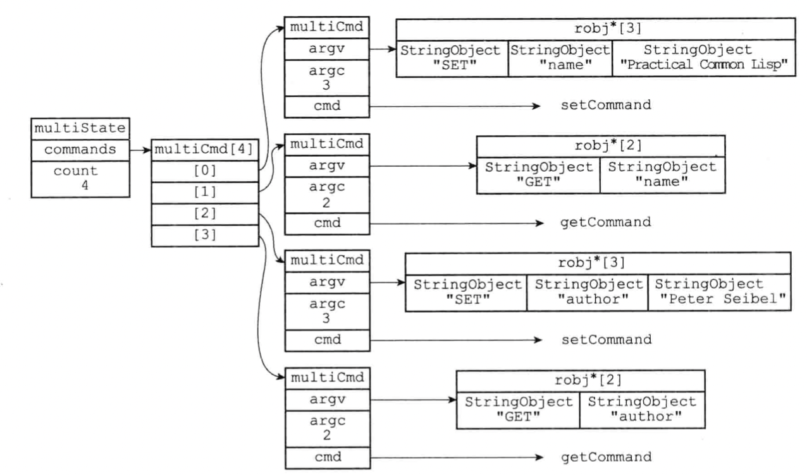
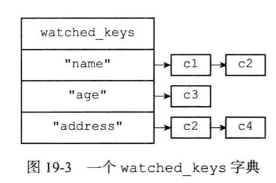

# 事务

事务的存在利于将多个命令打包一次性按照顺序实现，在事务执行期间，服务器不会中断事务而去执行其他客户端请求，服务器会将事务中的所有命令都执行完毕之后再去处理其他客户端的请求。

先以一个MULTI命令为开始，接着将多个命令放在事务之中，最后由EXEC命令将事务提交执行。

- MULTI 标记一个事务块的开始
- EXEC 执行所有事务块内的命令
- DISCARD 取消事务，放弃执行事务块内的所有命令
- WATCH key [key ...] 用于监视一个(或多个) key ，如果在事务执行之前这个(或这些) key 被其他命令所改动，那么事务将被打断
- UNWATCH 取消 WATCH 命令对所有 key 的监视

## 一 事务的实现

一个事务的执行会经历以下三个阶段：

1. 事务开始
2. 命令入队
3. 事务执行

### 1.1事务开始

客户端状态的flag记录当前客户端是否在集群状态；

mult命令的实现只是将客户端状态的flag标记为CLIENT_MULTI实现的，代码入口为multi.c/multiCommand

```cpp
void multiCommand(client *c) {
    if (c->flags & CLIENT_MULTI) {
        //已经设置的不能重复（说明已经有人在用之类的状态）
        addReplyError(c,"MULTI calls can not be nested");
        return;
    }
    c->flags |= CLIENT_MULTI;

    addReply(c,shared.ok);
}
```

 

### 1.2命令入队

非事务状态下，客户端发送的命令直接执行。

当客户端处于事务状态时，redis会根据命令判断是否要立即执行，还是要放到队列当中；

当客户端发送是命令是EXEC、DISCARD、WATCH、MUITL命令时，会立即执行，否则会加入到事务队列中；
代码入口位于server.c/processCommand()

```cpp
int processCommand(client *c) {
  //...
  /* Exec the command */
    //当前在事务状态，执行的命令不是EXEC，DICARD，MULTI，WATCH，就把命令放在事务队列中
    if (c->flags & CLIENT_MULTI &&
        c->cmd->proc != execCommand && c->cmd->proc != discardCommand &&
        c->cmd->proc != multiCommand && c->cmd->proc != watchCommand &&
        c->cmd->proc != resetCommand)
    {
        queueMultiCommand(c);
        addReply(c,shared.queued);
    } else {
        call(c,CMD_CALL_FULL);
        c->woff = server.master_repl_offset;
        if (listLength(server.ready_keys))
            handleClientsBlockedOnKeys();
    }

    return C_OK;
}
//...
```

 

## 1.3事务队列

redis每个客户端都有自己的事务状态，记录在了multiState属性中；
server.h/client

```cpp
typedef struct client {
//.......
    //事务执行的状态
    multiState mstate;      /* MULTI/EXEC state */
//......
}
```

**server.h/multiState**事务状态包含了事务队列和一个已经入队命令的计数器

结构如下：

```cpp
typedef struct multiState {
    multiCmd *commands;     /* 命令队列Array of MULTI commands */
    int count;              /* 事务队列中的命令数量Total number of MULTI commands */
    int cmd_flags;          /* The accumulated command flags OR-ed together.
                               So if at least a command has a given flag, it
                               will be set in this field. */
    int cmd_inv_flags;      /* Same as cmd_flags, OR-ing the ~flags. so that it
                               is possible to know if all the commands have a
                               certain flag. */
} multiState;
```

multiState结构体中multiCmd是个multiCmd数组， 保存着要执行的命令队列；

```cpp
typedef struct multiCmd {
    //参数
    robj **argv;
    //参数数量
    int argc;
    //命令指针
    struct redisCommand *cmd;
} multiCmd;
```

命令入队的入口位于：**multi.c/queueMultiCommand（）**
按照先进先出的顺序排列入队的命令

```cpp
/* Add a new command into the MULTI commands queue 
将一个命令加入到事务的执行队列中*/
void queueMultiCommand(client *c) {
    multiCmd *mc;
    int j;

    /* No sense to waste memory if the transaction is already aborted.
     * this is useful in case client sends these in a pipeline, or doesn't
     * bother to read previous responses and didn't notice the multi was already
     * aborted. */
    //这两种情况不需要执行事务了，直接舍弃
    if (c->flags & (CLIENT_DIRTY_CAS|CLIENT_DIRTY_EXEC))
        return;
    //重新分配事务队列，分配内存空间等
    c->mstate.commands = zrealloc(c->mstate.commands,
            sizeof(multiCmd)*(c->mstate.count+1));
    //mc执行新命令要存入的地址，并且将要写入的命令存入mc
    mc = c->mstate.commands+c->mstate.count;
    mc->cmd = c->cmd;
    mc->argc = c->argc;
    mc->argv = zmalloc(sizeof(robj*)*c->argc);
    memcpy(mc->argv,c->argv,sizeof(robj*)*c->argc);
    for (j = 0; j < c->argc; j++)
        incrRefCount(mc->argv[j]);
    //队列中命令数量加一
    c->mstate.count++;
    c->mstate.cmd_flags |= c->cmd->flags;
    c->mstate.cmd_inv_flags |= ~c->cmd->flags;
}
```

事务状态示例：



 

## 1.4执行事务

服务端收到EXEC命令后，首先会判断事务完整性是否已经被破坏：

- watch的key触发改变
- 命令排队期间有错误

如果事务是安全的会遍历所有事务队列中的命令，最后将执行结果返回给客户端；

exec的执行入口位于multi.c/execCommand()

```cpp
//exec命令实现
void execCommand(client *c) {
    int j;
    robj **orig_argv;
    int orig_argc;
    struct redisCommand *orig_cmd;
    int was_master = server.masterhost == NULL;
    //客户端当前不在事务状态
    if (!(c->flags & CLIENT_MULTI)) {
        addReplyError(c,"EXEC without MULTI");
        return;
    }

    /* EXEC with expired watched key is disallowed*/
    if (isWatchedKeyExpired(c)) {
        c->flags |= (CLIENT_DIRTY_CAS);
    }
    /**
     * 检查是否需要终止exec的事务的执行，
     * 出现以下情况会终止执行：
     * 1) watch的key触发改变
     * 2) 命令排队期间有错误
     * 
     * 在第一种情况下，失败的EXEC返回一个multi_bulk_nil对象,
     * （从技术上讲，这不是一个错误，而是一种特殊的场景）
     * 第二种情况下，返回EXECABORT错误。
     */
    /* Check if we need to abort the EXEC because:
     * 1) Some WATCHed key was touched.
     * 2) There was a previous error while queueing commands.
     * A failed EXEC in the first case returns a multi bulk nil object
     * (technically it is not an error but a special behavior), while
     * in the second an EXECABORT error is returned. */
    if (c->flags & (CLIENT_DIRTY_CAS | CLIENT_DIRTY_EXEC)) {
        if (c->flags & CLIENT_DIRTY_EXEC) {
            addReplyErrorObject(c, shared.execaborterr);
        } else {
            addReply(c, shared.nullarray[c->resp]);
        }
        //取消事务
        discardTransaction(c);
        return;
    }

    uint64_t old_flags = c->flags;

    /* we do not want to allow blocking commands inside multi */
    //对于事务中的block的命令，也要block掉
    c->flags |= CLIENT_DENY_BLOCKING;
    //开始执行所有的命令
    /* Exec all the queued commands */
    //尽快取消watch的key，他们会浪费CPU时钟
    unwatchAllKeys(c); /* Unwatch ASAP otherwise we'll waste CPU cycles */

    server.in_exec = 1;

    orig_argv = c->argv;
    orig_argc = c->argc;
    orig_cmd = c->cmd;
    addReplyArrayLen(c,c->mstate.count);
    //开始循环执行事务中的命令
    for (j = 0; j < c->mstate.count; j++) {
        c->argc = c->mstate.commands[j].argc;
        c->argv = c->mstate.commands[j].argv;
        c->cmd = c->mstate.commands[j].cmd;

        /* ACL permissions are also checked at the time of execution in case
         * they were changed after the commands were queued. */
        int acl_errpos;
        //查看当前client的权限
        int acl_retval = ACLCheckAllPerm(c,&acl_errpos);
        if (acl_retval != ACL_OK) {
            char *reason;
            switch (acl_retval) {
            case ACL_DENIED_CMD:
                reason = "no permission to execute the command or subcommand";
                break;
            case ACL_DENIED_KEY:
                reason = "no permission to touch the specified keys";
                break;
            case ACL_DENIED_CHANNEL:
                reason = "no permission to access one of the channels used "
                         "as arguments";
                break;
            default:
                reason = "no permission";
                break;
            }
            addACLLogEntry(c,acl_retval,acl_errpos,NULL);
            addReplyErrorFormat(c,
                "-NOPERM ACLs rules changed between the moment the "
                "transaction was accumulated and the EXEC call. "
                "This command is no longer allowed for the "
                "following reason: %s", reason);
        } else {
            call(c,server.loading ? CMD_CALL_NONE : CMD_CALL_FULL);
            serverAssert((c->flags & CLIENT_BLOCKED) == 0);
        }

        /* Commands may alter argc/argv, restore mstate. */
        c->mstate.commands[j].argc = c->argc;
        c->mstate.commands[j].argv = c->argv;
        c->mstate.commands[j].cmd = c->cmd;
    }

    // restore old DENY_BLOCKING value
    if (!(old_flags & CLIENT_DENY_BLOCKING))
        c->flags &= ~CLIENT_DENY_BLOCKING;

    c->argv = orig_argv;
    c->argc = orig_argc;
    c->cmd = orig_cmd;
    discardTransaction(c);

    /* Make sure the EXEC command will be propagated as well if MULTI
     * was already propagated. */
    //
    if (server.propagate_in_transaction) {
        int is_master = server.masterhost == NULL;
        server.dirty++;
        //如果在Multi/Exec块中，突然从主设备切换到从设备（使用slaveof命令），
        //初始MULTI已传播到广播后台中，但其他还没有。我们需要确保至少使用EXEC终止了后台。
        /* If inside the MULTI/EXEC block this instance was suddenly
         * switched from master to slave (using the SLAVEOF command), the
         * initial MULTI was propagated into the replication backlog, but the
         * rest was not. We need to make sure to at least terminate the
         * backlog with the final EXEC. */
        if (server.repl_backlog && was_master && !is_master) {
            char *execcmd = "*1\r\n$4\r\nEXEC\r\n";
            feedReplicationBacklog(execcmd,strlen(execcmd));
        }
        afterPropagateExec();
    }

    server.in_exec = 0;
}
```

 

## 二 watch 命令的实现

watch命令是一个乐观锁，他可以在EXEC命令执行之前，监视任意数量的数据库键；
在exec命令执行的时检查是否有个一个键被修改过, 如果有，服务器将拒绝执行事务；

两个事务对于同一个键的更改，watch命令可以监视到改变，从而终止当前事务，保证安全性。

### 2.1使用watch监听数据库键

redis数据库有一个watched_keys字典，键是被监视的key，值则是clien链表，记录监视这个key的客户端信息；

同样client中也有一个watched_keys列表，记录了当前clien 监视的所有key；



所以当redis 监视一个key时，需要执行下面两个操作：

1. 将监视key 添加到client->watched_keys 列表中；
2. 将 客户端 添加 redisDb->watched_keysc的字典中（key指向的列表）；

实现代码位于**multi.c/watchForKey()**

```cpp
/* In the client->watched_keys list we need to use watchedKey structures
 * as in order to identify a key in Redis we need both the key name and the
 * DB */
typedef struct watchedKey {
    robj *key;
    redisDb *db;
} watchedKey;

/* Watch for the specified key */
//监视指定的数据库键
void watchForKey(client *c, robj *key) {
    list *clients = NULL;
    listIter li;
    listNode *ln;
    watchedKey *wk;
    //检查当前要监视的键是否是已经被监视了
    /* Check if we are already watching for this key */
    listRewind(c->watched_keys,&li);
    while((ln = listNext(&li))) {
        wk = listNodeValue(ln);
        if (wk->db == c->db && equalStringObjects(key,wk->key))
            return; /* Key already watched */
    }
    //DB中是否已经记录了对这个键的监视，如果没有就创建新的
    /* This key is not already watched in this DB. Let's add it */
    clients = dictFetchValue(c->db->watched_keys,key);
    if (!clients) {
        clients = listCreate();
        dictAdd(c->db->watched_keys,key,clients);
        incrRefCount(key);
    }
    //将当前客户端添加到客户端列表中
    listAddNodeTail(clients,c);
    //将key添加到 客户端端watched_keys中
    /* Add the new key to the list of keys watched by this client */
    wk = zmalloc(sizeof(*wk));
    wk->key = key;
    wk->db = c->db;
    incrRefCount(key);
    listAddNodeTail(c->watched_keys,wk);
}
```

 

### 2.2监听机制的触发

所有对数据库进行的修改的操作，都会调用db.c/signalModifiedKey；（Hooks for key space changes.）

signalModifiedKey函数会调用multi.c/touchWatchedKey()函数；检查key是否被监视；

如果被监视，则会修改监视这个key的客户端的 CLIENT_DIRTY_CAS位，标记事务已经被破坏；

上面讲到过 EXEC执行的时候会检查CLIENT_DIRTY_CAS位，如果事务被破坏，EXEC将会不执行；

**上源码multi.c/touchWatchedKey()：**

```cpp
//触发key，如果一个key被某些cli监视，就“touch key”，后面事务执行exec将失败
/* "Touch" a key, so that if this key is being WATCHed by some client the
 * next EXEC will fail. */
void touchWatchedKey(redisDb *db, robj *key) {
    list *clients;
    listIter li;
    listNode *ln;
    //DB中没有key被监视就直接返回
    if (dictSize(db->watched_keys) == 0) return;
    //监视参数key的cli是空列表，直接返回
    clients = dictFetchValue(db->watched_keys, key);
    if (!clients) return;
    //要是有监视这个key的cli，就把他的CLIENT_DIRTY_CAS标识为dirty
    /* Mark all the clients watching this key as CLIENT_DIRTY_CAS */
    /* Check if we are already watching for this key */
    listRewind(clients,&li);
    while((ln = listNext(&li))) {
        client *c = listNodeValue(ln);

        c->flags |= CLIENT_DIRTY_CAS;
    }
}
```

 

## 三 事务的ACID属性

 

## 3.1原子性（atomicity）

原子性是指 数据库将事务中所有操作当作一个整体来执行，要么执行所有操作，要么都不执行；

和传统的关系型数据库最大的区别在于 redis不支持事务的回滚；

在事务队列执行阶段，如果某个命令执行出错，整个事务还是回执行下去，直到队里中所有命令执行完毕；

> redis官网对为什么不支持回滚做了下面的解释：
>
> ## Why Redis does not support roll backs?
>
> If you have a relational databases background, the fact that Redis commands can fail during a transaction, but still Redis will execute the rest of the transaction instead of rolling back, may look odd to you.
>
> However there are good opinions for this behavior:
>
> - Redis commands can fail only if called with a wrong syntax (and the problem is not detectable during the command queueing), or against keys holding the wrong data type: this means that in practical terms a failing command is the result of a programming errors, and a kind of error that is very likely to be detected during development, and not in production.
> - Redis is internally simplified and faster because it does not need the ability to roll back.
>
> An argument against Redis point of view is that bugs happen, however it should be noted that in general the roll back does not save you from programming errors. For instance if a query increments a key by 2 instead of 1, or increments the wrong key, there is no way for a rollback mechanism to help. Given that no one can save the programmer from his or her errors, and that the kind of errors required for a Redis command to fail are unlikely to enter in production, we selected the simpler and faster approach of not supporting roll backs on errors.
>
> =======
>
> - 只有在使用了错误的语法的时候才会导致命令的执行失败（在命令入队的时候无法检测的语法错误），或是使用了key不支持的错误数据类型；这就意味着 执行错误的命令是编程错误导致的；
>   这种错误在开发阶段大概率就发现了这种错误，而不是在生成环境；
> - 保持redis 内部实现的简单高效；
>
>  

## 3.2一致性（consistency）

事务一致性是指 ，如果数据库执行事务之前是一致的，那么在事务执行之后，无论事务是否成功，数据库也应该是一致的；

redis通过错误检查和简单的设计来保证一致性

1. 入队错误
   一个事务在命令入队的过程中会检查，是否存在语法错误，如果有错误将会导致事务不执行；
2. 执行错误
   在命令执行的时候，仍然有可能发生错误；但是并不会中断事务的执行
   并且已经执行过的命令也不会收到影响

## 3.3隔离型（isolation）

隔离性是指 即使数据库中有多个事务并发执行的时候，各个事务之间也不会相互影响
并且在串行执行和并发执行 事务执行的结果完全相同；

因为redis使用单线程方式执行，服务保证事务执行期间不会对事务中断，因为redis事务总是串行方式进行；具有隔离性

 

## 3.4持久性（durability）

事务的持久性是指 当一个事务执行完毕后，执行这个事务的结果被永久性存储介质；

redis的事务也是简单的包裹了一层redis命令，并没有为事务额外提供持久化功能

所以redis事务的持久性取决于所使用的持久化模式；
