## 数据结构

### sds

- 字符串长度保存在本体中,获取需要常数时间复杂度
- header包含的部分:
  - len: 表示字符串的真正长度（不包含NULL结束符在内）。
  - alloc: 表示字符串的最大容量（不包含最后多余的那个字节）。
  - flags: 总是占用一个字节。其中的最低3个bit用来表示header的类型。
- 缓冲区不会溢出
- 减少修改时的内存重分配次数
  - 空间预分配
  - alloca记录分配的总空间,惰性空间释放
- 除了自己加上的头部字段,其他和c函数一样,兼容相关函数

### 链表

- 双向链表
- 无环,头指针的prev,尾指针的next都指向null
- 自带指向头指针和尾指针的指针
- 链表具有链表长度计数器,标识长度
- void *可以保存不同类型的值

### dict

基于哈希表实现,采用某个哈希函数从key计算得到在哈希表中的位置，采用拉链法解决冲突，并在装载因子超过预定值时自动扩展内存，引发重哈希,并且在重哈希的过程中,每次增删改查推进一步重哈希,避免重哈希期间单个请求的响应时间剧烈增加.

实现增量式重哈希，dict的数据结构里包含两个哈希表。在重哈希期间，数据从第一个哈希表向第二个哈希表迁移

- hash table结构:

  - 一个dictEntry指针数组（table）。key的哈希值最终映射到这个数组的某个位置上（对应一个bucket）。如果多个key映射到同一个位置，就发生了冲突，那么就拉出一个dictEntry链表。
  - size：标识dictEntry指针数组的长度。它总是2的指数。
  - sizemask：用于将哈希值映射到table的位置索引。它的值等于(size-1)，比如7, 15, 31, 63，等等，也就是用二进制表示的各个bit全1的数字。每个key先经过hashFunction计算得到一个哈希值，然后计算(哈希值 & sizemask)得到在table上的位置。相当于计算取余(哈希值 % size)。
  - used：记录dict中现有的数据个数。它与size的比值就是装载因子（load factor）。这个比值越大，哈希值冲突概率越高。

- 单个dictentry结构:

  - ```c
    typedef struct dictEntry {
        void *key;//键
        union {
            void *val;
            uint64_t u64;
            int64_t s64;
            double d;
        } v;//值
        struct dictEntry *next;     /* 具有相同的hash值,先通过链表链接起来Next entry in the same hash bucket. */
        void *metadata[];           /* An arbitrary number of bytes (starting at a
                                     * pointer-aligned address) of size as returned
                                     * by dictType's dictEntryMetadataBytes(). */
    } dictEntry;
    ```

    

- dict本身结构:

  ```c
  //字典本身
  struct dict {
      dictType *type;//类型函数
      /*dictEntry指针数组（table）。
      key的哈希值最终映射到这个数组的某个位置上（对应一个bucket）。
      如果多个key映射到同一个位置，就发生了冲突，那么就拉出一个dictEntry链表。
      只有在重哈希的过程中，ht_table[0]和ht_table[1]才都有效。
      而在平常情况下，只有ht_table[0]有效，ht_table[1]里面没有任何数据。*/
      dictEntry **ht_table[2];//hash表
      /*记录dict中现有的数据个数。
      它与size的比值就是装载因子（load factor）。
      这个比值越大，哈希值冲突概率越高。*/
      unsigned long ht_used[2];
      // rehash 索引
      // 当 rehash 不在进行时，值为 -1,它的值记录了当前重哈希进行到哪一步了
      long rehashidx; /* rehashing not in progress if rehashidx == -1 */
  
      /* Keep small vars at end for optimal (minimal) struct padding */
      /* If >0 rehashing is paused (<0 indicates coding error) */
      int16_t pauserehash; //大于0表示rehash计算停止,小于0编码错误
      signed char ht_size_exp[2]; /* 记录大小的次方,exponent of size. (size = 1<<exp) */
  };
  ```

- rehash过程:

  - 大小选择:
    - 扩展时第二个hash表的大小是大于等于第一个的used*2的第一个$2^n$
    - 收缩时第二个hash表的大小是大于等于第一个的used的第一个$2^n$
  - rehash的时候重新计算键的哈希值和索引值
  - 所有键值对rehash结束之后就直接把新的hash表当作原来的hash表
  - rehash进行时,每次增删改查都会顺带把第一个哈希表上面相应rehashidx索引上面的所有键值对rehash到第二个表上,rehash完成之后将rehashidx值增加一
  - 当rehash完成之后,rehashidx的值设置成-1

### skiplist

- 基本结构:

  - ```c
    typedef struct zskiplistNode {
        //zadd命令在将数据插入到skiplist里面之前先进行了解码，所以存储的一定是一个sds
        //为了方便在查找的时候对数据进行字典序的比较，
        //而且，skiplist里的value部分是数字的可能性也比较小,不是很方便压缩
        sds ele;
        double score;
        //指向链表前一个节点的指针（前向指针）
        //每个节点只有1个前向指针(没有依靠level分开)，所以只有第1层链表是一个双向链表
        struct zskiplistNode *backward;
        //存放指向各层链表后一个节点的指针（后向指针）
        //是一个柔性数组,占用内存不在zskiplistNode结构里面，需要插入节点的时候单独为它分配
        //所以skiplist的每个节点所包含的指针数目是不固定的
        struct zskiplistLevel {
            //每层对应1个后向指针，用forward字段表示
            struct zskiplistNode *forward;
            //表示当前的指针跨越了多少个节点,用于计算元素排名
            unsigned long span;
        } level[];
    } zskiplistNode;
    ```

  - ```c
    //真正的skiplist结构
    typedef struct zskiplist {
        struct zskiplistNode *header, *tail;
        unsigned long length;//链表长度,头指针为空,不算在计数中
        int level;//总层数
    } zskiplist;
    ```

- 层数随机决定(1-32,幂次随机算法)

- 分值可以相同,但是对应成员必须不一样

### intset

- 不会出现重复元素

- 结构:

  - ```c
    //由整数组成的有序集合,便于在上面进行二分查找，用于快速地判断一个元素是否属于这个集合
    typedef struct intset {
        //整个统一的数据编码，表示intset中的每个数据元素用几个字节来存储
        //intset中存储的整数最多只能占用64bit
        //随着数据添加,可能改变数据编码,比如一些比较大的整数
        uint32_t encoding;
        //inset中的元素个数
        uint32_t length;
        //一个柔性数组,长度等于encoding * length,用于表达偏移量
        //contents需要单独为其分配空间，这部分内存不包含在intset结构当中
        int8_t contents[];
    } intset;
    ```

- 当原来的encoding大小不够新的数据存储时,需要升级数据编码

  - 先扩充整个集合底层数组大小,分配新元素空间
  - 原来的数据类型转换
  - 添加新元素(一般来说新元素都在开头或者末尾位置)

- 有点像数组的排列,中间插入元素需要整个向后移动,修改代价比较高

### ziplist

- 列表键只包含少量列表键,值的储存是变长的

- 将表中每一项存放在前后连续的地址空间内，一个ziplist整体占用一大块内存

- 结构:

  - ```c
    typedef struct {
        /* When string is used, it is provided with the length (slen). */
        unsigned char *sval;
        unsigned int slen;
        /* When integer is used, 'sval' is NULL, and lval holds the value. */
        long long lval;
    } ziplistEntry;
    //ziplist的数据类型，没有用自定义的struct之类的来表达，
    //而就是简单的unsigned char *。
    //这是因为ziplist本质上就是一块连续内存，
    //内部组成结构又是一个高度动态的设计（变长编码），也没法用一个固定的数据结构来表达。
    ```

  - ```c
    /* We use this function to receive information about a ziplist entry.
     * Note that this is not how the data is actually encoded, is just what we
     * get filled by a function in order to operate more easily. */
    //每一个entry的格式
    //记录长度是为了方便指针运算确定偏移量
    typedef struct zlentry {
        unsigned int prevrawlensize; /* Bytes used to encode the previous entry len*/
        unsigned int prevrawlen;     /* Previous entry len. */
        unsigned int lensize;        /* Bytes used to encode this entry type/len.
                                        For example strings have a 1, 2 or 5 bytes
                                        header. Integers always use a single byte.*/
        unsigned int len;            /* Bytes used to represent the actual entry.
                                        For strings this is just the string length
                                        while for integers it is 1, 2, 3, 4, 8 or
                                        0 (for 4 bit immediate) depending on the
                                        number range. */
        unsigned int headersize;     /* prevrawlensize + lensize. */
        unsigned char encoding;      /* Set to ZIP_STR_* or ZIP_INT_* depending on
                                        the entry encoding. However for 4 bits
                                        immediate integers this can assume a range
                                        of values and must be range-checked. */
        unsigned char *p;            /* Pointer to the very start of the entry, that
                                        is, this points to prev-entry-len field. */
    } zlentry;
    ```

- 添加/删除节点的时候很可能出现连锁更新

## robj(server.h)

对象的类型一般是指value的类型,和key类型无关(key一般都是string)

- 作用:

  - 为多种数据类型提供一种统一的表示方式。
  - 允许同一类型的数据采用不同的内部表示，从而在某些情况下尽量节省内存。
  - 支持对象共享和引用计数。当对象被共享的时候，只占用一份内存拷贝，进一步节省内存。

- 结构:

  - ```c
    typedef struct redisObject {
        //对象的数据类型
        //可能的取值有5种：OBJ_STRING, OBJ_LIST, OBJ_SET, OBJ_ZSET, OBJ_HASH，
        //分别对应Redis对外暴露的5种数据结构
        unsigned type:4;
        //对象的内部表示方式（也可以称为编码）
        //可能的取值有10种，即前面代码中的10个OBJ_ENCODING_XXX常量
        unsigned encoding:4;
        //lru算法记录使用的数据
        unsigned lru:LRU_BITS; /* LRU time (relative to global lru_clock) or
                                * LFU data (least significant 8 bits frequency
                                * and most significant 16 bits access time). */
        //引用计数,允许robj在一定情况下被共享
        int refcount;
        //数据指针,指向真正的数据
        void *ptr;
    } robj;
    ```

    

- string对象:

  - 接收到的value值（string类型）表示成一个type = OBJ_STRING并且encoding = OBJ_ENCODING_RAW的robj对象
  - 然后在存入内部存储之前先执行一个编码过程，试图将它表示成另一种更节省内存的encoding方式

- list对象

  - 一般使用ziplist

- 哈希对象

  - 使用ziplist或者hashtable
  - ziplist:
    - 键值对相邻,先压入键再压入值
    - 直接往尾部添加
  - hashtable:
    - 使用dict实现
    - dict的键保存键,值保存值

- 集合

  - 使用intset或者hashtable
  - 使用hashtable实现时,字典每个键都是一个字符串对象,对应一个集合元素,字典值设为null

- 有序集合

  - 使用ziplist或者skiplist

- 多态指令:

  - 根据对象的类型编码决定指令的具体函数与实现方式决定要调用的函数
  - 执行指令前像检查对应键或者值能否正确执行相关函数指令

- 内存回收

  - 通过引用计数在适当时候释放对象并回收内存
    - 创建时引用数加一
    - 被新程序使用时引用数加一
    - 程序不再使用,引用数减一
    - 引用数变成0,内存释放

- 对象共享

  - 共享就是利用refcount实现的,每多一个共享的就加一
  - 提前准备了0到9999的字符串对象共享

- 空转时长

  - lru记录最后一次被程序访问的时间,当前时间减去lru时间就是空转时长
  - (打印空转时长并不会更新lru值)
  - 当内存比较满时,最先被释放的是lru最早的那些键

## 数据类型实现

### t_string.c

- setGenericCommand()函数实现了SET,SETEX,PSETEX,SETNX指令
  - expire 定义了 Redis 对象的过期时间
  - *ok_reply 和 abort_reply 决定了命令回复的内容，NX 参数和 XX 参数也会改变回复。*
    - *如果 ok_reply 为 NULL ，那么 "+OK" 被返回。如果 abort_reply 为 NULL ，那么 "$-1" 被返回。*
- getExpireMillisecondsOrReply()实现了过期处理,从客户请求中处理过期的robj
- parseExtendedStringArgumentsOrReply()判断当前字符串操作指令的有效性
- *getexCommand()*对于GET的多余参数进行处理,和GET不同,这个指令不是仅可读的
- setrangeCommand()函数中感觉有个地方可以优化,sdslen只能为0或者正值,那么可以减少一个地方的判断,少用一个if语句

# 单机数据库实现

## 数据库细节实现

- 数据库的数据结构

  - ```c
    typedef struct redisDb {
        // 数据库键空间，保存着数据库中的所有键值对
        dict *dict;                 /* The keyspace for this DB */
        // 键的过期时间，字典的键为键，字典的值为过期事件 UNIX 时间戳
        dict *expires;              /* Timeout of keys with a timeout set */
        // 正处于阻塞状态的键
        dict *blocking_keys;        /* Keys with clients waiting for data (BLPOP)*/
        // 可以解除阻塞的键
        dict *ready_keys;           /* Blocked keys that received a PUSH */
        // 正在被 WATCH 命令监视的键
        dict *watched_keys;         /* WATCHED keys for MULTI/EXEC CAS */
        //数据库编码
        int id;                     /* Database ID */
        // 数据库的键的平均 TTL ，统计信息
        long long avg_ttl;          /* Average TTL, just for stats */
        //过期指针
        unsigned long expires_cursor; /* Cursor of the active expire cycle. */
        //即将整理的键名称,用一个list保存
        list *defrag_later;         /* List of key names to attempt to defrag one by one, gradually. */
    } redisDb;
    ```


- Hash table type implementation
  - tryResizeHashTables()用于缩小字典体积：如果字典的使用率比 HASHTABLE_MIN_MINFILL 常量要低，那么通过缩小字典的体积来节约内存,htNeedsResize()就是比较这两个大小的函数,在有孩子进程的时候不会进行resize
  - 服务器在对数据库执行增删改查命令时会对数据库进行渐进式 rehash ,但如果服务器长期没有执行命令的话，数据库字典的 rehash 就可能一直没办法完成,为了防止出现这种情况，incrementallyRehash()主动 rehash ,执行了rehash之后返回1,否则返回0

### 过期功能实现

- 设置生存和过期时间

  

- 带有生存和过期时间的数据库

  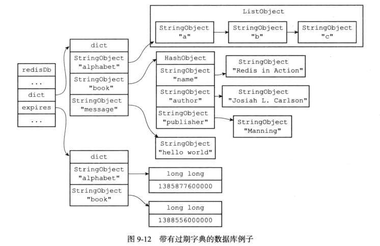

  添加过期时间就是在过期字典中添加项目,移除过期时间就是在过期字典中删除对应的项目,键过期时间和当前时间做差就可以计算出生存时间.

- 过期键删除:

  - 惰性删除
    - db.c的expireIfNeeded()函数对于所有的输入键检查是否过期,过期的键直接删除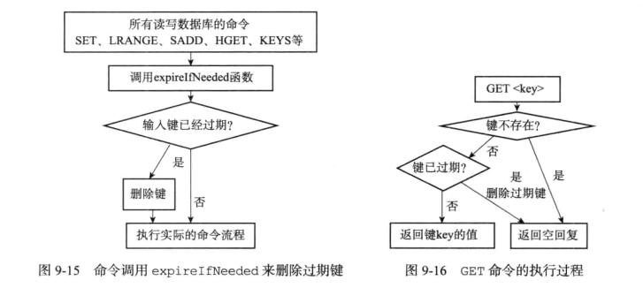
  - 定期删除
    - 由expire.c中的activeExpireCycle()函数实现定期删除,当服务器定期执行server.c的serverCron()函数时,就会调用,在expire字典中随机检查一部分键的过期时间,并且删除其中的过期键.

- RDB对于过期键处理

  - 生成时过期键不加入RDB文件中
  - 主服务器载入时检查键是否过期,过期键不加入数据库;从服务器不检查,但是会和主服务器同步数据,同步的时候也会清除过期键

- AOF对于过期键处理

  - 写入时如果键过期但没有删除,不会影响,当(惰性或者定期)删除的时候追加一条DEL
    - 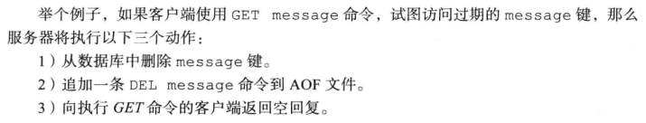

  - 重写入的时候检查键是否过期,过期键不加入数据库

- 复制对于过期键处理

  - 主服务器处理,之后对从服务器发送DEL,从服务器对于过期键不做处理
  - 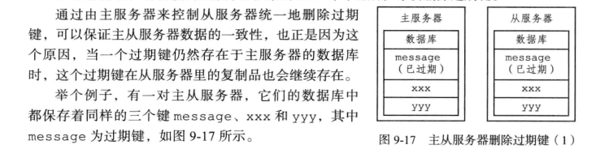


### 数据库通知

- 可以监视对键的操作情况,或者是监视某个指令的使用情况

- 由notify.c/notifyKeyspaceEvent()函数实现:

  ```c
  /* The API provided to the rest of the Redis core is a simple function:
   *实现了发送数据库通知的功能
   * notifyKeyspaceEvent(int type, char *event, robj *key, int dbid);
   *
   * 'type' is the notification class we define in `server.h`.
   * type是当前想要发送的通知的类型,根据这个判断通知发送与否,提前在server.h中定义过种类
   * 'event' is a C string representing the event name.
   *  event 参数是一个字符串表示的事件名
   * 'key' is a Redis object representing the key name.
   * key 参数是一个 Redis 对象表示的键名,是产生事件的键
   * 'dbid' is the database ID where the key lives.
   * dbid 参数为键所在(产生事件)的数据库  
   * 每当一个redis命令需要发送数据库通知的时候,都会调用此函数,向函数传递命令的相关信息*/
  void notifyKeyspaceEvent(int type, char *event, robj *key, int dbid) {
      sds chan;
      robj *chanobj, *eventobj;
      int len = -1;
      char buf[24];
  
      /* If any modules are interested in events, notify the module system now.
       * This bypasses the notifications configuration, but the module engine
       * will only call event subscribers if the event type matches the types
       * they are interested in. */
       moduleNotifyKeyspaceEvent(type, event, key, dbid);
  
      /* If notifications for this class of events are off, return ASAP. 
      如果给定通知不是服务器允许发送的通知,直接返回*/
      if (!(server.notify_keyspace_events & type)) return;
  
      eventobj = createStringObject(event,strlen(event));
  
      /* __keyspace@<db>__:<key> <event> notifications. */
      //发送键空间通知
      if (server.notify_keyspace_events & NOTIFY_KEYSPACE) {
          chan = sdsnewlen("__keyspace@",11);
          len = ll2string(buf,sizeof(buf),dbid);
          chan = sdscatlen(chan, buf, len);
          chan = sdscatlen(chan, "__:", 3);
          chan = sdscatsds(chan, key->ptr);
          chanobj = createObject(OBJ_STRING, chan);
          pubsubPublishMessage(chanobj, eventobj);//通过publish发送通知
          decrRefCount(chanobj);
      }
  
      /* __keyevent@<db>__:<event> <key> notifications. */
      //发送键时间通知
      if (server.notify_keyspace_events & NOTIFY_KEYEVENT) {
          chan = sdsnewlen("__keyevent@",11);
          //初始化为-1,加入前面发送键空间通知的时候计算过了就不会是-1,少计算一次
          if (len == -1) len = ll2string(buf,sizeof(buf),dbid);
          chan = sdscatlen(chan, buf, len);
          chan = sdscatlen(chan, "__:", 3);
          chan = sdscatsds(chan, eventobj->ptr);
          chanobj = createObject(OBJ_STRING, chan);
          pubsubPublishMessage(chanobj, key);
          decrRefCount(chanobj);
      }
      decrRefCount(eventobj);
  }
  ```


## RDB持久化

redis是内存数据库,RDB持久化将数据库状态保存到磁盘里面,避免数据意外丢失

RDB文件时压缩的二进制文件,可以用这个文件恢复数据库状态,主要使用save和bgsave实现

### 创建和载入

- save创建RDB文件,但是会阻塞服务器;bgsave生成一个子进程,专门负责生成RDB文件
- 只要有RDB文件在,就会自动载入RDB文件(如果开启了AOF持久化功能,会优先使用AOF文件还原数据库)
- bgsave执行期间不能执行save,bgsave(防止竞争条件);也不能执行bgrewriteaof,因为都会有大量的磁盘写入

### 自动保存

#### 设置自动保存条件

设定自动保存的条件,达到条件时自动运行bgsave

条件保存在redisServer的saveparams属性中

#### dirty计数器和lastsave属性

- dirty计数器记录上次成功执行save或者bgsave之后服务器对数据库进行修改的次数
- lastsave记录了上次成功save的时间

#### 检查保存条件

serverCron函数默认没100ms就要执行一次,维护当前运行的数据库,同时也检查了自动保存条件是否满足,只要有一个条件满足了就要执行bgsave

## AOF持久化(Append Only File)

通过保存所有的写命令记录数据库状态

写命令执行之后加到redisServer的aof_buf缓冲区末尾,在处理事件循环的时候决定是否将缓冲区的值写入到AOF文件

数据还原的时候先创建不带网络连接的伪客户端,直接使用来自AOF文件中的命令,挨个执行,最终执行完毕就是数据库的状态

### AOF文件重写

- 直接读取当前状态,对于每个键直接使用add指令读取最后的状态作为一个add添加进去.

- 开始执行重写之后可能会继续执行指令,对于数据库进行修改,因此建立了AOF重写缓冲区,新指令同时同步到AOF缓冲区和AOF重写缓冲区
- 完成重写之后直接覆盖原来的AOF文件

## 事件

### 数据结构

```c
//事件处理器状态(同时是时间处理器和文件处理器)
typedef struct aeEventLoop {
    //当前注册的最大描述符
    int maxfd;   /* highest file descriptor currently registered */
    //当前追踪的最大描述符
    int setsize; /* max number of file descriptors tracked */
    //时间事件的id,时间事件链表中记录了最大的id
    long long timeEventNextId;
    //已注册的文件事件
    aeFileEvent *events; /* Registered events */
    //已经就绪,执行过处理器的文件事件
    aeFiredEvent *fired; /* Fired events */
    //时间事件
    aeTimeEvent *timeEventHead;
    //事件处理器开关
    int stop;
    //多路复用库的私有数据
    void *apidata; /* This is used for polling API specific data */
    //处理事件之前要执行的函数
    aeBeforeSleepProc *beforesleep;
    //处理事件之后要执行的函数
    aeBeforeSleepProc *aftersleep;
    int flags;
} aeEventLoop;
```


### 文件事件

服务器通过套接字和客户端连接,文件事件是对于套接字操作的抽象,通信过程会产生相应文件事件,服务器监听处理这些事件

- **本身单线程运行,但是I/O多路复用监听多个套接字**

#### 数据结构

```c
/* File event structure
 *
 * 文件事件结构
 */
typedef struct aeFileEvent {

    // 监听事件类型掩码，
    // 值可以是 AE_READABLE 或 AE_WRITABLE ，
    // 或者 AE_READABLE | AE_WRITABLE
    int mask; /* one of AE_(READABLE|WRITABLE) */

    // 读事件处理器
    aeFileProc *rfileProc;

    // 写事件处理器
    aeFileProc *wfileProc;

    // 多路复用库的私有数据
    void *clientData;

} aeFileEvent;
```


#### 构成

- 套接字
  - 每当一个套接字准备好执行某项操作时,产生一个文件事件,一个服务器连接了多个套接字,可以产生多个文件事件
  - 当套接字可读(客户端执行write或者close之后)或者有新的可应答套接字出现(新的connect建立)时,产生AE_READABLE事件;套接字变得可写(客户端执行read操作之后)时,产生AE_WRITABLE事件

- I/O多路复用程序
  - 负责监听多个套接字的上述两种事件,向文件事件分派器传送产生了事件的套接字
  - 多个事件时先处理AE_READABLE事件,先读后写,多个套接字都有事件时按照一个队列传送,当上一个套接字的事件处理完毕之后再处理下一个套接字

- 文件事件分派器
  - 根据传来的套接字调用相应的事件处理器

- 事件处理器
  - 执行相关操作的函数


#### 相关API

- 函数aeCreateFileEvent

  ```c
  /*
   * 根据 mask 参数的值，监听 fd 文件的状态，
   * 当 fd 可用时，执行 proc 函数
   * 将给定套接字的给定事件加入到I/O多路复用程序的监听范围
   * 将事件和事件处理器关联
   */
  int aeCreateFileEvent(aeEventLoop *eventLoop, int fd, int mask,
          aeFileProc *proc, void *clientData)
  {
      if (fd >= eventLoop->setsize) {
          errno = ERANGE;
          return AE_ERR;
      }
      // 取出文件事件结构
      aeFileEvent *fe = &eventLoop->events[fd];
  
      if (aeApiAddEvent(eventLoop, fd, mask) == -1)
          return AE_ERR;
      // 设置文件事件类型，以及事件的处理器
      fe->mask |= mask;
      if (mask & AE_READABLE) fe->rfileProc = proc;
      if (mask & AE_WRITABLE) fe->wfileProc = proc;
      // 私有数据
      fe->clientData = clientData;
      // 如果有需要，更新事件处理器的最大 fd
      if (fd > eventLoop->maxfd)
          eventLoop->maxfd = fd;
      return AE_OK;
  }
  ```

- 函数aeDeleteFileEvent

  ```c
  /*
   * 将 fd 从 mask 指定的监听队列中删除
   * i/o多路复用程序取消对给定套接字的给定事件的监听
   * 取消事件和事件处理器之间的关联
   */
  void aeDeleteFileEvent(aeEventLoop *eventLoop, int fd, int mask)
  {
      if (fd >= eventLoop->setsize) return;
      // 取出文件事件结构
      aeFileEvent *fe = &eventLoop->events[fd];
      // 未设置监听的事件类型，直接返回
      if (fe->mask == AE_NONE) return;
  
      /* We want to always remove AE_BARRIER if set when AE_WRITABLE
       * is removed. */
      if (mask & AE_WRITABLE) mask |= AE_BARRIER;
      // 取消对给定 fd 的给定事件的监视
      aeApiDelEvent(eventLoop, fd, mask);
      // 计算新掩码
      fe->mask = fe->mask & (~mask);
      if (fd == eventLoop->maxfd && fe->mask == AE_NONE) {
          /* Update the max fd */
          int j;
  
          for (j = eventLoop->maxfd-1; j >= 0; j--)
              if (eventLoop->events[j].mask != AE_NONE) break;
          eventLoop->maxfd = j;
      }
  }
  ```

- 函数aeGetFileEvents

  ```c
  /*
   * 获取给定 fd 正在监听的事件类型
   * 返回正在监视的事件类型
   */
  int aeGetFileEvents(aeEventLoop *eventLoop, int fd) {
      if (fd >= eventLoop->setsize) return 0;
      aeFileEvent *fe = &eventLoop->events[fd];
  
      return fe->mask;
  }
  ```

- 函数aeWait

  ```c
  /* Wait for milliseconds until the given file descriptor becomes
   * writable/readable/exception
   * 在给定毫秒内等待，直到 fd 变成可写、可读或异常
   * 事件成功产生或者超时就返回 */
  int aeWait(int fd, int mask, long long milliseconds) {
      struct pollfd pfd;
      int retmask = 0, retval;
  
      memset(&pfd, 0, sizeof(pfd));
      pfd.fd = fd;
      if (mask & AE_READABLE) pfd.events |= POLLIN;
      if (mask & AE_WRITABLE) pfd.events |= POLLOUT;
  
      if ((retval = poll(&pfd, 1, milliseconds))== 1) {
          if (pfd.revents & POLLIN) retmask |= AE_READABLE;
          if (pfd.revents & POLLOUT) retmask |= AE_WRITABLE;
          if (pfd.revents & POLLERR) retmask |= AE_WRITABLE;
          if (pfd.revents & POLLHUP) retmask |= AE_WRITABLE;
          return retmask;
      } else {
          return retval;
      }
  }
  ```

- 函数aeApiPoll

  ```c
  /*在指定时间内阻塞并等待所有被aeCreateFileEvent函数设置为监听状态的套接字产生文件事件
  当有至少一个事件产生或者超时返回*/
  static int aeApiPoll(aeEventLoop *eventLoop, struct timeval *tvp) {
      aeApiState *state = eventLoop->apidata;
      int retval, j, numevents = 0;
  
      memcpy(&state->_rfds,&state->rfds,sizeof(fd_set));
      memcpy(&state->_wfds,&state->wfds,sizeof(fd_set));
  	//根据select的retval决定之后的操作
      retval = select(eventLoop->maxfd+1,
                  &state->_rfds,&state->_wfds,NULL,tvp);
      if (retval > 0) {
          for (j = 0; j <= eventLoop->maxfd; j++) {
              int mask = 0;
              aeFileEvent *fe = &eventLoop->events[j];
  			//监听得到的事件类型
              if (fe->mask == AE_NONE) continue;
              if (fe->mask & AE_READABLE && FD_ISSET(j,&state->_rfds))
                  mask |= AE_READABLE;
              if (fe->mask & AE_WRITABLE && FD_ISSET(j,&state->_wfds))
                  mask |= AE_WRITABLE;
              eventLoop->fired[numevents].fd = j;
              eventLoop->fired[numevents].mask = mask;
              numevents++;
          }
      } else if (retval == -1 && errno != EINTR) {
          panic("aeApiPoll: select, %s", strerror(errno));
      }
  
      return numevents;
  }
  ```

- 函数aeProcessEvents

  ```c
  /* 调用aeApiPoll等待事件产生,之后遍历所有产生的事件,处理所有已到达的时间事件，以及所有已就绪的文件事件
   * 如果不传入特殊 flags 的话，那么函数睡眠直到文件事件就绪，
   * 或者下个时间事件到达（如果有的话）
   * 根据flag值确定相应的处理步骤
   * 函数的返回值为已处理事件的数量*/
  int aeProcessEvents(aeEventLoop *eventLoop, int flags)
  {
      int processed = 0, numevents;
  
      /* Nothing to do? return ASAP */
      if (!(flags & AE_TIME_EVENTS) && !(flags & AE_FILE_EVENTS)) return 0;
  
      /* Note that we want to call select() even if there are no
       * file events to process as long as we want to process time
       * events, in order to sleep until the next time event is ready
       * to fire. */
      if (eventLoop->maxfd != -1 ||
          ((flags & AE_TIME_EVENTS) && !(flags & AE_DONT_WAIT))) {
          int j;
          struct timeval tv, *tvp;
          int64_t usUntilTimer = -1;
          // 距今最近的时间事件还要多久才能达到,使用usUntilTimer保存
          if (flags & AE_TIME_EVENTS && !(flags & AE_DONT_WAIT))
              usUntilTimer = usUntilEarliestTimer(eventLoop);
          //还没有到达
          if (usUntilTimer >= 0) {
              tv.tv_sec = usUntilTimer / 1000000;
              tv.tv_usec = usUntilTimer % 1000000;
              tvp = &tv;
          } else {
              //如果时间事件已经到达(到达间隔时间为负数),将已到达时间事件的到达时间间隔设置为0
              /* If we have to check for events but need to return
               * ASAP because of AE_DONT_WAIT we need to set the timeout
               * to zero */
              // 执行到这一步，说明没有时间事件即将到达
              // 那么根据 AE_DONT_WAIT 是否设置来决定是否阻塞，以及阻塞的时间长度
              if (flags & AE_DONT_WAIT) {
                  // 设置文件事件不阻塞,将已到达时间事件的到达时间间隔设置为0
                  tv.tv_sec = tv.tv_usec = 0;
                  tvp = &tv;
              } else {
                  /* Otherwise we can block */
                  // 文件事件可以阻塞直到有事件到达为止,wait时间设置为无穷
                  tvp = NULL; /* wait forever */
              }
          }
  
          if (eventLoop->flags & AE_DONT_WAIT) {
              tv.tv_sec = tv.tv_usec = 0;
              tvp = &tv;
          }
  
          if (eventLoop->beforesleep != NULL && flags & AE_CALL_BEFORE_SLEEP)
              eventLoop->beforesleep(eventLoop);
  
          /* Call the multiplexing API, will return only on timeout or when
           * some event fires. */
          // 处理文件事件，阻塞时间由 tvp 决定
          numevents = aeApiPoll(eventLoop, tvp);
  
          /* After sleep callback. */
          if (eventLoop->aftersleep != NULL && flags & AE_CALL_AFTER_SLEEP)
              eventLoop->aftersleep(eventLoop);
  
          for (j = 0; j < numevents; j++) {
              //从已就绪数组中获取事件
              int fd = eventLoop->fired[j].fd;
              aeFileEvent *fe = &eventLoop->events[fd];
              int mask = eventLoop->fired[j].mask;
              int fired = 0; /* Number of events fired for current fd. */
              int invert = fe->mask & AE_BARRIER;
              //读取事件
              if (!invert && fe->mask & mask & AE_READABLE) {
                  //确保读/写事件只能执行其中一个
                  fe->rfileProc(eventLoop,fd,fe->clientData,mask);
                  fired++;
                  fe = &eventLoop->events[fd]; /* Refresh in case of resize. */
              }
  
              /* Fire the writable event. */
              //写事件
              if (fe->mask & mask & AE_WRITABLE) {
                  if (!fired || fe->wfileProc != fe->rfileProc) {
                      fe->wfileProc(eventLoop,fd,fe->clientData,mask);
                      fired++;
                  }
              }
  
              /* If we have to invert the call, fire the readable event now
               * after the writable one. */
              if (invert) {
                  fe = &eventLoop->events[fd]; /* Refresh in case of resize. */
                  if ((fe->mask & mask & AE_READABLE) &&
                      (!fired || fe->wfileProc != fe->rfileProc))
                  {
                      fe->rfileProc(eventLoop,fd,fe->clientData,mask);
                      fired++;
                  }
              }
  
              processed++;
          }
      }
      /* Check time events */
      //执行时间事件
      if (flags & AE_TIME_EVENTS)
          processed += processTimeEvents(eventLoop);
  
      return processed; /* return the number of processed file/time events */
  }
  
  ```

#### 文件事件处理器

实现不同的网络通信需求,主要是连接应答处理器,命令请求处理器,命令回复处理器

- 连接应答处理器

  - 函数acceptTcpHandler对连接服务器监听套接字的客户端进行应答

    ```c
    //创建一个TCP连接
    void acceptTcpHandler(aeEventLoop *el, int fd, void *privdata, int mask) {
        int cport, cfd, max = MAX_ACCEPTS_PER_CALL;
        char cip[NET_IP_STR_LEN];
        UNUSED(el);
        UNUSED(mask);
        UNUSED(privdata);
    
        while(max--) {
            //accept客户端连接
            cfd = anetTcpAccept(server.neterr, fd, cip, sizeof(cip), &cport);//TCP连接函数
            if (cfd == ANET_ERR) {
                if (errno != EWOULDBLOCK)
                    serverLog(LL_WARNING,
                        "Accepting client connection: %s", server.neterr);
                return;
            }
            serverLog(LL_VERBOSE,"Accepted %s:%d", cip, cport);
            // 为客户端创建客户端状态（redisClient）
            acceptCommonHandler(connCreateAcceptedSocket(cfd),0,cip);
        }
    }
    ```

    redis进行初始化时,将处理器与套接字的AE_READABLE事件连接起来,当由客户端使用sys/socket.h/connect函数连接服务器监听套接字时,套接字产生AE_READABLE事件,引发连接应答处理器执行,并执行相应的套接字应答操作

    ```mermaid
    graph LR
    
      a((客户端))--连接监听套接字-->b[服务器:服务器监听套接字产生的AE_READABLE事件,执行连接应答处理器]
    ```

    

- 命令请求处理器

  - 函数readQueryFromClient从套接字中读入客户端发送的命令请求内容

    ```c
    /*
     * 读取客户端的查询缓冲区内容
     */
    void readQueryFromClient(connection *conn) {
        client *c = connGetPrivateData(conn);
        int nread, big_arg = 0;
        size_t qblen, readlen;
    
        /* Check if we want to read from the client later when exiting from
         * the event loop. This is the case if threaded I/O is enabled. */
        if (postponeClientRead(c)) return;
    
        /* Update total number of reads on server */
        //更新server的读入处理计数器
        atomicIncr(server.stat_total_reads_processed, 1);
    
        readlen = PROTO_IOBUF_LEN;
        /* If this is a multi bulk request, and we are processing a bulk reply
         * that is large enough, try to maximize the probability that the query
         * buffer contains exactly the SDS string representing the object, even
         * at the risk of requiring more read(2) calls. This way the function
         * processMultiBulkBuffer() can avoid copying buffers to create the
         * Redis Object representing the argument. */
        if (c->reqtype == PROTO_REQ_MULTIBULK && c->multibulklen && c->bulklen != -1
            && c->bulklen >= PROTO_MBULK_BIG_ARG)
        {
            ssize_t remaining = (size_t)(c->bulklen+2)-sdslen(c->querybuf);
            big_arg = 1;
    
            /* Note that the 'remaining' variable may be zero in some edge case,
             * for example once we resume a blocked client after CLIENT PAUSE. */
            if (remaining > 0) readlen = remaining;
        }
        // 获取查询缓冲区当前内容的长度
        // 如果读取出现 short read ，那么可能会有内容滞留在读取缓冲区里面
        // 这些滞留内容也许不能完整构成一个符合协议的命令
        qblen = sdslen(c->querybuf);
        //为查询缓冲区分配空间
        if (big_arg || sdsalloc(c->querybuf) < PROTO_IOBUF_LEN) {
            /* When reading a BIG_ARG we won't be reading more than that one arg
             * into the query buffer, so we don't need to pre-allocate more than we
             * need, so using the non-greedy growing. For an initial allocation of
             * the query buffer, we also don't wanna use the greedy growth, in order
             * to avoid collision with the RESIZE_THRESHOLD mechanism. */
            //太长的指令参数只读入一个参数,查询缓冲区不需要多余分配空间,不使用贪心分配空间
            c->querybuf = sdsMakeRoomForNonGreedy(c->querybuf, readlen);
        } else {
            c->querybuf = sdsMakeRoomFor(c->querybuf, readlen);
    
            /* Read as much as possible from the socket to save read(2) system calls. */
            readlen = sdsavail(c->querybuf);
        }
        //读入内容到查询缓存
        nread = connRead(c->conn, c->querybuf+qblen, readlen);
        //读入出错时
        if (nread == -1) {
            if (connGetState(conn) == CONN_STATE_CONNECTED) {
                return;
            } else {
                serverLog(LL_VERBOSE, "Reading from client: %s",connGetLastError(c->conn));
                freeClientAsync(c);
                return;
            }
        //遇到EOF
        } else if (nread == 0) {
            if (server.verbosity <= LL_VERBOSE) {
                sds info = catClientInfoString(sdsempty(), c);
                serverLog(LL_VERBOSE, "Client closed connection %s", info);
                sdsfree(info);
            }
            freeClientAsync(c);
            return;
        } else if (c->flags & CLIENT_MASTER) {
            /* Append the query buffer to the pending (not applied) buffer
             * of the master. We'll use this buffer later in order to have a
             * copy of the string applied by the last command executed. */
            // 根据内容，更新查询缓冲区（SDS） free 和 len 属性
            // 并将 '\0' 正确地放到内容的最后
            c->pending_querybuf = sdscatlen(c->pending_querybuf,
                                            c->querybuf+qblen,nread);
        }
    
        sdsIncrLen(c->querybuf,nread);
        qblen = sdslen(c->querybuf);
        // 如果有需要，更新缓冲区内容长度的峰值（peak）
        if (c->querybuf_peak < qblen) c->querybuf_peak = qblen;
        // 记录服务器和客户端最后一次互动的时间
        c->lastinteraction = server.unixtime;
        // 如果客户端是 master 的话，更新它的复制偏移量
        if (c->flags & CLIENT_MASTER) c->read_reploff += nread;
        atomicIncr(server.stat_net_input_bytes, nread);
        // 查询缓冲区长度超出服务器最大缓冲区长度
        // 清空缓冲区并释放客户端
        if (!(c->flags & CLIENT_MASTER) && sdslen(c->querybuf) > server.client_max_querybuf_len) {
            sds ci = catClientInfoString(sdsempty(),c), bytes = sdsempty();
    
            bytes = sdscatrepr(bytes,c->querybuf,64);
            serverLog(LL_WARNING,"Closing client that reached max query buffer length: %s (qbuf initial bytes: %s)", ci, bytes);
            sdsfree(ci);
            sdsfree(bytes);
            freeClientAsync(c);
            return;
        }
    
        /* There is more data in the client input buffer, continue parsing it
         * in case to check if there is a full command to execute. */
        // 从查询缓存重读取内容，创建参数，并执行命令
        // 函数会执行到缓存中的所有内容都被处理完为止
         processInputBuffer(c);
    }
    ```

    当一个客户端通过连接应答处理器连接到服务器之后,客户端套接字的AE_READABLE事件和命令请求处理器相关联,当客户端向服务器发送命令请求时,产生AE_READABLE事件引发处理器执行,执行相关套接字读入工作

    ```mermaid
    graph LR
    
      a((客户端))--发送命令请求-->b[服务器:客户端套接字产生AE_READABLE事件,执行命令请求处理器]
    ```

    

- 命令回复处理器

  - 函数sendReplyToClient将服务器执行相关命令得到的命令回复通过套接字返回给客户端

    ```c
    /*
     * 负责传送命令回复的写处理器
     */
     void sendReplyToClient(connection *conn) {
        client *c = connGetPrivateData(conn);
        writeToClient(c,1);//具体实现
    }
    ```

    具体实现的函数如下:

    ```c
    int writeToClient(client *c, int handler_installed) {
        /* Update total number of writes on server */
        //更新写回复计数器
        atomicIncr(server.stat_total_writes_processed, 1);
    
        ssize_t nwritten = 0, totwritten = 0;
        size_t objlen;
        clientReplyBlock *o;
        //一直循环直到回复缓冲区为空
        while(clientHasPendingReplies(c)) {
            if (c->bufpos > 0) {
                // 写入内容到套接字
                // c->sentlen 是用来处理 short write 的
                // 当出现 short write ，导致写入未能一次完成时,
                // c->buf+c->sentlen 就会偏移到正确（未写入）内容的位置上。
                nwritten = connWrite(c->conn,c->buf+c->sentlen,c->bufpos-c->sentlen);
                //出错时跳出循环
                if (nwritten <= 0) break;
                //写入之后更新写入计数器变量
                c->sentlen += nwritten;
                totwritten += nwritten;
    
                /* If the buffer was sent, set bufpos to zero to continue with
                 * the remainder of the reply. */
                // 如果缓冲区中的内容已经全部写入完毕
                // 那么清空客户端的两个计数器变量
                if ((int)c->sentlen == c->bufpos) {
                    c->bufpos = 0;
                    c->sentlen = 0;
                }
            } else {
                //取出位于链表最前面的对象
                o = listNodeValue(listFirst(c->reply));
                objlen = o->used;
                //空对象不做处理
                if (objlen == 0) {
                    c->reply_bytes -= o->size;
                    listDelNode(c->reply,listFirst(c->reply));
                    continue;
                }
                // 写入内容到套接字
                // c->sentlen 是用来处理 short write 的
                // 当出现 short write ，导致写入未能一次完成时，
                // c->buf+c->sentlen 就会偏移到正确（未写入）内容的位置上
                nwritten = connWrite(c->conn, o->buf + c->sentlen, objlen - c->sentlen);
                //写入出错时跳出
                if (nwritten <= 0) break;
                //成功写入时更新计数器变量
                c->sentlen += nwritten;
                totwritten += nwritten;
    
                /* If we fully sent the object on head go to the next one */
                // 如果缓冲区内容全部写入完毕，那么删除已写入完毕的节点
                if (c->sentlen == objlen) {
                    c->reply_bytes -= o->size;
                    listDelNode(c->reply,listFirst(c->reply));
                    c->sentlen = 0;
                    /* If there are no longer objects in the list, we expect
                     * the count of reply bytes to be exactly zero. */
                    //list之中没有对象,reply的字节数设置为0
                    if (listLength(c->reply) == 0)
                        serverAssert(c->reply_bytes == 0);
                }
            }
            /* 为了避免一个非常大的回复独占服务器，
             * 当写入的总数量大于 REDIS_MAX_WRITE_PER_EVENT ，
             * 临时中断写入，将处理时间让给其他客户端，
             * 剩余的内容等下次写入就绪再继续写入
             * 不过，如果服务器的内存占用已经超过了限制，
             * 那么为了将回复缓冲区中的内容尽快写入给客户端，
             * 然后释放回复缓冲区的空间来回收内存，
             * 这时即使写入量超过了 REDIS_MAX_WRITE_PER_EVENT ，
             * 程序也继续进行写入*/
            if (totwritten > NET_MAX_WRITES_PER_EVENT &&
                (server.maxmemory == 0 ||
                 zmalloc_used_memory() < server.maxmemory) &&
                !(c->flags & CLIENT_SLAVE)) break;
        }
        atomicIncr(server.stat_net_output_bytes, totwritten);
        //写入出错检测
        if (nwritten == -1) {
            if (connGetState(c->conn) != CONN_STATE_CONNECTED) {
                serverLog(LL_VERBOSE,
                    "Error writing to client: %s", connGetLastError(c->conn));
                freeClientAsync(c);
                return C_ERR;
            }
        }
        if (totwritten > 0) {
            /* For clients representing masters we don't count sending data
             * as an interaction, since we always send REPLCONF ACK commands
             * that take some time to just fill the socket output buffer.
             * We just rely on data / pings received for timeout detection. */
            if (!(c->flags & CLIENT_MASTER)) c->lastinteraction = server.unixtime;
        }
        if (!clientHasPendingReplies(c)) {
            c->sentlen = 0;
            /* Note that writeToClient() is called in a threaded way, but
             * adDeleteFileEvent() is not thread safe: however writeToClient()
             * is always called with handler_installed set to 0 from threads
             * so we are fine. *///前面应该是aeDeleteFileEvent()
            //不能直接删除write handler,因为本身调用就是在线程之中了,aeDeleteFileEvent()线程不安全
            if (handler_installed) connSetWriteHandler(c->conn, NULL);
    
            /* Close connection after entire reply has been sent. */
            // 如果指定了写入之后关闭客户端 FLAG ，那么关闭客户端
            if (c->flags & CLIENT_CLOSE_AFTER_REPLY) {
                freeClientAsync(c);
                return C_ERR;
            }
        }
        return C_OK;
    }
    ```

    当访问有命令回复需要传送给客户端的时候将客户端套接字的AE_WRITABLE事件和命令回复处理器相关联,当客户端准备好接受服务器传回的命令回复时,产生AE_WRITABLE事件引发处理器执行,执行相关套接字写入工作

    ```mermaid
    graph RL
    
      a[服务器:客户端套接字产生AE_WRITABLE事件,执行命令回复处理器]--发送命令回复-->b((客户端))
    ```

    回复发送之后就接触命令回复处理器和客户端套接字AE_WRITABLE事件之间的关联

- 全过程:

  ```mermaid
  graph LR
  a[客户端]--客户端向服务器发送连接请求,服务器执行连接应答处理器-->b[服务器]
  a--客户端向服务器发送命令请求,服务器执行命令请求处理器-->b
  b--服务器向客户端发送命令回复,服务器执行命令回复处理器-->a
  ```

  

### 时间事件

(如serverCron函数)在给定时间点执行,时间事件就是对定时操作的抽象

#### 分类

- 定时事件
- 周期性事件

#### 时间事件的结构

```c
//时间事件的结构,种类包括定时事件和周期性事件
typedef struct aeTimeEvent {
    //事件的唯一标识符,从小到大表示从旧到新
    long long id; /* time event identifier. */
    //事件的到达时间
    monotime when;
    //时间事件处理器,一个函数
    //时间事件的种类决定于这个函数的返回值
    //AE_NOMORE表示定时事件,到达一次之后被删除并且不会再次到达
    //返回其他整数n表示周期性事件,服务器对事件的when属性进行更新,使之n毫秒之后再次到达
    aeTimeProc *timeProc;
    //事件释放函数
    aeEventFinalizerProc *finalizerProc;
    //多路复用库的私有数据
    void *clientData;
    //指向上一个和下一个时间事件结构,形成链表
    struct aeTimeEvent *prev;
    struct aeTimeEvent *next;
    //防止在迭代过程中周期性事件被释放
    int refcount; /* refcount to prevent timer events from being
  		   * freed in recursive time event calls. */
} aeTimeEvent;
```

服务器将时间事件都放在一个链表中,每当时间事件处理器执行时遍历链表,对所有已到达的时间事件调用相应的事件处理器.

新事件放在链表头部,所以链表的头部事件id较大,无序是指when的无序

#### 相关API

- 函数aeCreateTimeEvent将一个新的时间事件加入到服务器,在当前时间的milliseconds毫秒之后到达

  ```c
  //创建事件计数器
  long long aeCreateTimeEvent(aeEventLoop *eventLoop, long long milliseconds,
          aeTimeProc *proc, void *clientData,
          aeEventFinalizerProc *finalizerProc)
  {
      //更新时间计数器
      long long id = eventLoop->timeEventNextId++;
      //创建时间事件结构
      aeTimeEvent *te;
  
      te = zmalloc(sizeof(*te));
      if (te == NULL) return AE_ERR;
      //设置id
      te->id = id;
      //设置事件
      te->when = getMonotonicUs() + milliseconds * 1000;
      //设置事件处理器
      te->timeProc = proc;
      te->finalizerProc = finalizerProc;
      //私有数据
      te->clientData = clientData;
      //将事件插入链表
      te->prev = NULL;
      te->next = eventLoop->timeEventHead;
      te->refcount = 0;
      if (te->next)
          te->next->prev = te;
      eventLoop->timeEventHead = te;
      return id;
  }
  ```

- 函数aeDeleteTimeEvent删除给定id的时间事件

  ```c
  //删除给定的时间事件
  int aeDeleteTimeEvent(aeEventLoop *eventLoop, long long id)
  {
      aeTimeEvent *te = eventLoop->timeEventHead;
      //遍历链表
      while(te) {
          //发现目标事件
          if (te->id == id) {
              //修改id之后,在processTimeEvents的时候删除
              te->id = AE_DELETED_EVENT_ID;
              return AE_OK;
          }
          te = te->next;
      }
      return AE_ERR; /* NO event with the specified ID found  */
  }
  ```

- 函数usUntilEarliestTimer返回到达时间距离当前时间最近的时间事件到达耗时

  ```c
  //返回距离第一个时间事件触发的毫秒数
  //需要遍历链表,定时一般来说时间事件不多,遍历时间很短
  static int64_t usUntilEarliestTimer(aeEventLoop *eventLoop) {
      aeTimeEvent *te = eventLoop->timeEventHead;
      if (te == NULL) return -1;
  
      aeTimeEvent *earliest = NULL;
      while (te) {
          if (!earliest || te->when < earliest->when)
              earliest = te;
          te = te->next;
      }
  
      monotime now = getMonotonicUs();
      return (now >= earliest->when) ? 0 : earliest->when - now;
  }
  ```

- 函数processTimeEvents

  ```c
  //处理到达的时间事件
  static int processTimeEvents(aeEventLoop *eventLoop) {
      int processed = 0;
      aeTimeEvent *te;
      long long maxId;
      //遍历链表执行已到达的事件
      te = eventLoop->timeEventHead;//指向链表头部
      maxId = eventLoop->timeEventNextId-1;
      monotime now = getMonotonicUs();
      while(te) {
          long long id;
  
          /* Remove events scheduled for deletion. */
          //之前id已经设置为AE_DELETED_EVENT_ID的事件需要删除掉
          if (te->id == AE_DELETED_EVENT_ID) {
              aeTimeEvent *next = te->next;
              /* If a reference exists for this timer event,
               * don't free it. This is currently incremented
               * for recursive timerProc calls */
              if (te->refcount) {//有迭代子程序调用的事件不删除
                  te = next;
                  continue;
              }
              //修改相关的指针
              if (te->prev)
                  te->prev->next = te->next;
              else
                  eventLoop->timeEventHead = te->next;
              if (te->next)
                  te->next->prev = te->prev;
              //执行清理处理器
              if (te->finalizerProc) {
                  te->finalizerProc(eventLoop, te->clientData);
                  now = getMonotonicUs();
              }
              //释放要删除的时间事件
              zfree(te);
              te = next;
              continue;
          }
  
          /* Make sure we don't process time events created by time events in
           * this iteration. Note that this check is currently useless: we always
           * add new timers on the head, however if we change the implementation
           * detail, this check may be useful again: we keep it here for future
           * defense. */
          //无效事件跳过
          if (te->id > maxId) {
              te = te->next;
              continue;
          }
          //当前时间大于等于时间事件的when,事件已到达,执行这个事件
          if (te->when <= now) {
              int retval;
  
              id = te->id;
              te->refcount++;
              //执行对应的文件处理器,记录返回值
              retval = te->timeProc(eventLoop, id, te->clientData);
              te->refcount--;
              processed++;
              now = getMonotonicUs();
              //区分是否是定时事件
              if (retval != AE_NOMORE) {
                  //retval毫秒之后再次执行
                  te->when = now + retval * 1000;
              } else {
                  //直接删除
                  te->id = AE_DELETED_EVENT_ID;
              }
          }
          te = te->next;
      }
      return processed;
  }
  ```

  serverCron就是非常典型的周期性时间事件,服务器只要在运行就要周期性运行这个函数

## redis运行流程


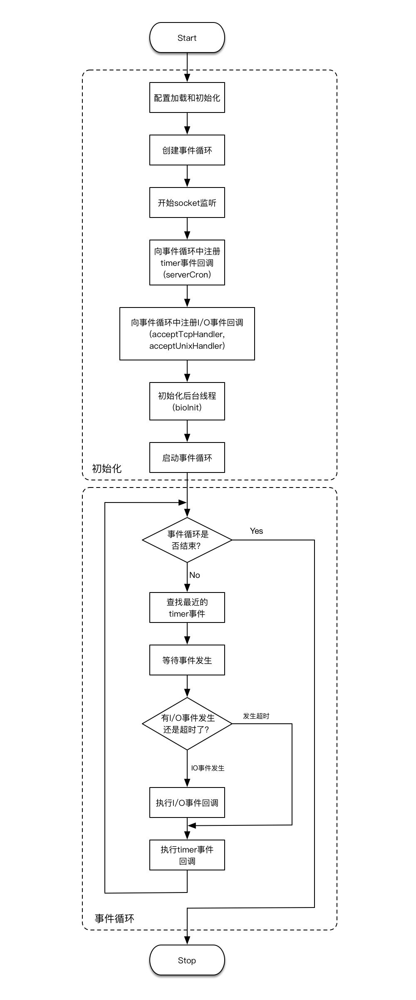

两张图的方式都差不多,展示了整个redis的过程

## 客户端

- cli命令行

  ```c
  typedef struct multiCmd {
      //参数
      robj **argv;
      //参数数量
      int argc;
      //命令指针
      struct redisCommand *cmd;
  } multiCmd;
  ```

- client结构(直接对于所有的数据结构进行了解释)

  ```c
  //I/O复用,所以需要为每个客户端维持一个状态,多个客户端在服务器用链表链接
  typedef struct client {
      //client的id
      uint64_t id;            /* Client incremental unique ID. */
      connection *conn;
      //协议版本
      int resp;               /* RESP protocol version. Can be 2 or 3. */
      //当前正在使用的数据库
      redisDb *db;            /* Pointer to currently SELECTed DB. */
      //客户端名字
      robj *name;             /* As set by CLIENT SETNAME. */
      //缓冲区,用于储存指令
      sds querybuf;           /* Buffer we use to accumulate client queries. */
      //在指令缓冲区中已经读到的位置
      size_t qb_pos;          /* The position we have read in querybuf. */
      sds pending_querybuf;   /* If this client is flagged as master, this buffer
                                 represents the yet not applied portion of the
                                 replication stream that we are receiving from
                                 the master. */
      //最近时间内缓冲区长度最大值
      size_t querybuf_peak;   /* Recent (100ms or more) peak of querybuf size. */
      //当前指令的参数数量
      int argc;               /* Num of arguments of current command. */
      //当前指令参数值
      robj **argv;            /* Arguments of current command. */
      //参数有可能是重写过的,记录了原来的参数数量
      int original_argc;      /* Num of arguments of original command if arguments were rewritten. */
      //参数有可能是重写过的,记录了原来的参数值
      robj **original_argv;   /* Arguments of original command if arguments were rewritten. */
      size_t argv_len_sum;    /* Sum of lengths of objects in argv list. */
      //记录客户端执行的命令
      struct redisCommand *cmd, *lastcmd;  /* Last command executed. */
      //与之前定义的user对应,从而赋予相应的权限,NULL是管理员
      user *user;             /* User associated with this connection. If the
                                 user is set to NULL the connection can do
                                 anything (admin). */
      //指令类型,一条指令还是多条(内联)
      int reqtype;            /* Request protocol type: PROTO_REQ_* */
      //还未读取的指令数量
      int multibulklen;       /* Number of multi bulk arguments left to read. */
      //未读指令的
      long bulklen;           /* Length of bulk argument in multi bulk request. */
      //回复链表
      list *reply;            /* List of reply objects to send to the client. */
      //回复链表中对象的总大小
      unsigned long long reply_bytes; /* Tot bytes of objects in reply list. */
      // 已发送字节，用于处理 short write 
      size_t sentlen;         /* Amount of bytes already sent in the current
                                 buffer or object being sent. */
      //创建客户端时间
      time_t ctime;           /* Client creation time. */
      long duration;          /* Current command duration. Used for measuring latency of blocking/non-blocking cmds */
      // 客户端最后一次和服务器互动的时间
      time_t lastinteraction; /* Time of the last interaction, used for timeout */
      time_t obuf_soft_limit_reached_time;
      //客户端状态CLIENT_*
      uint64_t flags;         /* Client flags: CLIENT_* macros. */
      int authenticated;      /* Needed when the default user requires auth. */
      //复制状态
      int replstate;          /* Replication state if this is a slave. */
      int repl_put_online_on_ack; /* Install slave write handler on first ACK. */
      // 用于保存主服务器传来的 RDB 文件的文件描述符
      int repldbfd;           /* Replication DB file descriptor. */
      // 读取主服务器传来的 RDB 文件的偏移量
      off_t repldboff;        /* Replication DB file offset. */
      // 主服务器传来的 RDB 文件的大小
      off_t repldbsize;       /* Replication DB file size. */
      sds replpreamble;       /* Replication DB preamble. */
      long long read_reploff; /* Read replication offset if this is a master. */
      // 主服务器的复制偏移量
      long long reploff;      /* Applied replication offset if this is a master. */
      // 从服务器最后一次发送 REPLCONF ACK 时的偏移量
      long long repl_ack_off; /* Replication ack offset, if this is a slave. */
      // 从服务器最后一次发送 REPLCONF ACK 的时间
      long long repl_ack_time;/* Replication ack time, if this is a slave. */
      long long repl_last_partial_write; /* The last time the server did a partial write from the RDB child pipe to this replica  */
      long long psync_initial_offset; /* FULLRESYNC reply offset other slaves
                                         copying this slave output buffer
                                         should use. */
      // 主服务器的 master run ID
      // 保存在客户端，用于执行部分重同步
      char replid[CONFIG_RUN_ID_SIZE+1]; /* Master replication ID (if master). */
      // 从服务器的监听端口号
      int slave_listening_port; /* As configured with: REPLCONF listening-port */
      char *slave_addr;       /* Optionally given by REPLCONF ip-address */
      int slave_capa;         /* Slave capabilities: SLAVE_CAPA_* bitwise OR. */
      //事务状态
      multiState mstate;      /* MULTI/EXEC state */
      //阻塞类型
      int btype;              /* Type of blocking op if CLIENT_BLOCKED. */
      //阻塞状态
      blockingState bpop;     /* blocking state */
      // 最后被写入的全局复制偏移量
      long long woff;         /* Last write global replication offset. */
      list *watched_keys;     /* Keys WATCHED for MULTI/EXEC CAS */
      // 这个字典记录了客户端所有订阅的频道
      // 键为频道名字，值为 NULL
      // 也即是，一个频道的集合
      dict *pubsub_channels;  /* channels a client is interested in (SUBSCRIBE) */
      // 链表，包含多个 pubsubPattern 结构
      // 记录了所有订阅频道的客户端的信息
      // 新 pubsubPattern 结构总是被添加到表尾
      list *pubsub_patterns;  /* patterns a client is interested in (SUBSCRIBE) */
      sds peerid;             /* Cached peer ID. */
      sds sockname;           /* Cached connection target address. */
      listNode *client_list_node; /* list node in client list */
      listNode *paused_list_node; /* list node within the pause list */
      RedisModuleUserChangedFunc auth_callback; /* Module callback to execute
                                                 * when the authenticated user
                                                 * changes. */
      void *auth_callback_privdata; /* Private data that is passed when the auth
                                     * changed callback is executed. Opaque for
                                     * Redis Core. */
      void *auth_module;      /* The module that owns the callback, which is used
                               * to disconnect the client if the module is
                               * unloaded for cleanup. Opaque for Redis Core.*/
  
      /* If this client is in tracking mode and this field is non zero,
       * invalidation messages for keys fetched by this client will be send to
       * the specified client ID. */
      uint64_t client_tracking_redirection;
      rax *client_tracking_prefixes; /* A dictionary of prefixes we are already
                                        subscribed to in BCAST mode, in the
                                        context of client side caching. */
      /* In clientsCronTrackClientsMemUsage() we track the memory usage of
       * each client and add it to the sum of all the clients of a given type,
       * however we need to remember what was the old contribution of each
       * client, and in which category the client was, in order to remove it
       * before adding it the new value. */
      uint64_t client_cron_last_memory_usage;
      int      client_cron_last_memory_type;
      /* Response buffer */
      // 回复偏移量
      int bufpos;
      size_t buf_usable_size; /* Usable size of buffer. */
      /* Note that 'buf' must be the last field of client struct, because memory
       * allocator may give us more memory than our apply for reducing fragments,
       * but we want to make full use of given memory, i.e. we may access the
       * memory after 'buf'. To avoid make others fields corrupt, 'buf' must be
       * the last one. */
      //回复缓冲区
      char buf[PROTO_REPLY_CHUNK_BYTES];
  } client;
  ```

  所有的client属性连成了一个链表,保存在redisServer的clients属性中,对于不同状态的client也有其他的链表保存.

  ```c
  struct redisServer {
  	//...
  	//链表,保存了所有的客户端状态
      list *clients;              /* List of active clients */
      //保存所有的待关闭客户端
      list *clients_to_close;     /* Clients to close asynchronously */
      //将要写的客户端列表
      list *clients_pending_write; /* There is to write or install handler. */
      //将要读的客户端列表(已经知道有指令输入了)
      list *clients_pending_read;  /* Client has pending read socket buffers. */
      //...
  };
  ```

### 客户端属性

包含通用属性(所有客户端执行基础功能都必须需要的)和特定功能(执行特定功能)相关的属性

- 套接字描述符uint64_t id;

  - 伪客户端:id为-1,载入AOF文件时使用,或者是执行Lua脚本中包含的redis命令
  - 普通客户端的id大于-1,表示是正常的客户端

- 名字robj *name;

  - 可有可无,一个robj对象,没有的时候指定为NULL

- 标志uint64_t flags;

  - 表示了当前客户端的角色和状态

  - 可以是单个也可以是多个标志的二进制取或.见CLIENT_*的定义可知,都是一位表示的

  - ```c#
    /* Client flags */
    //主从服务器进行复制时,相互都是客户端的关系,slave和master区分两个服务器
    #define CLIENT_SLAVE (1<<0)   /* This client is a replica */
    #define CLIENT_MASTER (1<<1)  /* This client is a master */
    //正在执行monitor指令,是一个从客户端
    #define CLIENT_MONITOR (1<<2) /* This client is a slave monitor, see MONITOR */
    //执行事务
    #define CLIENT_MULTI (1<<3)   /* This client is in a MULTI context */
    //客户端被阻塞
    #define CLIENT_BLOCKED (1<<4) /* The client is waiting in a blocking operation */
    //事务使用WATCH监视的数据库键已经被修改,EXEC执行过程中会直接fail
    #define CLIENT_DIRTY_CAS (1<<5)
    //用户对这个客户端执行了 CLIENT KILL命令或者客户端发送给服务器的命令中协议内容有误, 
    //服务器会将客户端积存在输出缓冲区中的所有内容发送给客户端,然后关闭客户端
    #define CLIENT_CLOSE_AFTER_REPLY (1<<6) /* Close after writing entire reply. */
    //从阻塞中解除,只有在之前阻塞过才可用
    #define CLIENT_UNBLOCKED (1<<7) /* This client was unblocked and is stored in
                                      server.unblocked_clients */
    //专门处理Lua脚本的客户端
    #define CLIENT_LUA (1<<8) /* This is a non connected client used by Lua */
    //客户端向集群节点（ 运行在集群模式下的服务器） 发送了ASKING 命令
    #define CLIENT_ASKING (1<<9)     /* Client issued the ASKING command */
    //客户端的输出缓冲区大小超出了服务器允许的范围，
    //服务器会在下一次执行 serverCron 函数时关闭这个客户端,以免影响服务器的稳定性
    //积存在输出缓冲区中的所有内容会直接被释放,不会返回给客户端.
    #define CLIENT_CLOSE_ASAP (1<<10)/* Close this client ASAP */
    //服务器使用 UNIX 套接字来连接客户端
    #define CLIENT_UNIX_SOCKET (1<<11) /* Client connected via Unix domain socket */
    //事务在命令入队时出现了错误, 和CLIENT_DIRTY_CAS 都表示了事务不安全,EXEC会执行失败
    #define CLIENT_DIRTY_EXEC (1<<12)  /* EXEC will fail for errors while queueing */
    //在主从服务器进行命令传播期间,从服务器需要向主服务器发送REPLICATION ACK命令
    //发送命令之前需要打开这个标志以允许发送操作执行
    #define CLIENT_MASTER_FORCE_REPLY (1<<13)  /* Queue replies even if is master */
    //执行PUBSUB指令时打开,强制服务器将当前执行的命令写人到 AOF 文件里面
    #define CLIENT_FORCE_AOF (1<<14)   /* Force AOF propagation of current cmd. */
    //执行SCRIPT LOADD指令时打开,强制主服务器将当前执行的命令复制给所有从服务器
    #define CLIENT_FORCE_REPL (1<<15)  /* Force replication of current cmd. */
    //主服务器不能使用PSYNC命令与当前低版本从服务器进行同步.
    //这个标志只能在 REDIS_SLAVE 标志处于打开状态时使用
    #define CLIENT_PRE_PSYNC (1<<16)   /* Instance don't understand PSYNC. */
    #define CLIENT_READONLY (1<<17)    /* Cluster client is in read-only state. */
    #define CLIENT_PUBSUB (1<<18)      /* Client is in Pub/Sub mode. */
    #define CLIENT_PREVENT_AOF_PROP (1<<19)  /* Don't propagate to AOF. */
    #define CLIENT_PREVENT_REPL_PROP (1<<20)  /* Don't propagate to slaves. */
    #define CLIENT_PREVENT_PROP (CLIENT_PREVENT_AOF_PROP|CLIENT_PREVENT_REPL_PROP)
    #define CLIENT_PENDING_WRITE (1<<21) /* Client has output to send but a write
                                            handler is yet not installed. */
    #define CLIENT_REPLY_OFF (1<<22)   /* Don't send replies to client. */
    #define CLIENT_REPLY_SKIP_NEXT (1<<23)  /* Set CLIENT_REPLY_SKIP for next cmd */
    #define CLIENT_REPLY_SKIP (1<<24)  /* Don't send just this reply. */
    #define CLIENT_LUA_DEBUG (1<<25)  /* Run EVAL in debug mode. */
    #define CLIENT_LUA_DEBUG_SYNC (1<<26)  /* EVAL debugging without fork() */
    #define CLIENT_MODULE (1<<27) /* Non connected client used by some module. */
    #define CLIENT_PROTECTED (1<<28) /* Client should not be freed for now. */
    #define CLIENT_PENDING_READ (1<<29) /* The client has pending reads and was put
                                           in the list of clients we can read
                                           from. */
    #define CLIENT_PENDING_COMMAND (1<<30) /* Indicates the client has a fully
                                            * parsed command ready for execution. */
    #define CLIENT_TRACKING (1ULL<<31) /* Client enabled keys tracking in order to
                                       perform client side caching. */
    #define CLIENT_TRACKING_BROKEN_REDIR (1ULL<<32) /* Target client is invalid. */
    #define CLIENT_TRACKING_BCAST (1ULL<<33) /* Tracking in BCAST mode. */
    #define CLIENT_TRACKING_OPTIN (1ULL<<34)  /* Tracking in opt-in mode. */
    #define CLIENT_TRACKING_OPTOUT (1ULL<<35) /* Tracking in opt-out mode. */
    #define CLIENT_TRACKING_CACHING (1ULL<<36) /* CACHING yes/no was given,
                                                  depending on optin/optout mode. */
    #define CLIENT_TRACKING_NOLOOP (1ULL<<37) /* Don't send invalidation messages
                                                 about writes performed by myself.*/
    #define CLIENT_IN_TO_TABLE (1ULL<<38) /* This client is in the timeout table. */
    #define CLIENT_PROTOCOL_ERROR (1ULL<<39) /* Protocol error chatting with it. */
    #define CLIENT_CLOSE_AFTER_COMMAND (1ULL<<40) /* Close after executing commands
                                                   * and writing entire reply. */
    #define CLIENT_DENY_BLOCKING (1ULL<<41) /* Indicate that the client should not be blocked.
                                               currently, turned on inside MULTI, Lua, RM_Call,
                                               and AOF client */
    #define CLIENT_REPL_RDBONLY (1ULL<<42) /* This client is a replica that only wants RDB without replication buffer. */
    ```

    

  - PUBSUB命令:本身不修改数据库,但是向频道的所有订阅者发送消息的行为带有副作用， 接收到消息的所有客户端的状态都会因为这个命令而改变,所以也需要写入AOF.

  - SCRIPT LOAD命令:类似的,它修改了服务器状态,也带有副作用,同时因为涉及到主从服务器,CLIENT_FORCE_REPL将指令发给所有的从服务器.

- 输入缓冲区

  - ```c#
    typedef struct client {
    	//缓冲区,用于储存指令
        sds querybuf;           /* Buffer we use to accumulate client queries. */
    }client;
    ```

    

  - 保存用户发送的命令请求,根据输入内容动态变化大小

- 命令和命令参数

  - ```c
    typedef struct client {
    	//当前指令的参数数量
        int argc;               /* Num of arguments of current command. */
        //当前指令参数值
        robj **argv;            /* Arguments of current command. */
        //参数有可能是重写过的,记录了原来的参数数量
        int original_argc;      /* Num of arguments of original command if arguments were rewritten. */
        //参数有可能是重写过的,记录了原来的参数值
        robj **original_argv;   /* Arguments of original command if arguments were rewritten. */
        size_t argv_len_sum;    /* Sum of lengths of objects in argv list. */
        
    }client;
    ```

- 命令实现函数

  - ```c
    typedef struct client {
    	//记录客户端执行的命令
        struct redisCommand *cmd, *lastcmd;  /* Last command executed. */
    }client;
    ```

    

  - 根据项argv[0] 的值,在命令表中査找命令所对应的命令实现函数,找到之后将客户端状态的cmd执行那个在命令表之中的这个结构,这个结构保存了命令的实现函数、 命令的标志 、 命令应该给定的参数个数、 命令的总执行次数和总消耗时长等统计信息  

- 输出缓冲区

  - 

    ```c
    typedef struct client {
        //...
    	/* Response buffer */
        // 回复偏移量
        int bufpos;
        size_t buf_usable_size; /* Usable size of buffer. */
        /* Note that 'buf' must be the last field of client struct, because memory
         * allocator may give us more memory than our apply for reducing fragments,
         * but we want to make full use of given memory, i.e. we may access the
         * memory after 'buf'. To avoid make others fields corrupt, 'buf' must be
         * the last one. */
        //回复缓冲区,放在最后,因为内存分配的时候可能多给了一些内存,实际上并没有用到
        char buf[PROTO_REPLY_CHUNK_BYTES];
    } client;
    ```

  - 当 buf 数组的空间已经用完,或者回复因为太大而没办法放进 buf 数组里面时， 服务器就会开始使用可变大小缓冲区`list *reply;`,一个链表连接多个字符串对象,可以保存很长的回复信息

- 身份验证

  - int authenticated;
  - 启用了身份验证之后,当属性为0时,除了AUTH指令,其他指令都会被拒绝.

- 时间

  - ```c
    	//创建客户端时间
        time_t ctime;           /* Client creation time. */
        long duration;          /* Current command duration. Used for measuring latency of blocking/non-blocking cmds */
        // 客户端最后一次和服务器互动的时间	,即客户端空转时间
        time_t lastinteraction; /* Time of the last interaction, used for timeout */
    	//达到buf软性限制的时间,太长的话会被kill
        time_t obuf_soft_limit_reached_time;
    ```

- 限制缓冲区大小

  - 硬性限制（ hard limit ): 如果输出缓冲区的大小超过了硬性限制所设置的大小， 那么服务器立即关闭客户端。
  - 软性限制（ softlimit ): 如果输出缓冲区的大小超过了软性限制所设置的大小， 但还没超过硬性限制， 那么服务器将使用客户端状态结构的 `obuf_soft_limit_
    reached_time `属性记录下客户端到达软性限制的起始时间； 之后服务器会继续监视客户端， 如果输出缓冲区的大小一直超出软性限制， 并且持续时间超过服务器设定的时长， 那么服务器将关闭客户端;如果不再超过的话就直接清零属性值,不关闭客户端

### 客户端的类型

- 普通客户端
  - 直接按照之前的模式执行相关程序即可

- Lua脚本的伪客户端
  - Lua_client 伪客户端在服务器初始化的时候就创建了,服务器运行的整个生命期中会一直存在,服务器被关闭时， 这个客户端才会被关闭

## 服务器

### 命令请求的执行过程

#### 发送请求

Redis 服务器的命令请求来自 Redis 客户端， 当用户在客户端中键人一个命令请求时，客户端会将这个命令请求转换成协议格式， 然后通过连接到服务器的套接字， 将协议格式的命令请求发送给服务器


#### 读取请求

客户端与服务器之间的连接套接字因为客户端的写入而变得可读,服务器将调用命令请求处理器:

1. 读取套接字中协议格式的命令请求， 并保存到客户端的输入缓冲区里面
2. 对输入缓冲区中的命令请求进行分析， 提取出命令请求中包含的命令参数， 以及命
   令参数的个数， 然后分别将参数和参数个数保存到客户端的argv属性和argc 属性里面
3. 调用命令执行器， 执行客户端指定的命令  

#### 命令执行

##### 查找命令实现

根据客户端状态的 argv [ 0 ] 参数， 在命令表中查找参数所指定的命令， 并将找到的命令保存到客户端的 cmd 属性.

> 命令表(redisCommandTable)是一个字典,键是命令名字,值是redisCommand结构,记录了命令的实现信息

##### 执行预备操作

检查上一步执行结果和执行命令的环境,权限等

##### 调用命令实现函数

执行`client->cmd->proc(client);`,执行函数之后产生相应的命令回复,保存在客户端状态的输出缓冲区(buf和reply)

##### 执行后续工作

记录日志等后续

#### 将回复发送给客户端

命令实现函数会将命令回复保存到客户端的输出缓冲区里面， 并为客户端的套接字关联命令回复处理器， 当客户端套接字变为可写状态时， 服务器就会执行命令回复处理器， 将保存在客户端输出缓冲区中的命令回复发送给客户端。  发送完之后将缓冲区清空.

#### 客户端接受并打印命令回复


#### 例子

SET KEY VALUE

1. 先由客户端转换成协议`*3\r\n$3\r\nSET\r\n$3\r\nKEY\r\n$5\r\nVALUE\r\n  `并发送给服务器

2. 

3. 命令执行过程

   1. 查找命令实现

      

   2. 调用实现函数

      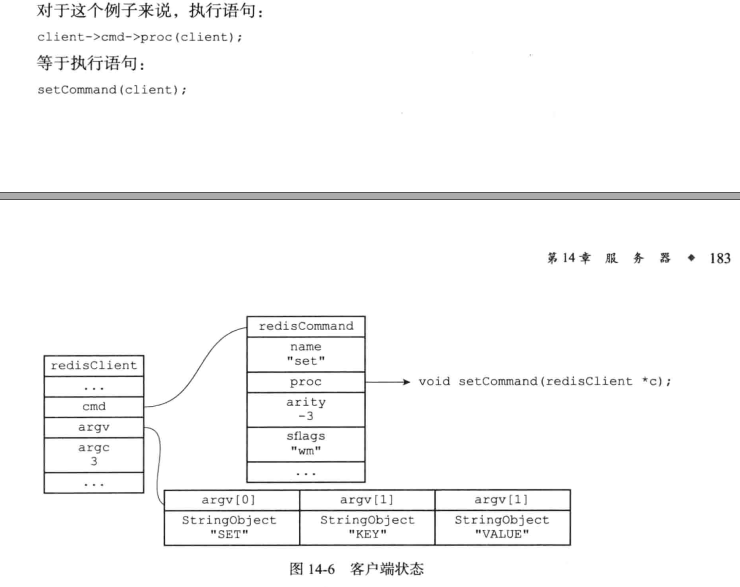

   3. 保存回复到缓冲区

      

4. 将`+OK\r\n`发送给客户端

5. 客户端转换格式为`OK\n`并显示

### serverCron函数

- 默认每隔 100 毫秒执行一次

- 负责管理服务器的资源， 并保持服务器自身的良好运转

- 更新的内容:

  - 更新服务器时间缓存

    实时获取系统当前时间开销比较大,对于时间精度要求不是很高的使用地方使用缓存时间就可以.

    ```c
    //保存秒级精度的系统当前UNIX时间戳
    redisAtomic time_t unixtime;
    //毫秒级精度的当前时间戳
    mstime_t mstime;            
    //微秒级精度的当前时间戳
    ustime_t ustime;
    ```

    serverCron就是定时更新时间缓存的

  - 更新LRU时钟

  - 更新redis对象的空转时长属性

  - 更新服务器每秒执行命令次数

    嵌套调用的trackOperationsPerSecond函数抽样调查服务器一秒执行命令数量

    ```c
    //抽样记录服务器每秒执行的命令数量
        struct {
            long long last_sample_time; /* Timestamp of last sample in ms */
            long long last_sample_count;/* Count in last sample */
            long long samples[STATS_METRIC_SAMPLES];
            int idx;
        } inst_metric[STATS_METRIC_COUNT];
    ```

    每次执行和上次执行的记录结果做比较,估算这一秒的执行情况

  - 更新服务器内存峰值记录

    ```
    size_t stat_peak_memory;//已用内存峰值
    ```

    查看使用的内存数量,记录使用时的最大值

  - 处理sigterm信号

    为信号关联处理器sigtermHandler函数,负责在服务器接到sigterm信号的时候根据shutdown_asap决定是否关闭服务器(关闭之前先完成持久化操作)

  - 管理客户端资源

    clientsCron函数对客户端进行检查,连接是否超时,输入缓冲区是否过大.

  - 管理数据库资源

    databasesCron函数对数据库和其中的过期键,字典进行检查

  - 执行被延迟的BGREWRITEAOGF

    在服务器执行bgsave命令的期间， 如果客户端向服务器发来 BGREWRITEAOF 命令，那 么 服 务 器 会 将 命 令 的 执 行 时 间 延 迟 到 bgsave命 令 执 行 完 毕 之 后 

### 初始化服务器

#### 初始化状态结构

创建一个`struct redisServer`实例变量,设置默认值,创建命令表

主要由initServerConfig函数完成

#### 载入配置选项

根据redis.config文件或者启动时指定的配置项配置其他选项

#### 初始化服务器数据结构

创建服务器需要的除命令表之外的其他数据结构,需要用到之前的配置信息

initServre负责初始化这些数据结构和一些其他的设置操作,包括:

- 为服务器设置进程信号处理器。
- 创建共享对象： 这些对象包含 Redis 服务器经常用到的一些值， 比如包含"OK"和"ERR"回复的字符串对象， 包含整数 1 到 10000 的字符串对象等等， 服务器通过重用这些共享对象来避免反复创建相同的对象。
- 打开服务器的监听端口， 并为监听套接字关联连接应答事件处理器， 等待服务器正
  式运行时接受客户端的连接。
- 为 serverCron 函数创建时间事件， 等待服务器正式运行时执行 serverCron 函数。
- 如果 AOF 持久化功能已经打开， 那么打开现有的 AOF 文件， 如果 AOF 文件不存在，
  那么创建并打开一个新的 AOF 文件， 为 AOF 写入做好准备。
- 初始化服务器的后台 I/O 模块（ bio )， 为将来的 I/O 操作做好准备  

#### 还原数据库状态

载入AOF或者RDB文件

#### 执行事件循环

打开事件循环,之后就可以接受命令

# 多机数据库实现

## 复制

SLAVEOF可以让从服务器复制主服务器的内容,二者保存的数据是一致的

### 旧版复制功能

以前直接在重连的时候复制整个数据库的RDB文件,bgsave开销非常大(相当于重新执行了一次sync,期间对于主服务器不能执行其他命令,需要保存在缓冲区)


执行SYNC命令:

- 主服务器需要执行BGSAVE命令来生成 RDB 文件， 这个生成操作会耗费主服务器大量的 CPU、 内存和磁盘 I/O 资源。
- 主服务器需要将自己生成的 RDB 文件发送给从服务器， 这个发送操作会耗费主从服务器大量的网络资源（ 带宽和流量 ）， 并对主服务器响应命令请求的时间产生影响。
- 接收到 RDB 文件的从服务器需要载入主服务器发来的 RDB 文件， 并且在载入期间， 从服务器会因为阻塞而没办法处理命令请求。  

每次主服务器改数据库之后都要传播该条命令

### 新版复制功能

使用PSYNC实现

- 完整重同步:初始复制主服务器,与之前的SYNC没有什么不同
- 部分重同步:断线后重连复制,条件允许时直接将断开连接期间的写命令发给从服务器.

重连之后从服务器发送PSYNC命令,主服务器向从服务器返回+CONTINUE回复,表示执行部分重同步,从服务器接受回复,准备执行部分重同步,主服务器发送断线期间的写命令,从服务器接受并执行,完成同步

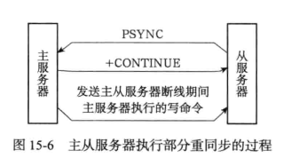

#### 复制偏移量

主从服务器都会维护复制偏移量,主服务器发送n数据,从服务器接受n数据,都会分别给自己的复制偏移量添加n.

如果master和slave的偏移量是相同的，那么主从数据处于一致的状态

#### 复制积压缓冲区

主服务器维护的一个FIFO队列,固定默认1MB大小

当master向slave传播命令时，会将命令**写入到复制积压缓冲区**,复制积压缓冲区记录了最近向slave传播的命令；并且为每个字节记录了相应的复制偏移量

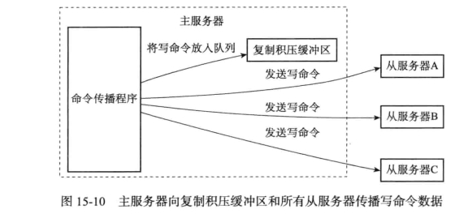


当slave断线后重新连接master时，向master发送PSYNC命令会将自己的复制偏移量发送给master。

master会根据这个偏移量决定对slave执行**部分同步**还是**完全同步；**

- slave的偏移量在复制积压缓冲区，执行部分同步 ；
- slave的偏移量不在复制积压缓冲区，则执行完全同步；

#### 服务器运行ID

slave对master初次复制时，会保存master的运行id；

- 当slave重新连接到master时，slave向master发送之前保存的mater run id；

- 如果slave保存的master run id和重新连接的master run id不一致，（换了master），则执行完全同步；

相反，如果一致则尝试执行部分同步

### PSYNC执行过程

**PSYNC命令调用方式有两种：**

1. **`PSYNC ? -1` 全量复制**
   当从服务没有复制过主服务器，或者从服务执行过`SLAVEOF NO ONE`命令（取消复制），那么从服务将发送`PSYNC ？-1`命令；

2. **`PSYNC <runid> <offset> `部分复制**
   从服务已经复制过主服务器，那么从服务将向主服务器发送`PSYNC <runid> <offset>`， runid是主服务器的id，offset服务器当前的偏移量；

   主服务器接受到`PSYNC <runid> <offset>` 命令后，主服务会判断是否能“部分同步”，向从服务回复相应的命令；

**主服务向从服务的三种回复：**

1. **`+FULLRESYNC <runid> <offset>` 执行完全重同步；**
2. **`+CONTINUE` 执行部分重同步；**
3. **`-ERR` 不支持psync同步操作，从服务将发送sync命令到主服务器,执行完全重同步；**


注意图片有个情况没写出来

1. 设置主服务器的地址和端口

   通过向从服务器发送SLAVE命令，可以让一个从服务器去复制一个主服务器

   slaveof要做的主要是给“从服务”设置的“主服务”地址和端口，会保存到从服务器的**masterhost**和**masterport**属性中(**replication.c/replicaofCommand**)

   slaveof是一个异步命令，完成设置后，会给客户端返回OK; 实际复制工作将在OK返回后真正开始执行；

   执行`SLAVEOF 127.0.0.1 6379`,设置好之后

   

2. 建立套接字连接

   根据前一步保存的属性开始连接主服务器套接字(**server.c/serverCron** > **replication.c/replicationCron** > **replication.c/connectWithMaster**)

   如果从服务和主服务器连接成功，从服务器会给这个套接字关联一个处理复制工作的文件处理器(**replication.c/syncWithMaster**),处理器完成后续工作,包括接受RDB文件,接受后续传来的写命令

   主服务器在接受（ accept ) 从服务器的套接字连接之后， 将为该套接字创建相应的客户端状态， 并将从服务器看作是一个连接到主服务器的客户端来对待， 这时从服务器将同时具有服务器和客户端两个身份. 

   

3. 发送ping命令

   - 检查套接字连接情况
   - 检查主服务器是否能正常处理命令

   

4. 身份验证

   - 如果从服务器设置了 masterauth 选项， 那么进行身份验证。
   - 如果从服务器没有设置 masterauth 选项， 那么不进行身份验证。

   

5. 发送端口信息

   从服务将执行`REPLCONF listen-port <port-number>`，向主服务器发送从服务监听的端口号

   

   主服务器接受到这个命令后，将从服务的端口号记录到客户端状态中的 slave_listening_port属性中

   

     

6. 同步

   从服务器向主服务器发送PSYNC命令

   在同步操作执行之前， 只有从服务器是主服务器的客户端， 但是在执行同步操作之后， 他们互为客户端,因为主服务器也需要发送写命令给从服务器

   

   

7. 命令传播

   写命令传播给从服务器

### 心跳检测

在命令传播阶段，从服务默认每秒一次的频率向主服务器发送 `REPLCONF ACK <replicaiotn_offset> `(`replication_offset`是当前从服务器的复制偏移量)

心跳检测的代码入口位于：`server.c/serverCron > replication.c/replicationCron >  replication.c/replicationSendAck`

#### **检测与主服务的网络连接状态**

主从服务器通过发送和接受`REPLCONF` 命令检查网络连接是否正常；
如果从服务器超过一秒没有接收到从服务的`REPLCONF` 命令，主服务器就知道从服务连接出了问题； 

主服务器对每个从服务器保存一个lag值记录上次收到心跳包的时间

#### **辅助实现min-slave选项**

redis的`min-slave-to-write`和`min-salve-max-lag`可以防止主服务在不安全的情况下执行写命令；

例如 主服务的min-slave-to-write和min-salve-max-lag配置如下：
min-salve-max-lag 10
min-slave-to-write 3

那么从服务的数量少于3个，或者3个从服务的延时（lag）值大于等于10秒时，主服务都不能执行写命令；

#### **检测命令丢失**

如果因为网络原因，主服务传播给从服务的命令丢失了。那么当从服务向主服务器放松RELPCONF ACK 命令时，主服务会发觉 从服务 的复制偏移量少于主服务的复制偏移量；

然后主服务会将丢失的部分发送给从服务器(这里是没有断线的部分重同步,与断线之后的PSYNC区分)


## 哨兵Sentinel

Sentinel节点本质上是一个特殊的Redis节点

它可以监视任意多个主服务器以及这些主服务器属下的所有从服务器，并在被监视的主服务器进人下线状态时(根据ping的时间间隔判断是否是下线了)， 自动将下线主服务器属下的某个从服务器升级为新的主服务器， 然后由新的主服务器代替已下线的主服务器继续处理命令请求  


当 serverl 的下线时长超过用户设定的下线时长上限时， Sentinel 系统就会对server1 执行故障转移操作：

- 首先， Sentinel 系统会挑选 server1属下的其中一个从服务器， 并将这个被选中的从服务器升级为新的主服务器。  
- 之后， Sentinel 系统会向 serverl 属下的所有从服务器发送新的复制指令， 让它们成为新的主服务器的从服务器， 当所有从服务器都开始复制新的主服务器时， 故障转移操作执行完毕。
- 另外， Sentinel 还会继续监视已下线的 serverl， 并在它重新上线时， 将它设置为新的主服务器的从服务器。  

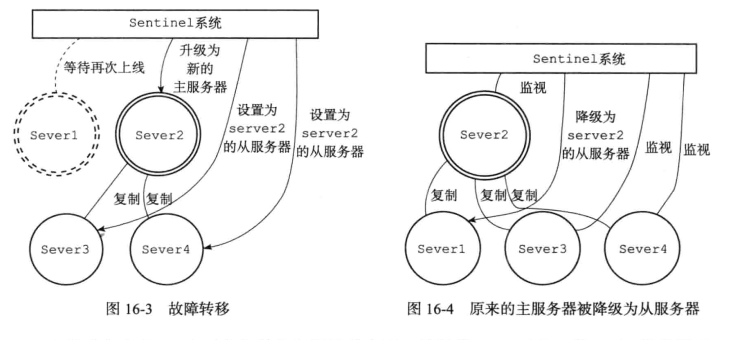

### 网络连接

每个Sentinel实例会维护与所监测的主从实例之间的两个连接，分别是命令连接（Command Connection）和发布/订阅连接（Pub/Sub Connection）。但是**Sentinel和其他Sentinel之间只有一个命令连接**。

#### 命令连接

Sentinel维护命令连接是为了与其他主从实例以及Sentinel实例通过发送接收命令的方式进行通信

作用包括：

1. Sentinel会默认以每1s间隔发送PING 命令给其他实例以主观判断其他实例是否下线。
2. Sentinel会通过Sentinel和主实例之间的命令连接每隔10s发送INFO命令给主从实例以得到主实例和从实例的最新信息。
3. 在主实例下线的情况下，Sentinel会通过Sentinel和从实例的命令连接发送SLAVEOF NO ONE命令给选定的从实例从而使从实例提升为新的主节点。
4. Sentinel会默认每隔1s发送is-master-down-by-addr命令以询问其他Sentinel节点关于监控的主节点是否下线。

实现函数sentinel.c/sentinelReconnectInstance

#### 发布/订阅连接

Sentinel维护和其他主从节点的发布/订阅连接作用是为了获知其他监控相同主从实例的Sentinel实例的存在，并且从其他Sentinel实例中更新对所监控的主从实例以及发送的Sentinel实例的认知。例如在故障转移完成后，其他Sentinel通过读取领头Sentinel的频道消息来更新新的主节点的相关信息（地址，端口号等）。

Sentinel在默认每隔2秒钟会发送Hello消息包到其对应的主从实例的\__sentinel__:hello频道中。Hello消息格式如下：

```bash
__sentinel__:hello <sentinel地址> <sentinel端口号> <sentinel运行id> <sentinel配置纪元> <主节点名字 > <主节点地址> <主节点端口号> <主节点配置纪元>
```

当Sentinel通过订阅连接收到其他Sentinel发送的的Hello包时，会更新对主从节点以及发送Sentinel的实例，如果收到自己发送的Hello包，则简单的丢弃不做任何处理。

处理hello信息实现函数sentinel.c/sentinelProcessHelloMessage

发布/订阅连接实现函数sentinel.c/sentinelReconnectInstance

### 初始化

sentinel本质是一个特殊模式的redis的服务器，代码的入口一样位于server.c/main函数

与普通的节点有不同:

**sertinet.c/initSentinelConfig()**函数将会覆盖普通redis服务器的一些默认配置

```c
/**
 * 此函数用于设置Sentinel的默认值
 * 覆盖普通redis config默认值。
 */ 
/* This function overwrites a few normal Redis config default with Sentinel
 * specific defaults. */
void initSentinelConfig(void) {
    //使用26379作为sentinel的默认端口
    server.port = REDIS_SENTINEL_PORT; 
    server.protected_mode = 0; /* Sentinel must be exposed. */
}
```


使用**sentinel.c/sentinelcmds**作为sentinel的命令表

```c
//sentinel 模块初始化
/* Perform the Sentinel mode initialization. */
void initSentinel(void) {
    unsigned int j;
 
    // 清空常用命令；只添加sentinel 命令
    /* Remove usual Redis commands from the command table, then just add
     * the SENTINEL command. */
    dictEmpty(server.commands,NULL);
    for (j = 0; j < sizeof(sentinelcmds)/sizeof(sentinelcmds[0]); j++) {
        int retval;
        struct redisCommand *cmd = sentinelcmds+j;
 
        retval = dictAdd(server.commands, sdsnew(cmd->name), cmd);
        serverAssert(retval == DICT_OK);
    }
 
    //......
    //初始化各种数据结构
    //......
}
 
 
//所有sentinel可以执行的命令
struct redisCommand sentinelcmds[] = {
    {"ping",pingCommand,1,"fast @connection"},
    {"sentinel",sentinelCommand,-2,"admin"},
    {"subscribe",subscribeCommand,-2,"pub-sub"},
    {"unsubscribe",unsubscribeCommand,-1,"pub-sub"},
    {"psubscribe",psubscribeCommand,-2,"pub-sub"},
    {"punsubscribe",punsubscribeCommand,-1,"pub-sub"},
    {"publish",sentinelPublishCommand,3,"pub-sub fast"},
    {"info",sentinelInfoCommand,-1,"random @dangerous"},
    {"role",sentinelRoleCommand,1,"fast read-only @dangerous"},
    {"client",clientCommand,-2,"admin random @connection"},
    {"shutdown",shutdownCommand,-1,"admin"},
    {"auth",authCommand,-2,"no-auth fast @connection"},
    {"hello",helloCommand,-1,"no-auth fast @connection"},
    {"acl",aclCommand,-2,"admin"},
    {"command",commandCommand,-1, "random @connection"}
};
```


初始化sentinel状态

接下来服务器会初始化一个**sentinel.c/sentinelState**，用于保存所有与sentinel功能有关的状态(redisServer保存了一般的状态)

```c
 
/**
 * sentinel 状态 
*/
/* Main state. */
struct sentinelState {
    char myid[CONFIG_RUN_ID_SIZE+1]; /* This sentinel ID. */
    uint64_t current_epoch;         /* Current epoch. */ //当前纪元用户实现故障转移
 
    /**
     * 当前哨兵监听的所有master字典
     * key是实例名，value是指向sentinelRedisInstance 结构的指针
     */ 
    dict *masters;      /* Dictionary of master sentinelRedisInstances.
                           Key is the instance name, value is the
                           sentinelRedisInstance structure pointer. */
    //是否进入了TILT模式                                          
    int tilt;           /* Are we in TILT mode? */
    //目前正在执行的脚本数量
    int running_scripts;    /* Number of scripts in execution right now. */
    //进入tilt模式的时间
    mstime_t tilt_start_time;       /* When TITL started. */
    //最后一次执行处理器的时间
    mstime_t previous_time;         /* Last time we ran the time handler. */
    //FIFO队列，包含所有需要执行的用户脚本
    list *scripts_queue;            /* Queue of user scripts to execute. */
    char *announce_ip;  /* IP addr that is gossiped to other sentinels if
                           not NULL. */
    int announce_port;  /* Port that is gossiped to other sentinels if
                           non zero. */
    unsigned long simfailure_flags; /* Failures simulation. */
    int deny_scripts_reconfig; /* Allow SENTINEL SET ... to change script
                                  paths at runtime? */
} sentinel;
 
 
 
//sentinel 模块初始化
/* Perform the Sentinel mode initialization. */
void initSentinel(void) {
    unsigned int j;
    //...............
    // 清空常用命令；只添加sentinel 命令
    //..............
 
    //初始化各种数据结构
    /* Initialize various data structures. */
    sentinel.current_epoch = 0;
    sentinel.masters = dictCreate(&instancesDictType,NULL);
    sentinel.tilt = 0;
    sentinel.tilt_start_time = 0;
    sentinel.previous_time = mstime();
    sentinel.running_scripts = 0;
    sentinel.scripts_queue = listCreate();
    sentinel.announce_ip = NULL;
    sentinel.announce_port = 0;
    sentinel.simfailure_flags = SENTINEL_SIMFAILURE_NONE;
    sentinel.deny_scripts_reconfig = SENTINEL_DEFAULT_DENY_SCRIPTS_RECONFIG;
    memset(sentinel.myid,0,sizeof(sentinel.myid));
}
```

初始化sentinel状态的master属性

sentinelState状态中的master属性记录所有被sentinel监视的所有相关信息；

- sentinelState.masters的结构是hash；
- 字典键的被监视主服务的名字；
- 字典值则是 sentinel.c/sentinelRedisInstance结构体；

根据sentinel启动时的指定的配置项或者配置文件来初始化

如果按照下图指定:


则最后的字典值为:

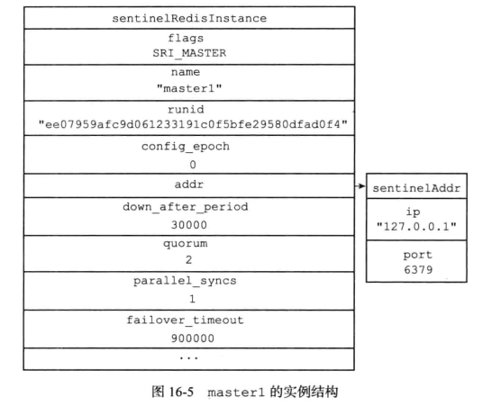


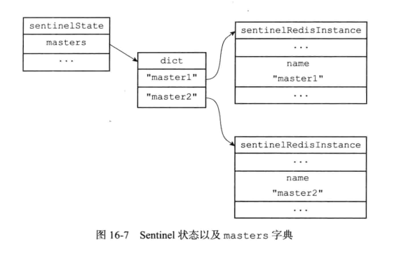

创建与主服务器的网络连接

sentinel会与被监控的master建立连接，sentinel将会成为master的客户端

sentinel会创建两个连接向master的异步网络连接：

- 一个是命令连接，用于向master发送命令并接受回复
- 一个是订阅连接，用于订阅master的`__sentinel__:hello`频道

> **为什么要有两个连接**
>
> 目前发布和订阅的功能，被发送的信息都不会保存在服务器里面；
>
> 如果发送时接受信息的客户端不在线，那么客户端就会丢失这条数据；为了不丢失`__sentinel__:hello`频道的任何信息，所以sentinel必须创建一个订阅连接来接受消息
>
> 因为是多个连接,所以必须是异步的
>
> **创建入口：**
> server.c/main -> server.c/serverCron() -> sentinel.c/sentinelTimer -> sentinel.c/sentinelHandleDictOfRedisInstances() -> sentinel.c/sentinelHandleRedisInstance

```c
//对于特定的redis实例执行预操作
/* Perform scheduled operations for the specified Redis instance. */
void sentinelHandleRedisInstance(sentinelRedisInstance *ri) {
    /* ========== MONITORING HALF ============ */
    /* Every kind of instance */
    //监控所有类型的实例(master,slave,sentinel)
    sentinelReconnectInstance(ri);
    sentinelSendPeriodicCommands(ri);

    /* ============== ACTING HALF ============= */
    /* We don't proceed with the acting half if we are in TILT mode.
     * TILT happens when we find something odd with the time, like a
     * sudden change in the clock. */
    //对于tilt模式下哨兵已经不可信,这时候检测是否时钟恢复正常,如果正常就推出tilt模式
    if (sentinel.tilt) {
        if (mstime()-sentinel.tilt_start_time < sentinel_tilt_period) return;
        sentinel.tilt = 0;
        sentinelEvent(LL_WARNING,"-tilt",NULL,"#tilt mode exited");
    }

    /* Every kind of instance */
    sentinelCheckSubjectivelyDown(ri);

    /* Masters and slaves */
    if (ri->flags & (SRI_MASTER|SRI_SLAVE)) {
        /* Nothing so far. */
    }

    /* Only masters */
    if (ri->flags & SRI_MASTER) {
        sentinelCheckObjectivelyDown(ri);
        if (sentinelStartFailoverIfNeeded(ri))
            sentinelAskMasterStateToOtherSentinels(ri,SENTINEL_ASK_FORCED);
        sentinelFailoverStateMachine(ri);
        sentinelAskMasterStateToOtherSentinels(ri,SENTINEL_NO_FLAGS);
    }
}
```


### 获取主服务器信息

sentinel默认每10s一次频率向 master & slale发送info命令

实现的入口:(server.c/main -> server.c/serverCron() -> sentinel.c/sentinelTimer -> sentinel.c/sentinelHandleDictOfRedisInstances() -> sentinel.c/sentinelSendPeriodicCommands)

```c
/**
 * 定期向指定的slave或master发送PING、INFO, 发布到消息到 “订阅”的channel
 */
//类似于心跳检测
/* Send periodic PING, INFO, and PUBLISH to the Hello channel to
 * the specified master or slave instance. */
void sentinelSendPeriodicCommands(sentinelRedisInstance *ri) {
    mstime_t now = mstime();
    mstime_t info_period, ping_period;
    int retval;

    /* Return ASAP if we have already a PING or INFO already pending, or
     * in the case the instance is not properly connected. */
    if (ri->link->disconnected) return;

    /* For INFO, PING, PUBLISH that are not critical commands to send we
     * also have a limit of SENTINEL_MAX_PENDING_COMMANDS. We don't
     * want to use a lot of memory just because a link is not working
     * properly (note that anyway there is a redundant protection about this,
     * that is, the link will be disconnected and reconnected if a long
     * timeout condition is detected. */
    if (ri->link->pending_commands >=
        SENTINEL_MAX_PENDING_COMMANDS * ri->link->refcount) return;

    /* If this is a slave of a master in O_DOWN condition we start sending
     * it INFO every second, instead of the usual SENTINEL_INFO_PERIOD
     * period. In this state we want to closely monitor slaves in case they
     * are turned into masters by another Sentinel, or by the sysadmin.
     *
     * Similarly we monitor the INFO output more often if the slave reports
     * to be disconnected from the master, so that we can have a fresh
     * disconnection time figure. */
    //对于一个处于客观判断下线的slave,每秒发送info,避免被转换成了master
    //同时也检测其真实下线时间
    //todo:这里其实消耗的资源会比较多,有没有更好的解决办法
    if ((ri->flags & SRI_SLAVE) &&
        ((ri->master->flags & (SRI_O_DOWN|SRI_FAILOVER_IN_PROGRESS)) ||
         (ri->master_link_down_time != 0)))
    {
        info_period = 1000;
    } else {
        info_period = sentinel_info_period;
    }

    /* We ping instances every time the last received pong is older than
     * the configured 'down-after-milliseconds' time, but every second
     * anyway if 'down-after-milliseconds' is greater than 1 second. */
    ping_period = ri->down_after_period;
    if (ping_period > sentinel_ping_period) ping_period = sentinel_ping_period;

    /* Send INFO to masters and slaves, not sentinels. */
    //向master和slave发送info命令
    if ((ri->flags & SRI_SENTINEL) == 0 &&
        (ri->info_refresh == 0 ||
        (now - ri->info_refresh) > info_period))
    {
        retval = redisAsyncCommand(ri->link->cc,
            sentinelInfoReplyCallback, ri, "%s",
            sentinelInstanceMapCommand(ri,"INFO"));
        if (retval == C_OK) ri->link->pending_commands++;
    }

    /* Send PING to all the three kinds of instances. */
    //对所有的实例发送ping
    if ((now - ri->link->last_pong_time) > ping_period &&
               (now - ri->link->last_ping_time) > ping_period/2) {
        sentinelSendPing(ri);
    }

    /* PUBLISH hello messages to all the three kinds of instances. */
    //向订阅的频道发布信息
    if ((now - ri->last_pub_time) > sentinel_publish_period) {
        sentinelSendHello(ri);
    }
}
```


通过解析maser返回Info命令信息，获取master的当前信息；

- 一方面获取master的信息，包括run_id、角色、地址等；
- 另一方面获取master下所有slave服务器信息；

根据这些返回信息，用户无需提供从服务器信息，就可以自动发现从服务器（便于与从服务器建立连接）

这些信息用来更新slaves字典,出现了新的就要加入到字典中,键是从服务器的ip:port，值是从服务器的对应实例结构


**解析info返回结果入口**
**sentinel.c/sentinelSendPeriodicCommands** -> **sentinel.c/sentinelInfoReplyCallback** > **sentinel.c/sentinelInfoReplyCallback** > **sentinel.c/sentinelRefreshInstanceInfo**

### 获取从服务器信息

对于每个连接到主服务器的从服务器也要建立命令连接和订阅连接


通过解析slave返回的slave的信息，主要提取以下信息。然后根据这些信息，更新从服务的实例信息；

- 从服务的run_id
- 主服务器的ip地址以及端口号
- 主从服务器的连接状态
- 从服务器优先级
- 从服务的偏移量


### 向被监视的主从服务器发送信息

每两秒进行一次

发送的内容：

- sentinel_ip :sentinel的ip；
- sentinel_port：sentinel的端口
- sentinel_runid：：sentinel的runid
- sentinel_current_epoch:sentinel当前配置的纪元
- master_name: master的名称
- ·master_ip：master的ip
- master_port：master的端口
- master_config_epoch：master的当前配置的纪元

函数实现：（sentinel.c/sentinelSendHello）

```c
//通过Pub/Sub向指定的redis实例(即ri)发送hello消息,广播主机当前的配置,通知sentinel存活
//如果发布成功排队,返回C_OK,否则是C_ERR
int sentinelSendHello(sentinelRedisInstance *ri) {
    char ip[NET_IP_STR_LEN];
    char payload[NET_IP_STR_LEN+1024];
    int retval;
    char *announce_ip;
    int announce_port;
    sentinelRedisInstance *master = (ri->flags & SRI_MASTER) ? ri : ri->master;
    sentinelAddr *master_addr = sentinelGetCurrentMasterAddress(master);

    if (ri->link->disconnected) return C_ERR;

    /* Use the specified announce address if specified, otherwise try to
     * obtain our own IP address. */
    //设置广播的ip和端口
    if (sentinel.announce_ip) {
        announce_ip = sentinel.announce_ip;
    } else {
        if (anetFdToString(ri->link->cc->c.fd,ip,sizeof(ip),NULL,FD_TO_SOCK_NAME) == -1)
            return C_ERR;
        announce_ip = ip;
    }
    if (sentinel.announce_port) announce_port = sentinel.announce_port;
    else if (server.tls_replication && server.tls_port) announce_port = server.tls_port;
    else announce_port = server.port;

    /* Format and send the Hello message. */
    //格式化要发送的消息
    snprintf(payload,sizeof(payload),
        "%s,%d,%s,%llu," /* Info about this sentinel. */
        "%s,%s,%d,%llu", /* Info about current master. */
        announce_ip, announce_port, sentinel.myid,
        (unsigned long long) sentinel.current_epoch,
        /* --- */
        master->name,announceSentinelAddr(master_addr),master_addr->port,
        (unsigned long long) master->config_epoch);
    retval = redisAsyncCommand(ri->link->cc,
        sentinelPublishReplyCallback, ri, "%s %s %s",
        sentinelInstanceMapCommand(ri,"PUBLISH"),
        SENTINEL_HELLO_CHANNEL,payload);
    if (retval != C_OK) return C_ERR;
    ri->link->pending_commands++;
    return C_OK;
}
```


### 接受来自主从服务器的频道信息

当sentinel与主服务或者从服务建立连接后，sentinel就订阅主服务或从服务器的`__sentinel__::hello`频道；

订阅频道会一直持续到连接断开；


这样对于监听同一个服务器的多个sentinel，一个sentinel发送的信息会被其他sentinel接受到，这些信息会被其他sentinel用于更新信息；

**举个例子：**
假设有三个sentinel ，s1、s2、s3监听同一个服务器，s1向服务器频道`__sentinel__:hello`发送了一条信息，s1、s2、s3都会受到这条消息 ；


sentinel接受到消息后，会对消息进行解析:

- 如果是自己发送的信息，就会丢弃该信息
- 如不是自己发送的，则是监视同一服务器的其他sentinel发送的，则会更新sentinel实例中相关信息


### 更新sentinels字典

每个sentinel节点对于其他也监视这个主服务器的其他sentinel节点保存了一个instance结构

- 键是其中一个 Sentinel 的名字， 格式为 ip:port
- 值是对应的实例结构

收到其他sentinel发送的消息时，对于信息中sentinel，主服务器相关的参数配置做相应的记录


sentinel节点保存的master实例中的sentinels字典不需要包含自身

sentinels字典利于发现监视同一个主服务器的其他sentinel节点

### 创建连向其他sentinel节点的命令连接

使用命令连接相连的各个 Sentinel 可以通过向其他 Sentinel 发送命令请求来进行信息交换，但是不会创建订阅链接

Sentinel需要通过接收主服务器或者从服务器发来的频道信息来发现未知的新 Sentinel, 所以需要建立订阅连接， 而相互已知的 Sentinel 只要使用命令连接来进行通信就足够了   


### 检测主观下线状态

默认情况下sentinel每秒发送ping，然后通过回复的pong确认监视的对象是否下线

对于ping命令的回复分两种情况：

- 有效回复：返回 +PONG、-LOADING、-MASTERDOWN
- 无效回复：除了上述三种的回复外，都是无效回复

如果down-after-millseconds毫秒内，连续返回无效回复，那么sentinel就会将master标记为主观下线，在实例结构的flag属性中标记主观下线


> down-after-millonseconds是sentinel配置文件指定的下线标准；
> 这个参数不仅会应用于master，还会应用到master下属的所有从服务器；
>
> 多个sentinel设置的down-after-millseconds时间可能是不同的，所以可能部分的sentinel认为主观下线，而其他的认为没有主观下线

#### 检测客观下线状态

当sentinel将一个主服务器判断主观下线时，会向其他sentinel询问，看其他sentinel是否也人为他下线；

当有足够多的sentinel认为服务已经下线时，就判定服务器是客观下线，并进行故障转移

#### 发送SENTINEL is-master-down-by-addr命令

询问其他sentinel的命令

```bash
SENTINEL is-master-down-by-addr <ip> <port> <current_epoch> <runid>
```

各参数意义如下

- ip：被sentinel判断为主观下线的服务ip
- port：被sentinel判断为主观下线的服务端口
- current_epoch：sentinel当前配置的纪元，用于选取领头sentinel
- runid:可以是\*符号或者sentinel的运行id，\* 代表用于检测主服务器的客观下线状态；sentinel的运行id 则代表用于选举领头的sentinel；

#### 接受SENTINEL is-master-down-by-addr命令

返回的信息是包含三个参数的multi bulk：

- <down_state>：表示自己对于目标服务器在线状态的检测结果
- <leader_runid>：可以是 \* 符号或者目标 Sentinel 的局部领头 Sentinel 的运行 ID: \* 符号代表命令用于检测主服务器的下线状态， 而局部领头 Sentinel 的运行 ID 则用于选举领头 Sentinel
- <leader_epoch>  ：局部领头 Sentinel的运行纪元

#### 接受SENTINEL is-master-down-by-addr命令 的回复

sentienl根据SENTINEL is-master-down-by-addr命令的返回，统计其他sentinel返回下线的数量；
当这一数量达到配置指定的客观下线数量（之前由quorum参数指定）时，sentinel会将服务器实例结构的flags属性的SIR_O_DOWN标记位打开，标识主服务进入客观下线状态；

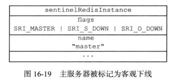

> 同样的，多个sentinel设置的quorum参数可能是不同的，所以可能部分的sentinel认为客观下线，而其他的认为没有客观下线

### 选举sentinel领头者

当一个主服务器被判断为下线时，监视这个服务器sentinel的会进行协商，选举出一个领头的sentinel，由这个领头的sentinel执行故障转移操作

**选举领头sentinel的规则和方法**：

- 所有在线的sentinel都有被选为领头sentinel的资格
- 每次进行领头sentinel选举的时候，不论选举是否成功，所有sentinel的配置纪元的值都会+1；（配置的纪元就是个计数器）
- 每个配置的纪元里面，所有sentinel都有一票将某个sentinel设置为局部领头sentinel的机会，并且局部领头一旦设置，在这个配置纪元里面就不能更改了
- 每个发现主服务器下线的sentinel，都会要求其他sentinel将自己设置为领头sentinel
- sentinel设置局部领头sentinel的选票规则是先到先得；最先向目标sentinel“索要投票” 将会得到该票，后续“索票”的sentinel将会被拒绝；
- 源sentinel收到目标sentinel的回复后，会解析回复中的leader_epoch；如果leader_epoch和源sentinel的一致，那么源sentinel会继续解析leader_runid参数；
  如果leader_runid和源sentinel的run_id一致，说明目标sentinel将源sentinel设为了领头sentinel；
- 如果某sentinel被半数以上sentinel设置为了领头sentinel，那么这个sentinel将会成为领头sentinel；
- 如果给定的时间限制内，没有选举出领头sentinel，那么将在一段时间后重新选举，直到选举出为止；

在这里和区块链选举比较相似

### 故障转移

选举出的领头sentinel将会已下线的主服务器进行下线操作，下线操作分为以下三个操作：

1. 在已下线的主服务的所有从服务器中，挑选出一个从服务器，将其转换为主服务器；
2. 将已下线的主服务的所有从服务器，复制新的主服务器；
3. 设置已经下线的主服务为从服务，并复制新的主服务，当下线的主服务重新上线后，就会复制新的主服务了；

#### 选取新的主服务器步骤

1. 领头的sentinel会将下线的主服务的所有从服务放到一个列表里，然后按照以下规则对列表中一个个的过滤：
2. 过滤掉已经断线的从服务器；
3. 过滤掉最近5s内没有回复过sentinel 的info命令的从服务；
4. 过滤掉与主服务器连接断开时间超过（down-after-millseconds * 10）毫秒的从服务器；这样可以保证剩余从服务器的数据比较新；
5. 然后从剩余从服务器中选举优先级高的从服务器；
6. 如果服务器优先级相同，则选取复制偏移量大的（复制偏移量大，说明数据新）；
7. 至此，如果还没有选举出，则对运行id进行排序，选举出运行id最小的从服务器；

选举出新的主服务后，sentinel将向新的主服务器发送slave no one ，转换成新的主服务器
然后领头sentinel以每秒一次的频率向新的主服务发送info命令,用于判断“切换主服务操作”是否成功（当新的主服务器角色由salve变成master，说明已经切换成功了）

#### 修改从服务器的复制目标

新的主服务出现后，sentinel就会让所有从服务器去复制新的主服务器（通过salveof 命令实现）


#### 修改旧的主服务器的为从服务器

最后，将已经下线的主服务设置为从服务器，并复制新的主服务；

注意：因为这时旧的主服务已经下线，所以这时这个操作先保存到sentinel对应的实例结构中，等到旧的主服务重新上线后，sentinel就会向他发送slaveof命令，将他设置为从服务器；

### tilt模式

Redis哨兵依赖于系统时间,为了了解某个实例是否是可用的,其会记住最后一次成功回复PING命令的时间,然后与现在时间进行比较判断生存时间.
但是如果计算机时间发生了意外的变化,或者计算机现在非常忙碌,或者进程因为某些原因阻塞,哨兵可能会有意料之外的行为

TILT是一个特殊的保护模式,Sentinel的Tilt模式会在以下两种情况下开启：

1. Sentinel进程被阻塞超过SENTINEL_TILT_TRIGGER时间（默认为2s），可能因为进程或系统I/O（内存，网络，存储）请求过多。
2. 系统时钟调整到之前某个时间值。

进入tilt模式会降低系统的可靠性(因为此时故障转移无法进行).sentinel计时器中断一般一秒十次.我们希望两次定时器中断的时间内控制在大约100毫秒.

当进入TILT模式时哨兵将会继续监视所有内容,但是

- 停止所有的动作
- 会开始否定`SENTINEL is-master-down-by-addr`命令因为其不信任故障检测的能力

如果30秒以内一切正常则退出TILT模式.
注意可以使用很多内核提供的单调时钟API已替换TILT模式.但是尚不清楚这是否是一个好的解决方案,因为当前系统避免了如果进程只是被挂起或长时间未由调度程序执行这种问题.

在计算机时间发生严重变化的时候进入`TILT模式`,并禁止除了监控以外的操作,因为此时sentinel依赖于时间,判断某个节点下线是根据PING的间隔来实现的,如果进入`TILT模式`证明时钟出现问题,此时这个sentinel已经不能被相信了.


