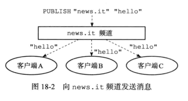
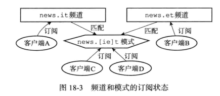
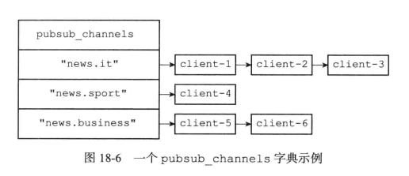
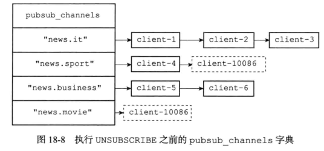
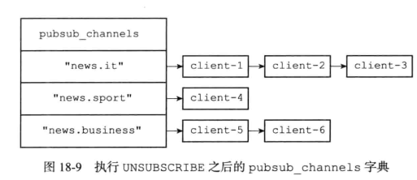

# 订阅

## 基础命令

PSUBSCRIBE pattern [pattern ...] 订阅一个或多个符合给定模式的频道。
SUBSCRIBE channel [channel ...] 订阅给定的一个或多个频道的信息。
UNSUBSCRIBE channel [channel ...]   命令用于退订给定的一个或多个频道的信息。
PSUBSCRIBE pattern [pattern ...]    订阅一个或多个符合给定模式的频道。
PUNSUBSCRIBE [pattern [pattern ...]]    退订所有给定模式的频道。
PUBSUB <subcommand> [argument [argument ...]]   查看订阅与发布系统状态，它由数个不同格式的子命令组成。

## 综述

SUBSCRIBE执行之后就会订阅对应的频道



客户端可以执行PSUBSCRIBE订阅一个或者多个模式，成为这些模式的订阅者  ，每当有其他客户端向某个频道发送消息时，消息会发送给频道和相匹配模式的订阅者



## 一 频道的订阅和退订

当一个客户端执行SUBSCRIIBE命令时，客户端和channel之间就建立了订阅关系；

client结构体中哈希表pubsub_channels属性记录 当前客户端订阅的所有channel；

server结构体中哈希表pubsub_channels属性 记录了订阅channel的所有客户端信息；

server.h/redisServer

```c
	/* Pubsub */
    dict *pubsub_channels;  /* Map channels to list of subscribed clients */
    dict *pubsub_patterns;  /* A dict of pubsub_patterns */
```

server.h/redisClient

```c
	// 这个字典记录了客户端所有订阅的频道
    // 键为频道名字，值为 NULL
    // 也即是，一个频道的集合
    dict *pubsub_channels;  /* channels a client is interested in (SUBSCRIBE) */
    // 链表，包含多个 pubsubPattern 结构
    // 记录了所有订阅频道的客户端的信息
    // 新 pubsubPattern 结构总是被添加到表尾
    list *pubsub_patterns;  /* patterns a client is interested in (SUBSCRIBE) */
    
```




### 1.1 订阅频道

客户端执行SUBSCRIBE命令订阅某个频道之后，服务器收到命令后将执行以下操作：

1. 将客户端添加到服务端状态server 的pubsub_channels哈希表中，如果channel已经在pubsub_channels中，直接添加到订阅者链表的末尾，如果没有这个channel就需要在字典中新建一个键，值设置为空链表，再把这个客户端加入到链表中

   

   

2. 同样的将channel信息添加到client的pubsub_channels字典中，如果channel已经在pubsub_channels字典中，不会重复添加，如果不存在就在字典中新建一个键，值设置为NULL


SUBSCRITEB命令的实现代码位于 pubsub.c/pubsubSubscribeChannel()

```c
/**
 * 为客户端订阅频道。
 * 操作成功，则返回1；
 * 如果客户端已订阅该通道，则返回0
 */
int pubsubSubscribeChannel(client *c, robj *channel) {
    dictEntry *de;
    list *clients = NULL;
    int retval = 0;

    /* Add the channel to the client -> channels hash table */
    /**
     * 将channel记录到client.pubsub_channels 哈希表
     * dictAdd函数保证了如果channel已经存在pubsub_channels哈希表中，将不会重复添加
     */
    if (dictAdd(c->pubsub_channels,channel,NULL) == DICT_OK) {
        retval = 1;
        incrRefCount(channel);
        /* Add the client to the channel -> list of clients hash table */
        //订阅channel的客户端列表
        de = dictFind(server.pubsub_channels,channel);
        if (de == NULL) {
            clients = listCreate();
            dictAdd(server.pubsub_channels,channel,clients);
            incrRefCount(channel);
        } else {
            clients = dictGetVal(de);
        }
        listAddNodeTail(clients,c);
    }
    /* Notify the client */
    //通知客户端
    addReplyPubsubSubscribed(c,channel);
    return retval;
}
```

### 1.2 取消订阅

客户端执行UNSUBSCRITEB命令取消订阅某个频道；

操作正好的SUBSCRITEB命令的操作相反：

1. 将channel信息 从client的pubsub_channels字典中删除；

2. 从服务器的pubsub_channels字典中找到要退订的channel，从订阅者链表中删除对应的客户端，如果删除之后对应的是空链表，就删除掉channel对应的键

UNSUBSCRITEB命令的实现位于 pubsub.c/unsubscribeCommand，其中调用了相关的函数

删除单个channel和删除所有channel的实现都是调用的pubsub.c/pubsubUnsubscribeChannel():

```c
/**
 * 从频道取消订阅客户端。如果操作成功，则返回1；如果客户端未订阅指定channel，则返回0。
 */
int pubsubUnsubscribeChannel(client *c, robj *channel, int notify) {
    dictEntry *de;
    list *clients;
    listNode *ln;
    int retval = 0;
    // 从client->pubsub_channels 哈希表中移除从channel
    /* Remove the channel from the client -> channels hash table */
    //引用计数为啥要+1:channel可能只是指向哈希表中相同对象的指针,引用计数+1保护它
    incrRefCount(channel); /* channel may be just a pointer to the same object
                            we have in the hash tables. Protect it... */
    //dictDelete 从client->pubsub_channels 哈希表中移除此channel
    if (dictDelete(c->pubsub_channels,channel) == DICT_OK) {
        retval = 1;
        //从server->pubsub_channels 哈字典中移除此channel
        /* Remove the client from the channel -> clients list hash table */
        de = dictFind(server.pubsub_channels,channel);
        serverAssertWithInfo(c,NULL,de != NULL);
        clients = dictGetVal(de);
        ln = listSearchKey(clients,c);
        serverAssertWithInfo(c,NULL,ln != NULL);
        listDelNode(clients,ln);
        //如果没有订阅此channel的客户端，就删除server.pubsub_channels的channel键
        if (listLength(clients) == 0) {
            /* Free the list and associated hash entry at all if this was
             * the latest client, so that it will be possible to abuse
             * Redis PUBSUB creating millions of channels. */
            dictDelete(server.pubsub_channels,channel);
        }
    }
    //告知客户端
    /* Notify the client */
    if (notify) addReplyPubsubUnsubscribed(c,channel);
    decrRefCount(channel); /* it is finally safe to release it */
    return retval;
}
```





## 二 模式的订阅与退订

### 2.1 订阅模式

和订阅类似 
client结构体中列表pubsub_patterns属性记录当前客户端订阅的所有channel；
server服务端状态中字典pubsub_patterns属性记录所有的订阅模式

### 2.2 退订模式

与频道的取消订阅比较相似

```c
//取消订阅模式
/* Unsubscribe a client from a channel. Returns 1 if the operation succeeded, or
 * 0 if the client was not subscribed to the specified channel. */
int pubsubUnsubscribePattern(client *c, robj *pattern, int notify) {
    dictEntry *de;
    list *clients;
    listNode *ln;
    int retval = 0;
    //如果是重复的就不能直接移除
    incrRefCount(pattern); /* Protect the object. May be the same we remove */
    //在客户端pubsub_patterns属性中查找对应的pattern
    if ((ln = listSearchKey(c->pubsub_patterns,pattern)) != NULL) {
        retval = 1;
        listDelNode(c->pubsub_patterns,ln);
        /* Remove the client from the pattern -> clients list hash table */
        //在server的pubsub_patterns字典中删除对应的pattern
        de = dictFind(server.pubsub_patterns,pattern);
        serverAssertWithInfo(c,NULL,de != NULL);
        //在client的pubsub_patterns列表中删除对应的pattern
        clients = dictGetVal(de);
        ln = listSearchKey(clients,c);
        serverAssertWithInfo(c,NULL,ln != NULL);
        listDelNode(clients,ln);
        if (listLength(clients) == 0) {
            /* Free the list and associated hash entry at all if this was
             * the latest client. */
            dictDelete(server.pubsub_patterns,pattern);
        }
    }
    /* Notify the client */
    if (notify) addReplyPubsubPatUnsubscribed(c,pattern);
    decrRefCount(pattern);
    return retval;
}
```

## 三 发送消息

当有客户端执行`PUBLISH <channel> <msg>` ，将msg发送给channel时，服务端执行以下两个操作：

1. 将消息发送给channel订阅者
2. 将消息发送给模式订阅者

直接遍历相应的属性pubsub_patterns就可以得到对应的channel的订阅者，然后直接遍历所有的订阅者，都发送一条消息就可以了

代码实现的入口：pubsub.c/pubsubPublishMessage

```c
//在对应的channel发送一条消息
/* Publish a message */
int pubsubPublishMessage(robj *channel, robj *message) {
    int receivers = 0;
    dictEntry *de;
    dictIterator *di;
    listNode *ln;
    listIter li;

    /* Send to clients listening for that channel */
    /* 从server.pubsub_channels查找channel。没有找到说明没有客户端订阅该channel */
    de = dictFind(server.pubsub_channels,channel);
    if (de) {
        list *list = dictGetVal(de);
        listNode *ln;
        listIter li;

        listRewind(list,&li);
        //对channel的所有订阅者发送消息,所以需要遍历订阅者
        while ((ln = listNext(&li)) != NULL) {
            client *c = ln->value;
            addReplyPubsubMessage(c,channel,message);
            receivers++;
        }
    }
    /* Send to clients listening to matching channels */
    //对所有的订阅者发送消息
    di = dictGetIterator(server.pubsub_patterns);
    if (di) {
        channel = getDecodedObject(channel);
        //对于所有的模式订阅也要发送消息
        while((de = dictNext(di)) != NULL) {
            robj *pattern = dictGetKey(de);
            list *clients = dictGetVal(de);
            if (!stringmatchlen((char*)pattern->ptr,
                                sdslen(pattern->ptr),
                                (char*)channel->ptr,
                                sdslen(channel->ptr),0)) continue;

            listRewind(clients,&li);
            while ((ln = listNext(&li)) != NULL) {
                client *c = listNodeValue(ln);
                addReplyPubsubPatMessage(c,pattern,channel,message);
                receivers++;
            }
        }
        decrRefCount(channel);
        dictReleaseIterator(di);
    }
    return receivers;
}
```

## 四 查看订阅信息

redis可以通过PUBSUB subcommand命令查看频道或者模式相关信息；

可以通过代码看到pubsub命令支持以下子命令：

PUBSUB help  查帮助 
PUBSUB CHANNELS [<pattern>]     获取当前服务器所有被订阅的channel，可选参数pattern：和pattern匹配的    遍历server->pubsub_channels；时间复杂度O(n)
PUBSUB NUMSUB [Channel_1 ... Channel_N] 返回给定各个channel的订约这数量 遍历server->pubsub_channels;时间复杂度O(k) 传入参数的数量
PUBSUB NUMPAT   返回服务器当前被订约的模式的数量    直接返回server->pubsub_patterns 列表长度 ；时间复杂度O(1)

PUBSUB的实现入口位于pubsub.c/pubsubCommand;

```c
void pubsubCommand(client *c) {
    if (c->argc == 2 && !strcasecmp(c->argv[1]->ptr,"help")) {
        const char *help[] = {
"CHANNELS [<pattern>]",
"    Return the currently active channels matching a <pattern> (default: '*').",
"NUMPAT",
"    Return number of subscriptions to patterns.",
"NUMSUB [<channel> ...]",
"    Return the number of subscribers for the specified channels, excluding",
"    pattern subscriptions(default: no channels).",
NULL
        };
        addReplyHelp(c, help);
    } else if (!strcasecmp(c->argv[1]->ptr,"channels") &&
        (c->argc == 2 || c->argc == 3))
    {
        //处理channels命令
        /* PUBSUB CHANNELS [<pattern>] */
        //获取当前被订阅的channel，pattern选项返回被订阅的和pattern模式匹配的频道
        sds pat = (c->argc == 2) ? NULL : c->argv[2]->ptr;
        dictIterator *di = dictGetIterator(server.pubsub_channels);
        dictEntry *de;
        long mblen = 0;
        void *replylen;

        replylen = addReplyDeferredLen(c);
        //对server.pubsub_channels 字典遍历
        while((de = dictNext(di)) != NULL) {
            robj *cobj = dictGetKey(de);
            sds channel = cobj->ptr;
            //匹配pattern参数的channel
            if (!pat || stringmatchlen(pat, sdslen(pat),
                                       channel, sdslen(channel),0))
            {
                addReplyBulk(c,cobj);
                mblen++;
            }
        }
        dictReleaseIterator(di);
        setDeferredArrayLen(c,replylen,mblen);
    } else if (!strcasecmp(c->argv[1]->ptr,"numsub") && c->argc >= 2) {
        //处理numsub命令
        /* PUBSUB NUMSUB [Channel_1 ... Channel_N] */
        //对于指定channel(也可以不指定)返回对应的订阅者数量
        int j;

        addReplyArrayLen(c,(c->argc-2)*2);
        for (j = 2; j < c->argc; j++) {
            list *l = dictFetchValue(server.pubsub_channels,c->argv[j]);

            addReplyBulk(c,c->argv[j]);
            addReplyLongLong(c,l ? listLength(l) : 0);
        }
    } else if (!strcasecmp(c->argv[1]->ptr,"numpat") && c->argc == 2) {
        /* PUBSUB NUMPAT */
        //当前被订阅的模式的数量
        addReplyLongLong(c,dictSize(server.pubsub_patterns));
    } else {
        addReplySubcommandSyntaxError(c);
    }
}
```


