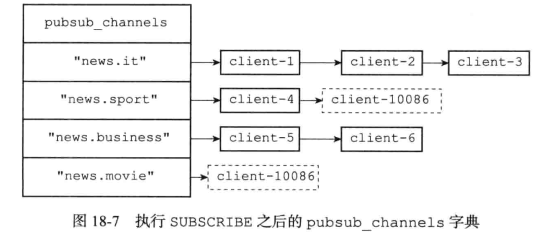

# 订阅

## 基础命令

PSUBSCRIBE pattern [pattern ...] 订阅一个或多个符合给定模式的频道。
SUBSCRIBE channel [channel ...] 订阅给定的一个或多个频道的信息。
UNSUBSCRIBE channel [channel ...]   命令用于退订给定的一个或多个频道的信息。
PSUBSCRIBE pattern [pattern ...]    订阅一个或多个符合给定模式的频道。
PUNSUBSCRIBE [pattern [pattern ...]]    退订所有给定模式的频道。
PUBSUB <subcommand> [argument [argument ...]]   查看订阅与发布系统状态，它由数个不同格式的子命令组成。

## 综述

SUBSCRIBE执行之后就会订阅对应的频道


客户端可以执行PSUBSCRIBE订阅一个或者多个模式，成为这些模式的订阅者  ，每当有其他客户端向某个频道发送消息时，消息会发送给频道和相匹配模式的订阅者


## 一 频道的订阅和退订

当一个客户端执行SUBSCRIIBE命令时，客户端和channel之间就建立了订阅关系；

client结构体中哈希表pubsub_channels属性记录 当前客户端订阅的所有channel；

server结构体中哈希表pubsub_channels属性 记录了订阅channel的所有客户端信息；

server.h/redisServer

```c
	/* Pubsub */
    dict *pubsub_channels;  /* Map channels to list of subscribed clients */
    dict *pubsub_patterns;  /* A dict of pubsub_patterns */
```

server.h/redisClient

```c
	// 这个字典记录了客户端所有订阅的频道
    // 键为频道名字，值为 NULL
    // 也即是，一个频道的集合
    dict *pubsub_channels;  /* channels a client is interested in (SUBSCRIBE) */
    // 链表，包含多个 pubsubPattern 结构
    // 记录了所有订阅频道的客户端的信息
    // 新 pubsubPattern 结构总是被添加到表尾
    list *pubsub_patterns;  /* patterns a client is interested in (SUBSCRIBE) */
    
```


### 1.1 订阅频道

客户端执行SUBSCRIBE命令订阅某个频道之后，服务器收到命令后将执行以下操作：

1. 将客户端添加到服务端状态server 的pubsub_channels哈希表中，如果channel已经在pubsub_channels中，直接添加到订阅者链表的末尾，如果没有这个channel就需要在字典中新建一个键，值设置为空链表，再把这个客户端加入到链表中

   

   

2. 同样的将channel信息添加到client的pubsub_channels字典中，如果channel已经在pubsub_channels字典中，不会重复添加，如果不存在就在字典中新建一个键，值设置为NULL


SUBSCRITEB命令的实现代码位于 pubsub.c/pubsubSubscribeChannel()

```c
/**
 * 为客户端订阅频道。
 * 操作成功，则返回1；
 * 如果客户端已订阅该通道，则返回0
 */
int pubsubSubscribeChannel(client *c, robj *channel) {
    dictEntry *de;
    list *clients = NULL;
    int retval = 0;

    /* Add the channel to the client -> channels hash table */
    /**
     * 将channel记录到client.pubsub_channels 哈希表
     * dictAdd函数保证了如果channel已经存在pubsub_channels哈希表中，将不会重复添加
     */
    if (dictAdd(c->pubsub_channels,channel,NULL) == DICT_OK) {
        retval = 1;
        incrRefCount(channel);
        /* Add the client to the channel -> list of clients hash table */
        //订阅channel的客户端列表
        de = dictFind(server.pubsub_channels,channel);
        if (de == NULL) {
            clients = listCreate();
            dictAdd(server.pubsub_channels,channel,clients);
            incrRefCount(channel);
        } else {
            clients = dictGetVal(de);
        }
        listAddNodeTail(clients,c);
    }
    /* Notify the client */
    //通知客户端
    addReplyPubsubSubscribed(c,channel);
    return retval;
}
```

### 1.2 取消订阅

客户端执行UNSUBSCRITEB命令取消订阅某个频道；

操作正好的SUBSCRITEB命令的操作相反：

1. 将channel信息 从client的pubsub_channels字典中删除；

2. 从服务器的pubsub_channels字典中找到要退订的channel，从订阅者链表中删除对应的客户端，如果删除之后对应的是空链表，就删除掉channel对应的键

UNSUBSCRITEB命令的实现位于 pubsub.c/unsubscribeCommand，

删除单个channel和删除所有channel的实现都是调用的pubsub.c/pubsubUnsubscribeChannel():