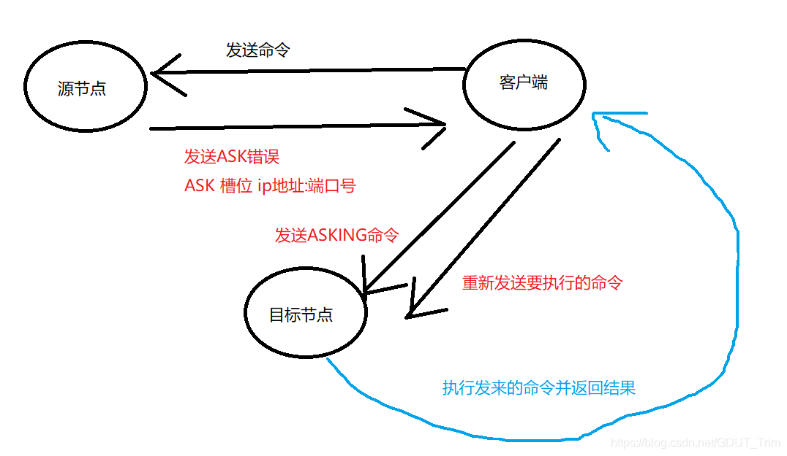

# redis集群理论

单机遇到内存、并发、流量等瓶颈时，可以采用Cluster架构方案来达到负载均衡

## 一 基础理论

### 1.1分区规则

数据集按照分区规则映射到各个节点


常见哈希分区：

1. 节点取余分区

   使用特定的数据，如Redis的键或用户ID，再根据节点数量N使用公式： hash（key）%N计算出哈希值，用来决定数据映射到哪一个节点上。


   **缺点**：当节点数量变化时，如扩容或收缩节点，数据节点映射关系需要重新计算，会导致数据的重新迁移。

   **优点**：这种方式的突出优点是简单，易理解；

   这种方式常用于数据库的分库分表规则，一般采 用预分区的方式，提前根据数据量规划好分区数，比如划分为512或1024张 表，保证可支撑未来一段时间的数据量，再根据负载情况将表迁移到其他数 据库中。
   扩容时通常采用翻倍扩容，避免数据映射全部被打乱导致全量迁移 的情况
    

2. 一致性哈希分区

   一致性哈希分区（Distributed Hash Table）实现思路是为系统中每个节点分配一个token（范围一般在0~2^32），这些token构成一个哈希环。

   数据读写 执行节点查找操作时，先根据key计算hash值，然后顺时针找到第一个大于等于该哈希值的token节点；

   **缺点：**

   加减节点会造成哈希环中部分数据无法命中，需要手动处理或者忽略这部分数据，因此一致性哈希常用于缓存场景。
   当使用少量节点时，节点变化将大范围影响哈希环中数据映射，因此 这种方式不适合少量数据节点的分布式方案。

   **优点**：

   相比节点取余最大的好处在于加入和删除节点只影响哈希环中相邻的节点，对其他节点无影响

3. **虚拟槽分区**
   虚拟槽分区使用分散度良好的哈希函数把所有数据映射到一个固定范围的整数集合中，整数定义为槽（slot）；
   槽范围一般远远大于节点数，比如Redis Cluster槽范围是0~16383；
   槽是集群内数据 管理和迁移的基本单位。采用大范围槽的主要目的是为了方便数据拆分和集 群扩展；
   每个节点会负责一定数量的槽；

### 1.2redis的数据分区

Redis Cluser 采用虚拟槽分区，所有的键根据哈希函数映射到 0~16383整 数槽内；

计算公式：slot=CRC16（ key ） &16383；
每一个节点负责维护一部分槽以及槽所映射的键值数据；

 

redis虚拟槽分区的特点：

- 解耦数据和节点之间的关系，简化了节点扩容和收缩难度。
- 节点自身维护槽的映射关系，不需要客户端或者代理服务维护槽分区元数据。
-  支持节点、槽、键之间的映射查询，用于数据路由、在线伸缩等场景。

 

### 1.3集群功能限制

1. key批操作命令支持有限。如mset、mget，目前只支持具有相同slot值的 key执行批量操作。
2. key事务操作支持有限。只支持多key在同一节点上的事务操 作，当多个key分布在不同的节点上时无法使用事务功能。
3. key作为数据分区的最小粒度，因此不能将一个大的键值对象如 hash、list等映射到不同的节点。
4. 不支持多数据库空间。单机下的Redis可以支持16个数据库，集群模 式下只能使用一个数据库空间，即db0。
5. 复制结构只支持一层，从节点只能复制主节点，不支持嵌套树状复 制结构。

 

## 二 搭建

搭建集群工作分四步：

### 准备节点

Redis 集群一般由多个节点组成，节点数量至少为 6个才能保证组成完整高可用的集群。

**cluster-enabled :** 每个节点需要**开启配置** **cluster-enabled yes** ，让 Redis运行在集群模式下。
**cluster-config-file:** 第一次启动时如果没有【集群配置文件】，它会自动创建一份，该配置文件名称采用cluster-config-file配置参数项控制；
节点重启的时候会加载该配置文件进行重用；

如果集群内节点信息发生变化，如添加节点、节点下线、故障转移等。节点会自动保存集群状态到配置文件中（ **cluster-config-file**）
Redis自动维护集群配置文件，不要手动修改，防止节点重启时产生集群信息错乱。

 

### 节点握手cluster meet

节点握手是指一批运行在集群模式下的节点通过 Gossip协议彼此通信， 达到感知对方的目的。

由客户端使用命令：

```bash
cluster meet {ip} {port}
```

cluster meet命令是一个异步命令，执行之后立刻返回。内部发起与目标节点进行握手通信；


我们只需要在集群内任意节点上执行cluster meet命令加入新节点，握手 状态会通过消息在集群内传播，这样其他节点会自动发现新节点并发起握手流程

节点建立握手之后集群还不能正常工作，这时集群处于下线状态，所有的数据读写都被禁止


由于目前所有的槽没有分配到节点，因此集群无法完成槽到节点的映射。

只有当 16384 个槽全部分配给节点后，集群才进入在线状态。

### **分配槽**cluster addslots

通过 cluster addslots命令为节点分配槽:

```bash
redis-cli -h 127.0.0.1 -p 46379 cluster addslots {0..2730}
redis-cli -h 127.0.0.1 -p 46380 cluster addslots {2731..5461}
redis-cli -h 127.0.0.1 -p 46381 cluster addslots {5462..7211}
redis-cli -h 127.0.0.1 -p 46382 cluster addslots {7212..10922}
redis-cli -h 127.0.0.1 -p 46383 cluster addslots {10923..12331}
redis-cli -h 127.0.0.1 -p 46384 cluster addslots {12332..16383}
```

 

### 设置主从关系cluster replicate

作为一个完整的集群，每个负责处理槽的 节点应该具有从节点，保证当它出现故障时可以自动进行故障转移。

集群模式下， Reids 节点角色分为主节点和从节点。

首次启动的节点和被分配槽的节点都是主节点，从节点负责复制主节点槽信息和相关的数据。

```cpp
cluster replicate{nodeId}命令让一个节点成为从节点
```

注意：在群模式下slaveof添加从节点操作不再支持

cluster info命令可以获取集群当前状态：
cluster nodes命令可以看到节点和槽的分配关系：

## 三 节点通信

在分布式存储中需要提供维护节点元数据信息的机制。
所谓元数据是 指：节点负责哪些数据，是否出现故障等状态信息。
常见的元数据维护方式 分为：集中式和P2P方式。
Redis集群采用P2P的Gossip（流言）协议， Gossip协议工作原理就是节点彼此不断通信交换信息，一段时间后所有的节点都会知道集群完整的信息。

### 3.1通信流程

1. 集群中的每个节点都会单独开辟一个 TCP通道，用于节点之间彼此通信，默认通信端口号在基础端口上加 10000（也可通过 `cluter meet <ip> <port> [cport]` 的cport的参数指定端口） 。
2. 每个节点在固定周期内通过特定规则选择几个节点发送 ping 消息。
3. 接收到 ping 消息的节点用 pong 消息作为响应。

当节点出故障、新节点加入、主从角色变化、槽信息 变更等事件发生时，通过不断的ping/pong消息通信


经过一段时间后所有的节点都会知道整个集群全部节点的最新状态，从而达到集群状态同步的目的。

### 3.2 Gossip消息

Gossip协议的主要职责就是信息交换。信息交换的载体就是节点彼此发送的 Gossip 消息；

常用的 Gossip 消息可分为： ping 消息、 pong 消息、 meet 消息、 fail 消息等:

- meet消息：用于通知新节点加入。
  消息发送者通知接收者加入到当前集群， meet消息通信正常完成后，接收节点会加入到集群中并进行周期性的ping 、 pong 消息交换。

- ping消息：集群内交换最频繁的消息，集群内每个节点每秒向多个其他节点发送 ping 消息，用于检测节点是否在线和交换彼此状态信息。
  ping消息发送封装了自身节点和部分其他节点的状态数据。

- pong 消息：当接收到 ping 、 meet消息时，作为响应消息回复给发送方确认消息正常通信。
  pong 消息内部封装了自身状态数据。
  节点也可以向集群内 广播自身的 pong 消息来通知整个集群对自身状态进行更新。

- fail消息：当节点判定集群内另一个节点下线时，会向集群内广播一个fail 消息
  其他节点接收到 fail 消息之后把对应节点更新为下线状态。

   

### 3.3节点选择

虽然 Gossip协议的信息交换机制具有天然的分布式特性，但它是有成本的。

由于内部需要频繁地进行节点信息交换，而 ping/pong消息会携带当前节点和部分其他节点的状态数据，会加重带宽和计算的负担。


因此节点每次选择需 要通信的节点列表变得非常重要;

- 通信节点选择过多，虽然可以做到信息及时 交换但成本过高。

- 节点选择过少会降低集群内所有节点彼此信息交换频率， 从而影响故障判定、新节点发现等需求的速度。

 

 

1. **选择发送消息的节点数量**

   集群内每个节点维护定时任务默认每秒执行 10 次，每秒会随机选取 5个节点找出最久没有通信的节点发送 ping 消息，用于保证 Gossip信息交换的随机性。
   每 100 毫秒都会扫描本地节点列表，如果发现节点最近一次接受pong消息的时间大于 cluster_node_timeout/2 ，则立刻发送ping消息，防止该节点信息太长时间未更新。

   因此 cluster_node_timeout参数对消息发送的节点数量影响非常大。

   当我们的带宽资源紧张时，可以适当调大这个参数，如从默认 15 秒改为 30秒来降低带宽占用率。

   过度调大 cluster_node_timeout 会影响消息交换的频率从而影响故障转移、槽信息更新、新节点发现的速度。

   因此需要根据业务容忍度和资源消耗进行平衡。同时整个集群消息总交换量也跟节点数成正比。

2. **消息数据量**

   每个 ping消息的数据量体现在消息头和消息体中，其中消息头主要占用空间的字段是 myslots[CLUSTER_SLOTS/8] ，占用 2KB，这块空间占用相对固定。
   消息体会携带一定数量的其他节点信息用于信息交换。


 

## 四 集群伸缩

Redis集群可以实现对节点的灵活上下线控制。其中原理可抽象为槽和对应数据在不同节点之间灵活移动。

 

### 4.1扩容集群

扩容可以分为如下步骤：

**1.准备新节点**

**2.加入集群**
准备好新节点后，依然采用 cluster meet 命令，将新的节点加入到集群
新节点加入到集群后，还没有负责的槽，所以还不能接受任何读写操作；对新节点的后续操作一般有两种选择：
（1）作为其他主节点的从节点，负责故障转移
（2）为他迁移槽和数据，实现扩容

> 注意：
> 手动执行 cluster meet 命令加入已经存在于其他集群的节点，会造成被加入节点的集群合并到现有集群的情况从而造成数据丢失和错乱，
>
> 后果非常严重，线上谨慎操作。
>  
>
> 正式环境建议使用redis-trib.rb add-node命令加入新节点，该命令内部会执行新节点状态检查
> 如果新节点已经加入其他集群或者包含数据，则放弃集群加入操作
>  

**3.迁移槽和数据**
最后 迁移槽和数据 是扩容最核心的环节，槽在迁移过程中集群仍然可以正常提供读写服务；
槽是Redis集群管理数据的基本单位，首先需要为新节点制定槽的迁移计划，确定原有节点的哪些槽需要迁移到新节点。
迁移计划需要确保每个节点负责相似数量的槽，从而保证各节点的数据均匀。

迁移具体操作步骤如下：

1. 对目标节点发送 cluster setslot {slot} importing {sourceNodeId}命令，让目标节点准备导入槽的数据。
2. 对源节点发送 cluster setslot {slot} migrating {targetNodeId}命令，让源节点准备迁出槽的数据。
3. 源节点循环执行 cluster getkeysinslot {slot} {count} 命令，获取 count个属于槽 {slot} 的键。
4. 在源节点上执行migrate{targetIp}{targetPort}""0{timeout}keys{keys...}命令，把获取的键通过流水线（ pipeline ）机制批量迁移到目标节点。
5. 重复执行步骤 3 ）和步骤 4）直到槽下所有的键值数据迁移到目标节点。
6. 向集群内所有主节点发送 cluster setslot {slot} node {targetNodeId}命令，通知槽分配给目标节点。
   

 

### 4.2收缩集群

收缩集群意味着缩减规模，需要从现有集群中安全下线部分节点；

 

操作流程如下：

1. 确定下线节点是否有负责的槽，如果是，需要把槽迁移到其他节点，保证节点下线后整个集群槽节点映射的完整性。

   
   原理与上面 节点扩容的迁移槽过程一致。

   

2. 当下线节点不再负责槽或者本身是从节点时，就可以通知集群内其他节点忘记下线节点，当所有的节点忘记该节点后可以正常关闭。

   
   Redis 提供了cluster forget {downNodeId} 命令实现该功能。

   当节点接收到 cluster forget{down NodeId} 命令后，会把 nodeId指定的节点加入到禁用列表中，在禁用列表内的节点不再发送 Gossip消息。
   禁用列表有效期是 60 秒，超过 60秒节点会再次参与消息交换。

   也就是说当第一次forget 命令发出后，我们有 60 秒的时间让集群内的所有节点忘记下线节点。
   

   > 线上操作不建议直接使用 cluster forget命令下线节点，需要跟大量节点命令交互，
   > 实际操作起来过于繁琐并且容易遗漏 forget 节点。
   > 建议使用redis-trib.rb del-node{host ： port} {downNodeId} 命令
   >
   >  

 

## 五 请求路由

### 5.1请求重定向

在集群模式下， Redis接收任何键相关命令时首先计算键对应的槽，再根据槽找出所对应的节点，如果节点是自身，则处理键命令；

否则回复MOVED重定向错误，通知客户端请求正确的节点。 这个过程称为MOVED重定向；

 

用 redis-cli 命令时，可以加入-c参数支持自动重定向，简化手动发起重定向操作；

redis-cli 自动帮我们连接到正确的节点执行命令，这个过程是在redis-cli内部维护；
实质上是 client 端接到 MOVED 信息之后再次发起请求，并不在Redis节点中完成请求转发；

 

> Redis计算键所对应的槽时
> 如果键内容包含{和}大括号字符，则计算槽的有效部分是括号内的内容；否则采用键的全内容计算槽。

 

 

### 5.2 smart客户端

Smart 客户端通过在内部维护 slot→node的映射关系，本地就可实现键到节点的查找，从而保证 IO 效率的最大化，

而 MOVED 重定向负责协助 Smart客户端更新 slot→node映射。

对 Smart客户端成本和可能存在的问题：

- 客户端内部维护 slots缓存表，并且针对每个节点维护连接池，当集群规模非常大时，客户端会维护非常多的连接并消耗更多的内存。

 

### 5.3ASK重定向

Redis 集群支持在线迁移槽（ slot ）和数据来完成水平伸缩，当slot对应的数据从源节点到目标节点迁移过程中，客户端需要做到智能识别，保证键命令可正常执行。

例如当一个 slot数据从源节点迁移到目标节点时，期间可能出现一部分数据在源节点，而另一部分在目标节点；

 

当出现上述情况时，客户端键命令执行流程将发生变化：

1. 客户端根据本地 slots缓存发送命令到源节点，如果存在键对象则直接执行并返回结果给客户端。
2. 如果键对象不存在，则可能存在于目标节点，这时源节点会回复ASK 重定向异常。
   格式如下：（ error ） ASK{slot}{targetIP} ： {targetPort} 。
3. 客户端从 ASK 重定向异常提取出目标节点信息，发送 asking命令到目标节点打开客户端连接标识，再执行键命令。

> ASK 与 MOVED 虽然都是对客户端的重定向控制，但是有着本质区别。
>
> ASK 重定向说明集群正在进行 slot数据迁移，客户端无法知道什么时候迁移完成，因此只能是临时性的重定向，客户端不会更新 slots 缓存；
>
>
> 但是MOVED 重定向说明键对应的槽已经明确指定到新的节点，因此需要更新slots缓存；

# redis集群代码实现

## 一 节点部分实现

### 1.1节点数据结构

集群中每个节点都会使用clusterNode结构自己的状态，并为集群中的其他节点都创建一个clusterNode结构记录其他节点状态：

```cpp
typedef struct clusterNode {
    //节点创建时间
    mstime_t ctime; /* Node object creation time. */
    //节点的名字
    char name[CLUSTER_NAMELEN]; /* Node name, hex string, sha1-size */
    //节点标识,节点的角色和状态等信息
    int flags;      /* CLUSTER_NODE_... */
    //节点当前配置的纪元
    uint64_t configEpoch; /* Last configEpoch observed for this node */
    //二进制数组,这个节点所持有的slots
    unsigned char slots[CLUSTER_SLOTS/8]; /* slots handled by this node */
    //用string标识的slots的具体信息
    sds slots_info; /* Slots info represented by string. */
    //记录节点的槽数量
    int numslots;   /* Number of slots handled by this node */
    //拥有的slave的数量,前提是这个节点是master
    int numslaves;  /* Number of slave nodes, if this is a master */
    //具体拥有哪些slave数组
    struct clusterNode **slaves; /* pointers to slave nodes */
    //当前节点是slave,指向他的master(也可能是空,当前没有master节点)
    struct clusterNode *slaveof; /* pointer to the master node. Note that it
                                    may be NULL even if the node is a slave
                                    if we don't have the master node in our
                                    tables. */
    //节点最近一次发送ping的时间
    mstime_t ping_sent;      /* Unix time we sent latest ping */
    //节点最近一次接收到ping的时间
    mstime_t pong_received;  /* Unix time we received the pong */
    //接收到数据的时间
    mstime_t data_received;  /* Unix time we received any data */
    mstime_t fail_time;      /* Unix time when FAIL flag was set */
    mstime_t voted_time;     /* Last time we voted for a slave of this master */
    mstime_t repl_offset_time;  /* Unix time we received offset for this node */
    mstime_t orphaned_time;     /* Starting time of orphaned master condition */
    //最近的偏移量,用处很多
    long long repl_offset;      /* Last known repl offset for this node. */
    char ip[NET_IP_STR_LEN];  /* Latest known IP address of this node */
    int port;                   /* Latest known clients port (TLS or plain). */
    int pport;                  /* Latest known clients plaintext port. Only used
                                   if the main clients port is for TLS. */
    int cport;                  /* Latest known cluster port of this node. */
    //保存与当前节点有链接的节点
    clusterLink *link;          /* TCP/IP link with this node */
    list *fail_reports;         /* List of nodes signaling this as failing */
} clusterNode;
```

clusterNode中link属性保存了连接节点所需要的有关信息（与redisClient结构的连接到客户端有所不同，用于连接其他的节点）：

```cpp
typedef struct clusterLink {
    //连接创建时间
    mstime_t ctime;             /* Link creation time */
    //远程连接结构体
    connection *conn;           /* Connection to remote node */
    //输出缓冲区,保存需要发送给其他节点的信息
    sds sndbuf;                 /* Packet send buffer */
    //输入缓冲区,报讯其他节点发送过来的消息
    char *rcvbuf;               /* Packet reception buffer */
    size_t rcvbuf_len;          /* Used size of rcvbuf */
    size_t rcvbuf_alloc;        /* Allocated size of rcvbuf */
    //该连接所关联的节点
    struct clusterNode *node;   /* Node related to this link if any, or NULL */
} clusterLink;
```

每个节点都会保存一个clusterState结构（server.h/redisServer --> cluster.h/clusterState）;用来记录当前集群所处的状态；

```cpp
/**
 * 集群状态
 * 入口:  server.h/struct redisServer --> clusterState;
 * 初始化入口：server.c/initServer() --> cluster.c/clusterInit()
 */ 
typedef struct clusterState {
    //指向当前服务器节点
    clusterNode *myself;  /* This node */
    //节点纪元,故障转移使用
    uint64_t currentEpoch;
    //整个集群的状态,上线/下线
    int state;            /* CLUSTER_OK, CLUSTER_FAIL, ... */
    //集群中至少处理着一个槽的节点的数量
    int size;             /* Num of master nodes with at least one slot */
    //name->clusterNode的键值对
    dict *nodes;          /* Hash table of name -> clusterNode structures */
    dict *nodes_black_list; /* Nodes we don't re-add for a few seconds. */
    clusterNode *migrating_slots_to[CLUSTER_SLOTS];
    clusterNode *importing_slots_from[CLUSTER_SLOTS];
    //记录槽的指派信息,数组的每个值对应于负责该槽的节点
    clusterNode *slots[CLUSTER_SLOTS];
    clusterSlotsToKeysData slots_to_keys;
    /* The following fields are used to take the slave state on elections. */
    //选举时获取slave的状态
    mstime_t failover_auth_time; /* Time of previous or next election. */
    //故障转移收到的票数
    int failover_auth_count;    /* Number of votes received so far. */
    //是否已经向其他节点请求投票给自己
    int failover_auth_sent;     /* True if we already asked for votes. */
    int failover_auth_rank;     /* This slave rank for current auth request. */
    uint64_t failover_auth_epoch; /* Epoch of the current election. */
    //slave节点不能故障转移的原因
    int cant_failover_reason;   /* Why a slave is currently not able to
                                   failover. See the CANT_FAILOVER_* macros. */
    
    
    //需要手动转移故障,记录当前状态
    /* Manual failover state in common. */
    //手动故障切换时间限制（ms unixtime）。
    //如果没有正在进行的manual failover,则为零
    mstime_t mf_end;            /* Manual failover time limit (ms unixtime).
                                   It is zero if there is no MF in progress. */
    /* Manual failover state of master. */
    //mester的手动故障转移状态
    clusterNode *mf_slave;      /* Slave performing the manual failover. */
    /* Manual failover state of slave. */
    long long mf_master_offset; /* Master offset the slave needs to start MF
                                   or -1 if still not received. */
    int mf_can_start;           /* If non-zero signal that the manual failover
                                   can start requesting masters vote. */
    /* The following fields are used by masters to take state on elections. */
    uint64_t lastVoteEpoch;     /* Epoch of the last vote granted. */
    int todo_before_sleep; /* Things to do in clusterBeforeSleep(). */
    /* Messages received and sent by type. */
    //按照消息类型进行接受和发送
    long long stats_bus_messages_sent[CLUSTERMSG_TYPE_COUNT];
    long long stats_bus_messages_received[CLUSTERMSG_TYPE_COUNT];
    long long stats_pfail_nodes;    /* Number of nodes in PFAIL status,
                                       excluding nodes without address. */
} clusterState;
```

一个实际的例子：


### 1.2 cluster meet命令的实现

[指令实现](#节点握手cluster meet)

向节点A发送cluster meet将节点B加入到集群中

```bash
CLUSTER MEET <ip> <port>
```

节点握手过程如下图：(类似于TCP的三次握手)


cluster meet 命令的入口位于 cluster.c/clusterCommand()

## 二 槽指派

[指令实现](#分配槽cluster addslots)

每个槽都要有节点处理，要是有槽没有对应的节点，集群就处于下线状态

### 2.1节点记录槽信息

**clusterNode**结构体中的slots属性是个二进制数组，数组长度16384/8=2048个字节，记录了节点具体负责了哪个节点；例如，slots[111] = 1,表示该节点负责了编号111的槽；为0就表示不负责


numslots属性记录了节点负责槽的数量；

### 2.2传播节点的槽指派信息

节点除了会记录自己负责的槽信息，还会将自己负责的槽信息发送给其他节点

通过发送slots数组信息实现，接收到其他节点发来的消息之后就保存在对应于那个节点的clusterNode结构里面

### 2.3记录集群所有槽的指派信息

每个节点都有的clusterState结构中的slots是clusterNode数组，值是一个指向clusterNode的指针，记录了每个槽是由哪个节点负责的；

如果槽没有节点负责，则slot对应的数组值是NULL;

如果需要检查某个槽是否有节点负责，可以通过查询clusterState的slots高效解决；


> 节点和服务器都有slots数组，节点的本地数组记录了自己管理的槽的信息，而

### 2.4CLUSTER ADDSLOTS命令的实现

cluster addslots 命令接受一个或者多个槽作为参数，并将输入的槽指派给接受该命令的节点；

cluster addslots 主要操作可以分为两步：

1. 更新myself节点的 slots属性bit位置标记为1。标识该槽由myself节点负责
2. 更新clusterStatus属性的slots 数组对应的槽指向 myself节点；标识对应槽是由哪个节点负责的

**代码入口 cluster.c/clusterCommand() ==>  cluster.c/clusterAddSlot()**

开始创建的一个没有指派任何槽的节点


执行指令`CLUSTER ADDSLOTS 1 2`之后变成：


还会发布消息告诉其他节点，自己正在负责这些槽


 **cluster.c/clusterAddSlot()**

```cpp
/* Add the specified slot to the list of slots that node 'n' will
 * serve. Return C_OK if the operation ended with success.
 * If the slot is already assigned to another instance this is considered
 * an error and C_ERR is returned. */
//将指定的插槽添加到节点n负责的插槽列表中
int clusterAddSlot(clusterNode *n, int slot) {
    //插槽已经被分配了
    if (server.cluster->slots[slot]) return C_ERR;
    //更新n的slots属性随用的slot的bit位为1,表示负责这个节点
    clusterNodeSetSlotBit(n,slot);
    //更新clusterStatus的slots数组,使对应的槽指向myself节点,表示这个槽是由自己负责的
    server.cluster->slots[slot] = n;
    return C_OK;
}
```

 

## 三 集群中执行命令

在集群中执行命令，整理流程如下


例子， 如果我们在之前提到的， 由 7000、 7001、 7002 三个节点组成的集群中， 用客户端连上节点 7000, 并发送以下命令， 那么命令会直接被节点 7000 执行:

```
127.0.0.1:7000>set date "2021-12-31"
```

因为键date所在的槽2022刚好是7000负责的，如果是执行

```
127.0.0.1:7000>set msg "happy new year"
```

msg所在的槽6257就不是7000负责的了，就需要

- 当客户端第一次向节点 7000 发送命令的时候， 节点 7000 会向客户端返回MOVED 错误， 指引客户端转向至节点 7001。
- 当客户端转向到节点 7001 之后， 客户端重新向节点 7001 发送命令， 这个命令会被节点 7001 成功执行。

流程是这样的：

```
127.0.0.1:7000>set msg "happy new year"
->Redirected to slot [ 6257] located at 127.0.0.1:7001
OK


127.0.0.1:7001>GET msg
happy new year
```

  用7001可以直接得到msg对应的值，不需要重定向

命令执行的入口位于：**server.c/processCommand()** ==> **cluster.c/getNodeByQuery()**

计算键属于哪个槽、判断槽是否当前节点负责、MOVED错误 几个关系操作都是由 getNodeByQuery() 完成的；

```cpp
/*
 * 返回指向能够为命令提供服务的集群节点的指针。
 * 要使函数成功，命令应仅针对以下任一目标：
 * 1） 命令只有一个key时（甚至像LPOPRPUSH mylist mylist那样多次）。
 * 2） 在同一个哈希槽中有多个key，而该槽是稳定的（没有正在进行的重新哈希）。
 */
clusterNode *getNodeByQuery(client *c, struct redisCommand *cmd, robj **argv, int argc, int *hashslot, int *error_code) {
    clusterNode *n = NULL;
    robj *firstkey = NULL;
    int multiple_keys = 0;
    multiState *ms, _ms;
    multiCmd mc;
    // migrating_slot标记slot正在迁移操作， 当前节点是迁移的源节点
    // importing_slot标记slot正在迁移操作， 当前节点是迁移的目标节点
    int i, slot = 0, migrating_slot = 0, importing_slot = 0, missing_keys = 0;
    //如果模块禁用了集群重定向,就是允许设置任何key(没有分配槽的说法),直接可以用当前节点处理
    /* Allow any key to be set if a module disabled cluster redirections. */
    if (server.cluster_module_flags & CLUSTER_MODULE_FLAG_NO_REDIRECTION)
        return myself;

    /* Set error code optimistically for the base case. */
    if (error_code) *error_code = CLUSTER_REDIR_NONE;

    /* Modules can turn off Redis Cluster redirection: this is useful
     * when writing a module that implements a completely different
     * distributed system. */
    //模块可以关闭集群重定向,利于编写实现完全不同的分布式系统的模块
    /* We handle all the cases as if they were EXEC commands, so we have
     * a common code path for everything */
    if (cmd->proc == execCommand) {
        /* If CLIENT_MULTI flag is not set EXEC is just going to return an
         * error. */
        if (!(c->flags & CLIENT_MULTI)) return myself;
        ms = &c->mstate;
    } else {
        /* In order to have a single codepath create a fake Multi State
         * structure if the client is not in MULTI/EXEC state, this way
         * we have a single codepath below. */
        ms = &_ms;
        _ms.commands = &mc;
        _ms.count = 1;
        mc.argv = argv;
        mc.argc = argc;
        mc.cmd = cmd;
    }
    //检查所有的key是否在同一个哈希槽中,并且获取槽和负责槽的节点
    /* Check that all the keys are in the same hash slot, and obtain this
     * slot and the node associated. */
    for (i = 0; i < ms->count; i++) {
        struct redisCommand *mcmd;
        robj **margv;
        int margc, *keyindex, numkeys, j;

        mcmd = ms->commands[i].cmd;
        margc = ms->commands[i].argc;
        margv = ms->commands[i].argv;

        getKeysResult result = GETKEYS_RESULT_INIT;
        numkeys = getKeysFromCommand(mcmd,margv,margc,&result);
        keyindex = result.keys;

        for (j = 0; j < numkeys; j++) {
            //计算key所属的slot,用thisslot记录下来
            robj *thiskey = margv[keyindex[j]];
            int thisslot = keyHashSlot((char*)thiskey->ptr,
                                       sdslen(thiskey->ptr));

            if (firstkey == NULL) {
                //key就是这个slot中的第一个节点
                /* This is the first key we see. Check what is the slot
                 * and node. */
                firstkey = thiskey;
                slot = thisslot;
                //n获取负责这个slot的节点
                n = server.cluster->slots[slot];

                /* Error: If a slot is not served, we are in "cluster down"
                 * state. However the state is yet to be updated, so this was
                 * not trapped earlier in processCommand(). Report the same
                 * error to the client. */
                /*
                 *  如果这个节点还没节点负责，还在cluster down状态；
                 *  但是，该状态尚未更新，因此在processCommand（）中没有捕获到该状态。
                 * 向客户端报告相同的错误。
                 */ 
                if (n == NULL) {
                    getKeysFreeResult(&result);
                    if (error_code)
                        *error_code = CLUSTER_REDIR_DOWN_UNBOUND;
                    return NULL;
                }

                /* If we are migrating or importing this slot, we need to check
                 * if we have all the keys in the request (the only way we
                 * can safely serve the request, otherwise we return a TRYAGAIN
                 * error). To do so we set the importing/migrating state and
                 * increment a counter for every missing key. */
                /*
                 * 如果要迁移或导入此槽，则需要检查请求中有所有的key
                 //（只有这样才能安全地为请求提供服务，否则返回TRYAGAIN错误）
                 * 为此，需要设置导入/迁移状态，并为每个缺少的键增加一个计数器。
                 */
                if (n == myself &&
                    server.cluster->migrating_slots_to[slot] != NULL)
                {
                    //标记正在进行迁移,作为源节点
                    migrating_slot = 1;
                } else if (server.cluster->importing_slots_from[slot] != NULL) {
                    //标记正在迁移,作为目标节点
                    importing_slot = 1;
                }
            } else {
                /* If it is not the first key, make sure it is exactly
                 * the same key as the first we saw. */
                //确保后续的key和前面看到的第一个key在同一个槽里面
                if (!equalStringObjects(firstkey,thiskey)) {
                    if (slot != thisslot) {
                        //虽然slot最开始初始化为0,但是之前那个if一定是已经执行过一次以上了,
                        //就保证了一直处理的都是一个slot里面的key
                        /* Error: multiple keys from different slots. */
                        getKeysFreeResult(&result);
                        if (error_code)
                            *error_code = CLUSTER_REDIR_CROSS_SLOT;
                        return NULL;
                    } else {
                        //标记,记录这个指令包含了不同的key(虽然刚好是同一个slot)
                        //todo:这个概率是不是很低啊?
                        /* Flag this request as one with multiple different
                         * keys. */
                        multiple_keys = 1;
                    }
                }
            }

            /* Migrating / Importing slot? Count keys we don't have. */
            if ((migrating_slot || importing_slot) &&
                lookupKeyRead(&server.db[0],thiskey) == NULL)
            {
                missing_keys++;
            }
        }
        //释放keyindex
        getKeysFreeResult(&result);
    }
    //指令之中本来就没有key
    /* No key at all in command? then we can serve the request
     * without redirections or errors in all the cases. */
    if (n == NULL) return myself;
    //集群并不是在线状态,在allow_reads_when_down打开的时候允许读
    /* Cluster is globally down but we got keys? We only serve the request
     * if it is a read command and when allow_reads_when_down is enabled. */
    if (server.cluster->state != CLUSTER_OK) {
        if (!server.cluster_allow_reads_when_down) {
            /* The cluster is configured to block commands when the
             * cluster is down. */
            if (error_code) *error_code = CLUSTER_REDIR_DOWN_STATE;
            return NULL;
        } else if (cmd->flags & CMD_WRITE) {
            /* The cluster is configured to allow read only commands */
            if (error_code) *error_code = CLUSTER_REDIR_DOWN_RO_STATE;
            return NULL;
        } else {
            //不做处理,继续执行后面的代码,在本地进行读
            /* Fall through and allow the command to be executed:
             * this happens when server.cluster_allow_reads_when_down is
             * true and the command is not a write command */
        }
    }

    /* Return the hashslot by reference. */
    //返回slot(引用返回,返回多个值的办法)
    if (hashslot) *hashslot = slot;

    /* MIGRATE always works in the context of the local node if the slot
     * is open (migrating or importing state). We need to be able to freely
     * move keys among instances in this case. */
    /*
     * 如果槽处于 "迁移或导入状态"，则迁移始终在本地节点的上下文中工作。
     * 在这种情况下，我们需要能够在实例之间自由移动键。
     */ 
    if ((migrating_slot || importing_slot) && cmd->proc == migrateCommand)
        return myself;

    /* If we don't have all the keys and we are migrating the slot, send
     * an ASK redirection. */
    //节点处于迁移状态，当前节点是迁移的源节点，并且key不在当前节点，返回ASK错误
    if (migrating_slot && missing_keys) {
        if (error_code) *error_code = CLUSTER_REDIR_ASK;
        return server.cluster->migrating_slots_to[slot];
    }
    /*
     * 如果我们正在接收槽，并且client正确地将请求标记为“ASKING”，我们就可以为请求提供服务
     * 但是，如果请求涉及多个key，而我们没有全部key，那么唯一的选择就是发送一个trygain错误
     * 等待所有的key迁移完毕之后再进行查询
     */
    /* If we are receiving the slot, and the client correctly flagged the
     * request as "ASKING", we can serve the request. However if the request
     * involves multiple keys and we don't have them all, the only option is
     * to send a TRYAGAIN error. */
    //当前节点是迁移节点的目标节点
    if (importing_slot &&
        (c->flags & CLIENT_ASKING || cmd->flags & CMD_ASKING))
    {
        if (multiple_keys && missing_keys) {
            if (error_code) *error_code = CLUSTER_REDIR_UNSTABLE;
            return NULL;
        } else {
            return myself;
        }
    }

    /* Handle the read-only client case reading from a slave: if this
     * node is a slave and the request is about a hash slot our master
     * is serving, we can reply without redirection. */
    int is_write_command = (c->cmd->flags & CMD_WRITE) ||
                           (c->cmd->proc == execCommand && (c->mstate.cmd_flags & CMD_WRITE));
    if (c->flags & CLIENT_READONLY &&
        !is_write_command &&
        nodeIsSlave(myself) &&
        myself->slaveof == n)
    {
        return myself;
    }
    //返回moved错误,需要重定向
    /* Base case: just return the right node. However if this node is not
     * myself, set error_code to MOVED since we need to issue a redirection. */
    if (n != myself && error_code) *error_code = CLUSTER_REDIR_MOVED;
    return n;
}
```

 分布实现如下

###  计算节点属于哪个槽

直接根据key的哈希算法计算当前key应该属于的槽i

### 判断槽是否由当前节点处理

在clusterState.slots[]数组中查找第i项，并与clusterState.myself作比较：

- 如果刚好是这个节点负责，就直接处理该指令
- 如果不是，根据记录中指定的节点ip和端口号返回moved错误，使客户端指向正确的节点

### MOVED错误

用于引导正确的节点，格式为`MOVED <slot> <ip>:<port>`，由客户端自动处置，不会在命令行显示出来。


### 节点数据库实现

只能使用一个数据库（0号数据库），其他的实现和单机数据库没有什么区别

## 四 重新分片

重新分片操作可以将任意数量已经指派给某个节点（ 源节点 ） 的槽改为指派给另一个节点（ 目标节点 ）， 并且相关槽所属的键值对也会从源节点被移动到目标节点。
重新分片操作可以在线（ online ) 进行， 在重新分片的过程中， 集群不需要下线， 并且源节点和目标节点都可以继续处理命令请求。

## 五 ASK错误

重新分片的过程中可能槽中一部分键在源节点中，而有一部分键已经移动到目标节点了，这时候客户端对于源节点发送针对相关键的请求：

- 源节点会先在自己的数据库里面査找指定的键， 如果找到的话， 就直接执行客户端发送的命令。
- 相反地， 如果源节点没能在自己的数据库里面找到指定的键， 那么这个键有可能已经被迁移到了目标节点， 源节点将向客户端返回一个 ASK 错误， 指引客户端转向正在导人槽的目标节点， 并再次发送之前想要执行的命令。


客户端也不会显示错误，直接根据返回的ASK错误转向合适的节点请求数据

### Cluster SetSlot Importing命令的实现

cluster setslot importing是进行重新分片的第一步，redis-trib向目标节点发送该命令，准备好接收源节点的指定槽。

关于被导入的数组，是会被记录在目标节点的importing_slots_form数组中的，这个数组是一个clusterNode数组，是用来记录当前节点正在从哪些节点导入槽

```c
typedef struct clusterState(
	//..
    clusterNode *importing_slots_from[CLUSTER_SLOTS];
    //..
)clusterState;
```

可以看到这是一个clusterNode数组，但容量却是16384，对应的是槽的数量，使用索引i记录槽

假如importing_slots_from[i]指向的不是空，而是一个具体的clusterNode结构，那么就代表当前节点正在从这个clusterNode对应的节点导入槽i。

在对集群进行重新分片的时候，第一个命令是

```redis
cluster setslot <i> importing <source_id>
```

i代表的是16384个槽中的哪个槽，source_id是代表节点在集群里面的runid

这条命令的作用其实就是，当目标节点接收到这条命令，**会修改importing_slots_from数组，在索引为i的位置上，放入source_id对应的clusterNode结构**。


### cluster setslot migrating命令的实现

cluster setslot migrating命令是对于第二个步骤，就是redis-trib向源节点发送该命令，让源节点准备发送槽的count个键值对。

在clusterState结构里面是使用一个migrating_slots_to数组来记录了当前节点正在迁移至其他节点的槽，也是一个clusterNode数组

```c
typedef struct clusterState(
	//...
    clusterNode *migrating_slots_to[CLUSTER_SLOTS];
    //...
)clusterState;
```

这个与importing_slots_from一样，也是使用索引代表槽，然后对应数组的位置有没有节点，去代表该槽是否正在被发送中，发送给里面对应的clusterNode

在对集群进行重新分片的时候，会向源节点发送命令

```bash
cluster setslots <i> migrating <target_id>
```

i就代表槽的位置，target_id对应目标节点在集群中的runid。

**当源节点收到该命令的时候，就会在migrating_slots_to[i]里保存target_id对应的custerNode节点**

跟importing_slots_from很类似

### ASK错误

前面提到过，如果节点收到一个关于键Key的命令请求，会先去计算这个键属于的是哪个槽，然后看这个槽是不是被委派给当前节点，如果是，就自己进行执行，如果不是就发送MOVED指令，指引客户端去找正确的节点。

假设，现在槽是委派给当前节点的，**那么当前节点就回去数据库（集群节点的数据库只会使用0号数据库）里找，找的时候会先检查自己的clusterState.migrating_slots_to[i]（i是指定的槽）是否为空，如果为空就代表该槽没有进行转移，去数据库里面找，如果不为空，那么发送一个ASK错误，指引客户端到导入槽i的节点去查找键key**。

**接收到ASK错误的客户端会根据错误提供的IP地址和端口号，转向至正在导入槽的目标节点，然后首先向目标节点发送一个ASKING命令，之后再重新发送自己想要执行的命令**


### ASKING命令

ASKING命令唯一要做的就是打开发送该命令的客户端的**REDIS_ASKING标识**

```code
def ASKING():
	#打开REDIS_ASKING标识
	client.flags |= REDIS_ASKING
	#向客户端返回OK回复
	reply("ok")
12345
```

在一般情况下，客户端向节点发送一个关于槽i的命令，而槽又不是被委派给这个节点的，那么是会返回一个MOVED错误给客户端的，**但如果此时该节点的ckusterState.importing_slots_from[i]显示节点正在导入槽i，而且发来的命令带有REDIS_ASKING标识**，那么节点将破例执行这个关于槽i的命令一次。

**这里要注意的是，客户端的REDIS_ASKING标识是一个一次性的标识，当节点执行了一个带有REDIS_ASKING标识的客户端发送的命令之后，客户端的REDIS_ASKING标识就会被移除，以后的命令都不会带有该标识了**

### ASK错误和MOVED错误的区别

ASK错误和MOVED错误都会导致客户端转向，他们的区别如下所示

- MOVED错误**代表槽的负责权已经从一个节点转移到了另一个节点**；在客户端收到关于槽i的MOVED错误之后，**客户端下次的每次遇到关于槽i的命令请求时，都可以直接将命令请求发送至MOVED错误所指向的节点（因为已经建立了套接字连接，而且记录了该键是在之前MOVED错误所指向的节点处）**
- 与此相反，ASK错误只是两个节点在迁移槽的过程中使用的一种临时措施，在客户端收到关于槽i的ASK错误之后，**客户端只会在接下来的一次命令请求中将关于槽i的命令请求发送至ASK错误所指示的节点**，但这种转向客户端并不会记录下来，所以不会对客户端今后发送关于槽i的命令产生任何的影响，客户端发送请求仍然会请求到目前负责处理槽i的节点，除非ASK、MOVED错误出现。

MOVED错误的过程

ASKING错误的过程


## 四 复制与故障转移

Redis中节点分为主节点和从节点，主节点用于处理槽，从节点用于复制某个主节点；

当主节点下线时，从节点将成为主节点，替代主节点处理命令请求；下线主节点重新上线时，将成为从节点；

当从节点开始复制主节点，也会通过消息告诉集群中的其他节点

### 4.1设置从节点 CLUSTER REPLICATE <node_id>

CLUSTER REPLICATE <node_id> 让接受到命令的节点设置为从节点， 复制node_id节点；

CLUSTER REPLICATE命令的实现入口位于：**cluster.c/clusterCommand** ==> replicate

clusterCommand函数接受到replicate命令后主要做了一下几件事：

- 在自己的clusterState的nodes属性中查找参数的node节点；
- 判断当前节点是否可以设置复制。
  是否是自己复制自己？
  参数中的node节点是否是从节点？
  当前节点是否分配了槽？
  ......

复合要求设置条件后，调用clusterSetMaster函数，clusterSetMaster主要用于修正clusterState中的属性值（可以参考上面贴出的注释）；

 之后还需要设置当前节点为从节点，代码实现在**clster.c/clusterSetMaster**

```cpp
//将指定的节点n设置成当前节点的master，如果当前节点是master也会转换成slave
void clusterSetMaster(clusterNode *n) {
    //复制的对象不能是自己
    serverAssert(n != myself);
    //当前节点没有分配槽
    serverAssert(myself->numslots == 0);

    if (nodeIsMaster(myself)) {//当前节点是master
        //将当前节点的CLUSTER_NODE_MASTER和CLUSTER_NODE_MIGRATE_TO取反(因为时slave不可以再MIGRATE_TO)
        myself->flags &= ~(CLUSTER_NODE_MASTER|CLUSTER_NODE_MIGRATE_TO);
        //将点钱节点设置为slave
        myself->flags |= CLUSTER_NODE_SLAVE;
        clusterCloseAllSlots();
    } else {//当前节点不是master
        if (myself->slaveof)
            //将当前节点从原来的master的slave列表中移除
            clusterNodeRemoveSlave(myself->slaveof,myself);
    }
    //设置当前节点复制指定的节点n
    myself->slaveof = n;
    //给节点n添加当前节点作为slave
    clusterNodeAddSlave(n,myself);
    //复制n的信息
    replicationSetMaster(n->ip, n->port);
    resetManualFailover();
}
```


### 4.2故障检测

集群中每个节点会定期向其他节点发送PING消息，如果规定时间内没有返回PONG消息，则会将该节点标记为P_FAIL(疑似下线 probable fail)；


各个节点会相互交换消息，确认各个节点的状态

当节点A通过消息得知节点B认为节点C疑似下线之后，就会在自己的clusterState.nodes 字典中找到主节点 C 所对应的 clusterNode 结构，将节点B 的下线报告（ failure report ) 添加到节点c的clusterNode 结构的 fail_reports  链表中。

节点的下线报告结构如下：（记录的就是发出报告的节点指针和上次报告的时间）

```c
typedef struct clusterNodeFailReport {
    struct clusterNode *node;  /* Node reporting the failure condition. */
    mstime_t time;             /* Time of the last report from this node. */
} clusterNodeFailReport;
```


注意这个是保存在7001那里的

如果某节点发现集群中超过半数已经以上的主节点 将x节点标记为P_FAIL,那么x节点将被标记为FAIL（客观下线），这个节点还会向集群广播x节点的FAIL下线消息，收到消息的节点都会直接把x节点标记为下线

 

### 4.3故障转移

当一个从节点得知自己复制的master进入FAIL下线状态时，从节点将开始对主节点进行故障转移：

- 从slave中选取一个主节点；（通过其他所有负责槽的主节点投票产生，也使用了配置纪元的设置，与选举新的sentinel的方式比较相似，基于Raft算法实现）
- 被选中的slave执行 salveof no one命令，成为新的master
- 新的master会撤销已下线master的槽指派，将槽指派给自己；
- 新的master向集群广播一条PONG消息，告知新的master已经上线；
- 新的节点接受命令，故障转移完成；

## 五 集群间消息

集群各节点通过互相发送消息来进行通信， 集群间的消息可以大致分为以下几种：

- MEET消息：当节点接受客户端发送的CLUSTER MEET命令时，节点会向其他节点会发送meet消息，请求加入到集群；
  
- PING消息：集群中每个节点默认每间隔一秒，会从节点列表中**随机**选举出5个节点，在从这5个节点中选一个最长时间没有通信的，发送PING消息；
  
- PONG消息：当节点接受到PING 、MEET消息时，会向发送者回复PONG消息； 节点也可以主动向集群广播PONG消息，通知其他节点更新该节点信息；
  
- FAIL消息：当一个主节点判断另个主节点已经下线时，节点会向集群广播一条FAIL消息；
  
- PUBLISH消息：当节点接受到一个PUBLISH命令时，节点会立即执行该命令，并向集群广播PUBLISH消息；

### 5.1消息头

节点消息都会包裹在一个消息头，消息头的定义位于cluster.h/clusterMsg

消息头中clusterMsgData 联合体 （刚好对应几种消息类型）记录消息的正文；

### 5.2 MEET PING PONG消息的实现

Redis集群中个节点是通过GOSSIP协议来交换各个节点状态信息，gossip协议由MEET、PING、PONG三种消息组成的：

因为MEET 、PING、PONG是相同的消息体，所以节点是通过消息头中的type属性来区分PING、PONG、MEET消息的；

发送pong 、ping、meet消息的入口位于cluster.c/clusterCron ==>cluster.c/clusterSendPing； （ping、pong、meet消费发送都是通过clusterSendPing函数实现的）

```c
//向指定的链接link(对应于节点)发送PIGNG或者PONG数据包,确保要加入足够的gossip信息
void clusterSendPing(clusterLink *link, int type) {
    unsigned char *buf;
    clusterMsg *hdr;
    //已经加入的gossip目标
    int gossipcount = 0; /* Number of gossip sections added so far. */
    //需要加入的gossip目标数
    int wanted; /* Number of gossip sections we want to append if possible. */
    int totlen; /* Total packet length. */
    /* freshnodes is the max number of nodes we can hope to append at all:
     * nodes available minus two (ourself and the node we are sending the
     * message to). However practically there may be less valid nodes since
     * nodes in handshake state, disconnected, are not considered. */
    //除去自身和发送目标节点之外的节点数
    int freshnodes = dictSize(server.cluster->nodes)-2;

    /* How many gossip sections we want to add? 1/10 of the number of nodes
     * and anyway at least 3. Why 1/10?
     *
     * If we have N masters, with N/10 entries, and we consider that in
     * node_timeout we exchange with each other node at least 4 packets
     * (we ping in the worst case in node_timeout/2 time, and we also
     * receive two pings from the host), we have a total of 8 packets
     * in the node_timeout*2 failure reports validity time. So we have
     * that, for a single PFAIL node, we can expect to receive the following
     * number of failure reports (in the specified window of time):
     *
     * PROB * GOSSIP_ENTRIES_PER_PACKET * TOTAL_PACKETS:
     *
     * PROB = probability of being featured in a single gossip entry,
     *        which is 1 / NUM_OF_NODES.
     * ENTRIES = 10.
     * TOTAL_PACKETS = 2 * 4 * NUM_OF_MASTERS.
     *
     * If we assume we have just masters (so num of nodes and num of masters
     * is the same), with 1/10 we always get over the majority, and specifically
     * 80% of the number of nodes, to account for many masters failing at the
     * same time.
     *
     * Since we have non-voting slaves that lower the probability of an entry
     * to feature our node, we set the number of entries per packet as
     * 10% of the total nodes we have. */
    //希望添加的gossip目标数是节点数除以十,且至少是3
    wanted = floor(dictSize(server.cluster->nodes)/10);
    if (wanted < 3) wanted = 3;
    if (wanted > freshnodes) wanted = freshnodes;

    /* Include all the nodes in PFAIL state, so that failure reports are
     * faster to propagate to go from PFAIL to FAIL state. */
    //对于疑似下线的节点要及时发送ping测试连通性
    int pfail_wanted = server.cluster->stats_pfail_nodes;

    /* Compute the maximum totlen to allocate our buffer. We'll fix the totlen
     * later according to the number of gossip sections we really were able
     * to put inside the packet. */
    totlen = sizeof(clusterMsg)-sizeof(union clusterMsgData);
    totlen += (sizeof(clusterMsgDataGossip)*(wanted+pfail_wanted));
    /* Note: clusterBuildMessageHdr() expects the buffer to be always at least
     * sizeof(clusterMsg) or more. */
    //消息长度太短的情况需要补全
    if (totlen < (int)sizeof(clusterMsg)) totlen = sizeof(clusterMsg);
    buf = zcalloc(totlen);
    hdr = (clusterMsg*) buf;

    /* Populate the header. */
    if (link->node && type == CLUSTERMSG_TYPE_PING)
        link->node->ping_sent = mstime();
    clusterBuildMessageHdr(hdr,type);

    /* Populate the gossip fields */
    int maxiterations = wanted*3;
    while(freshnodes > 0 && gossipcount < wanted && maxiterations--) {
        //todo:这里使用的随机算法其实会比较耗时,为什么不直接遍历整个词典呢?
        dictEntry *de = dictGetRandomKey(server.cluster->nodes);
        clusterNode *this = dictGetVal(de);

        /* Don't include this node: the whole packet header is about us
         * already, so we just gossip about other nodes. */
        if (this == myself) continue;

        /* PFAIL nodes will be added later. */
        if (this->flags & CLUSTER_NODE_PFAIL) continue;

        /* In the gossip section don't include:
         * 1) Nodes in HANDSHAKE state.
         * 3) Nodes with the NOADDR flag set.
         * 4) Disconnected nodes if they don't have configured slots.
         */
        //对于在HANDSHAKE的节点,NOADDR的节点,断开连接的节点就不用gossip了
        if (this->flags & (CLUSTER_NODE_HANDSHAKE|CLUSTER_NODE_NOADDR) ||
            (this->link == NULL && this->numslots == 0))
        {
            freshnodes--; /* Technically not correct, but saves CPU. */
            continue;
        }

        /* Do not add a node we already have. */
        if (clusterNodeIsInGossipSection(hdr,gossipcount,this)) continue;

        /* Add it */
        clusterSetGossipEntry(hdr,gossipcount,this);
        freshnodes--;
        gossipcount++;
    }

    /* If there are PFAIL nodes, add them at the end. */
    //最后添加哪些疑似下线的节点
    if (pfail_wanted) {
        dictIterator *di;
        dictEntry *de;

        di = dictGetSafeIterator(server.cluster->nodes);
        while((de = dictNext(di)) != NULL && pfail_wanted > 0) {
            clusterNode *node = dictGetVal(de);
            if (node->flags & CLUSTER_NODE_HANDSHAKE) continue;
            if (node->flags & CLUSTER_NODE_NOADDR) continue;
            if (!(node->flags & CLUSTER_NODE_PFAIL)) continue;
            clusterSetGossipEntry(hdr,gossipcount,node);
            freshnodes--;
            gossipcount++;
            /* We take the count of the slots we allocated, since the
             * PFAIL stats may not match perfectly with the current number
             * of PFAIL nodes. */
            pfail_wanted--;
        }
        dictReleaseIterator(di);
    }

    /* Ready to send... fix the totlen field and queue the message in the
     * output buffer. */
    //准备发送阶段,在buf中排队
    totlen = sizeof(clusterMsg)-sizeof(union clusterMsgData);
    totlen += (sizeof(clusterMsgDataGossip)*gossipcount);
    hdr->count = htons(gossipcount);
    hdr->totlen = htonl(totlen);
    clusterSendMessage(link,buf,totlen);
    zfree(buf);
}
```

当 接 收 者 收 到 MEET、 PING、 PONG 消 息 时， 接 收 者 会 访 问 消 息 正 文 中 的 两 个clusterMsgDataGossip 结构， 并根据自己是否认识 clusterMsgDataGossip 结构中记录的被选中节点来选择进行哪种操作：

- 如果被选中节点不存在于接收者的已知节点列表， 那么说明接收者是第一次接触到被选中节点， 接收者将根据结构中记录的 IP 地址和端口号等信息， 与被选中节点进行握手。
- 如果被选中节点已经存在于接收者的已知节点列表， 那么说明接收者之前已经与被选中节点进行过接触， 接收者将根据 clusterMsgDataGossip 结构记录的信息，对被选中节点所对应的 clusterNode 结构进行更新。  


### 5.3FAIL消息的实现

在集群节点数量较多时，使用Gossip协议来传播下线消息 会是下线消息传播延时；

而发送FAIL消息可以让集群中所有节点知道节点下线，从而尽快判断集群是否下线，对下线主节点执行故障转移操作；

FAIL消息体的定义位于cluster.h/clusterMsgDataFail

 发送FAIL消息的入口位于cluster.c/clusterSendFail

### 5.4PUBLISH消息的实现

`PUBLISH <channel> <msg>`

当某节点接受到PUBLISH 消息，不仅会向自己的channel发送msg消息，还会向集群广播一条PUBLISH消息，是集群中所有系欸但那都对于自己的channel发送一条msg消息；

publish消息的消息体定义位于cluster.h/clusterMsgDataPublish

```c#
typedef struct {
    uint32_t channel_len;
    uint32_t message_len;
    //八字节是为了对齐,实际长度是保存的内容决定的
    unsigned char bulk_data[8]; /* 8 bytes just as placeholder. */
} clusterMsgDataPublish;
```

bulk_data的0到channel_len-1字节保存的是channel，channel_len到channel_len+message_len-1字节保存的是message的内容。

对于消息`PUBLISH "news.it" "hello"`，保存的结构如图：


处理publish命令的入口位于`pubsub.c/publishCommand ==>cluster.c/clusterPropagatePublish==>cluster.c/clusterSendPublish`

为了保证所有的节点通过发送和接受消息进行通信，所以客户端不会直接给所有的节点都发送PUBLISH（好像其实客户端也没有所有节点的信息，必须要先访问某个节点得知所有节点的信息之后才能向所有的节点都发送PUBLISH）


