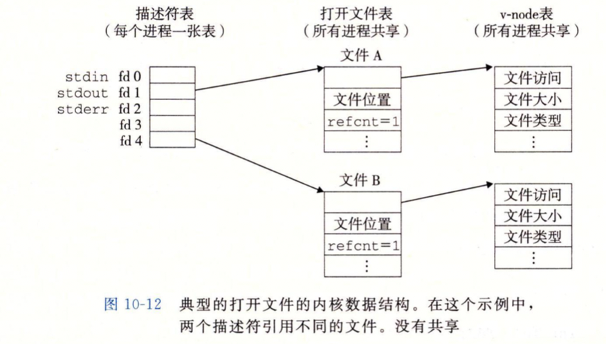
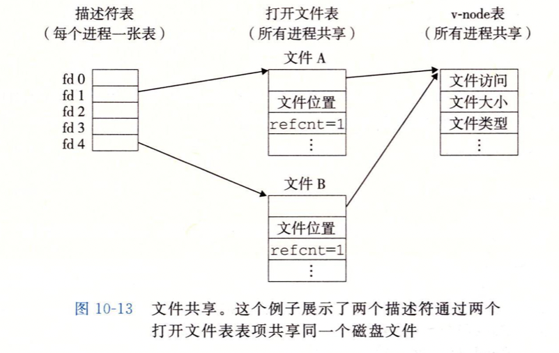
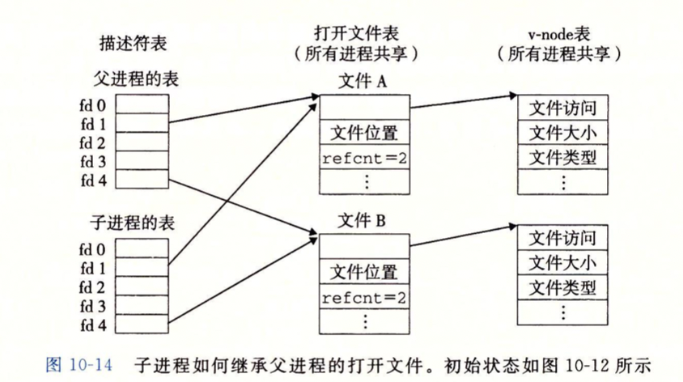
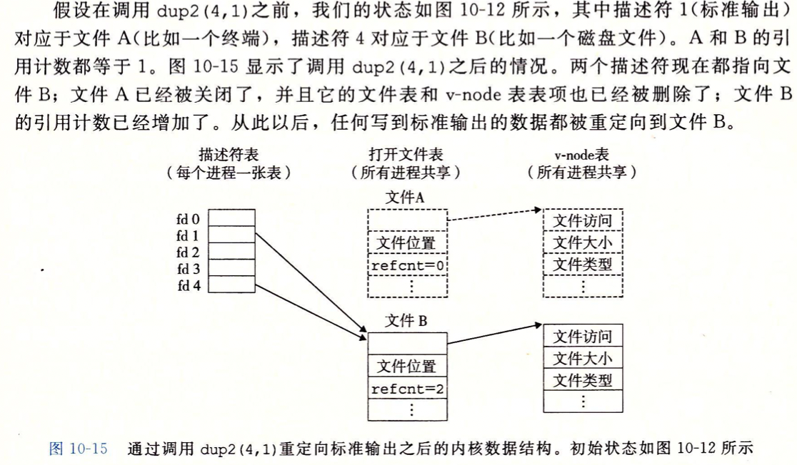
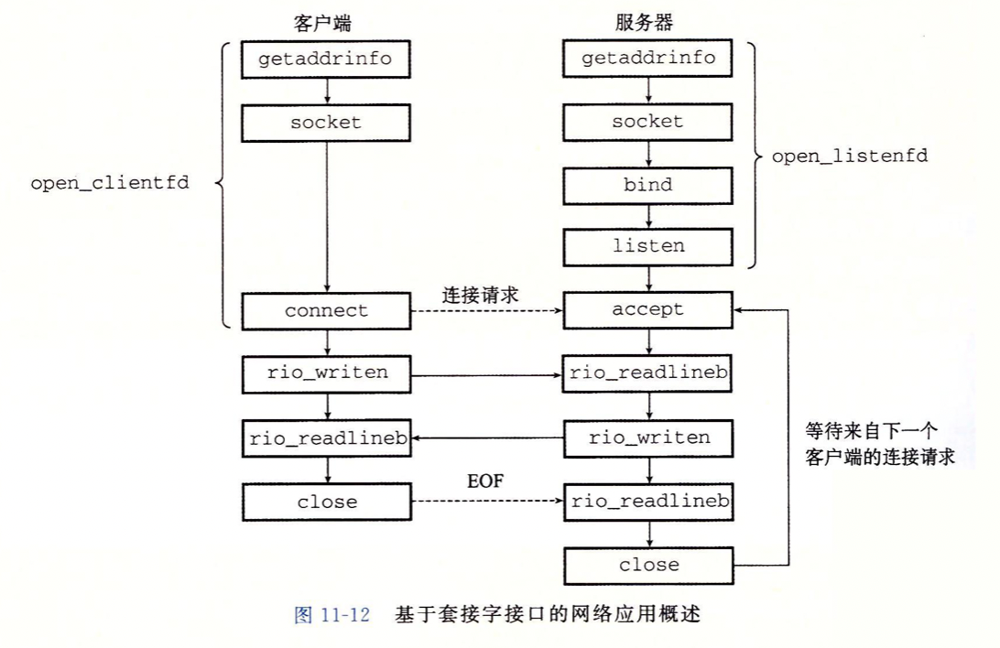
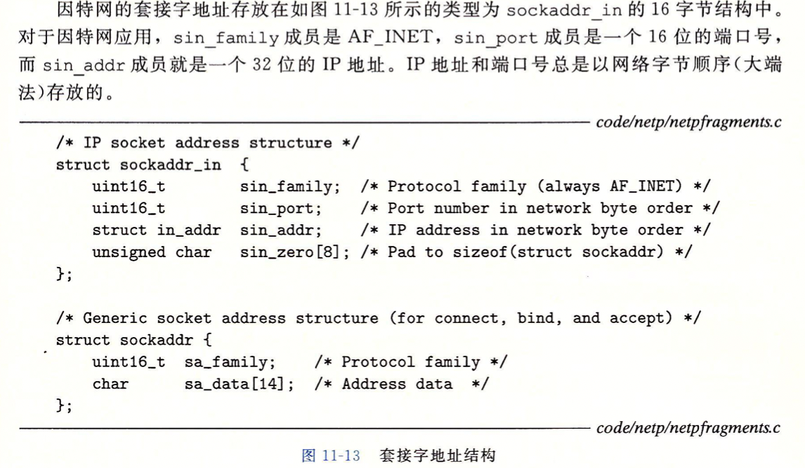

# 进程间通信

## 常见问题

1. 一台机器最多能撑多少个TCP连接

   - 客户端，单个IP

     **当Linux作为客户端建立连接的时候，最大连接数量是受内核参数net.ipv4.ip_local_port_range限制** 而ip_local_port_range是可配置的，最大理论范围是0-65535

   - 多个IP地址

     **对于有1个Ip的客户端来说，受限于ip_local_port_range参数，也受限于65535。但单Linux可以配置多个ip，有几个ip，最大理论值就翻几倍**

     > 多张网卡不是必须的。即使只有一张网卡，也可以配置多ip。k8s就是这么干的，在k8s里，一台物理机上可以部署多个pod。但每一个pod都会被分配一个独立的ip，所以完全不用担心物理机上部署了过多的pod而影响你用的pod里的TCP连接数量。在ip给你的那一刻，你的pod就和其它应用隔离开了。

   - 服务端

     一条TCP连接是由一个四元组组成的。不考虑地址重用（unix的SO_REUSEADDR选项）的情况下，对于我们这台Nginx Server来说，它的IP和端口是固定的。cp连接4元组中只有remote ip（也就是client ip）和remote port（客户端port）是可变的。它可能建立的最大的连接数是2的32次方（ip数）×2的16次方（port数）

     - 一条TCP连接如果不发送数据的话，消耗内存是3.3K左右。如果有数据发送，需要为每条TCP分配发送缓存区，大小受你的参数net.ipv4.tcp_wmem配置影响，默认情况下最小是4K。如果发送结束，缓存区消耗的内存会被回收
     - 内存消耗一般是阈值限制，不需要考虑端口不够的情况
   
   - **TCP连接的客户端机：**每一个ip可建立的TCP连接理论受限于ip_local_port_range参数，也受限于65535。但可以通过配置多ip的方式来加大自己的建立连接的能力。
   
   - **TCP连接的服务器机：**每一个监听的端口虽然理论值很大，但这个数字没有实际意义。最大并发数取决你的内存大小，每一条静止状态的TCP连接大约需要吃3
     .3K的内存。
   
2. 

## 系统级I/O

### Unix I/O

所有的设备都被模型化为文件，所有的输入和输出都是对相应的文件的读写。

### 文件

#### 文件的类型

- 普通文件

  可以包含任意数据，文本文件是只含有ACSII或者Unicode字符的普通文件，二进制文件是所有其他的文件，内核角度看其实没区别

- 目录

  目录是包含一组链接的文件，每个链接都把一个文件名映射到一个文件，文件也可能是另一个目录。

- 套接字

  用来与另一个进程进行跨网络通信的文件。

还有命名通道等。。。

文件具有目录层次结构，当前工作目录

### 打开和关闭文件

int open(char *filename, int flags, mode_t mode)函数将filename转换成一个文件描述符，并且返回描述符数字，返回的描述符总是在进程中当前没有打开的最小描述符，flags表明如何访问文件，mode制定了新文件的访问权限位。

close函数关闭文件。

### 读写文件

read()和write()函数执行输入和输出

> ssize_t和size_t的区别：前者对应的是unsigned long，后者对应的是long（有符号的大小），只是为了包含返回错误值-1

### RIO包健壮读写

I/O中可能会遇到读取不足值，文件结束等情况，返回0或者不足值，RIO可以处理这样的返回值

#### RIO无缓冲输入输出函数

直接在内存和文件之间传送数据，没有应用级缓冲。

调用rio_readn和rio_writen函数直接在内存和文件之间传输数据，可以指定最多传送字节数。

#### RIO带缓冲的输入函数

文件内容在应用级缓冲区中，可以为printf提供缓冲区，rio_readkineb可以从内部缓冲区复制一个文本行，当缓冲区变空的时候，自动调用read重新填满缓冲区。

### 读区文件元数据

调用stat和fstat函数可以检索到关于文件的信息（即元数据）。

### 读区目录内容

readdir系列函数可以读取目录内容。

每次对readdir调用都是返回一个指向目录流dirp中下一个目录项的指针，每个目录项结构体包括文件名和文件位置，没有的话就返回NULL。

### 共享文件

#### 内核打开文件的方式

- 描述符表

  每个进程都有独立的描述符表，表项由进程打开的文件描述符索引，每个打开的描述符表项指向文件表中的一个表项。

- 文件表

  打开文件的集合由一张文件表表示，所有进程共享。每个表项包含了当前的文件位置，引用计数，还有一个指向v-node表中对应表项的指针。关闭一个描述符会减少相应的文件表表项的引用计数，直到引用计数变成0，内核就会删除文件表项。

- v-node表

  所有进程共享，每个表项包含了stat结构的大多数信息，包括了st_mode和st_size成员。

  

#### 示例

- 最正常的情况

- 多个描述符通过不同的文件表表项引用同一个文件，比如使用一个filename调用两次open函数。

  这种情况下，每个描述符都有自己的文件位置，对于不同的描述符的读操作可以从文件的不同位置获取数据

  

- 父子进程共享文件，fork之前父进程有10-12对应的打开文件，调用之后

  

  子进程拥有一个描述符表的副本，共享相应的文件表，文件位置。

### I/O重定向

将磁盘文件和标准输入输出联系起来。

就是将描述符表项指针指向要重定向的文件表表项。

### 标准I/O

C语言高级的输入和输出函数。

一个打开的文件就是一个流，也就是一个指向FILE类型的结构体指针。

缓冲区的目的就是通过一次系统调用的时候，尽可能读取多的内容，减少之后系统调用的次数，不是系统调用本来那样一个一个字符去读取文件内容。

### I/O函数使用判断标准

- 尽量使用标准io

- 不要用scanf和rio_readlineb来读取二进制文件，他们是用来读取文本文件的。
- 读网络套接字的I/O使用RIO函数。对于格式化的输出，在内存先用sprintf格式化一个字符串再用rio_writen把它发送到套接口；需要格式化输入的时候也是先用rio_readlineb来读一个完整的文本行再使用sscanf从文本行提取不同的字段。

## 网络编程

### 客户端-服务器编程模型

基本操作是事务

客户端和服务器其实都是进程而不是机器。一台主机可以运行多个服务器和客户端。

### 因特网连接

一个连接由两端的套接字地址唯一确定，叫做套接字对，格式为（cliaddr：cliport，servaddr：servport）

### 套接字接口

一组函数，用来创建网络应用。

#### 套接字地址结构

内核角度看套接字就是通信的端点，linux程序看套接字就是由相应的描述符的打开文件。

#### 各种API

- socket函数可以创建一个套接字描述符。

- connect函数可以建立和服务器之间的连接

- bind，listen，accept函数是服务器用来和客户端建立联系的函数

  listen函数把主动套接字转换成监听套接字

  accept函数等待来自客户端的连接请求到达，来到之后，就连接上，填写相应的套接字对

  监听描述符作为客户端连接请求的一个端点，通常被创建一次，存在于服务器的整个生命周期；已连接描述符是客户端和服务器之间已经建立起连接的端点，服务器每次接受连接请求的时候都会创建一次，只存在于服务器为一个客户端服务的过程中。

  - 区分两者利于建立并发服务器可以同时处理多个客户端连接

  

#### 主机和服务器之间的转换

- getaddrinfo函数

  将主机名，主机地址，服务名和端口号的字符串表示转换成套接字地址结构，通过result指针参数返回一个指向addrinfo结构链表的指针，每个结构指向一个对应于host和service的套接字地址结构。

  客户端的调用会遍历这个列表，依次尝试每个套接字地址，直到调用socket和connect成功，建立起连接

  服务器调用的话会遍历直到socket和bind成功，描述符绑定到一个合法的套接字地址。

- genameinfo函数

  与getaddrinfo函数的作用相反，将套接字地址结构sa转换为相应的主机和服务名字符串，并且将他们复制到host和service缓冲区。

  

#### 其他套接字辅助函数

##### open_clientfd函数

int open_clientfd(char *hostname, char *port);

客户端调用此函数建立与服务器的连接。

服务器运行在hostname上面，并且在端口号port上监听请求连接。返回一个打开的套接字描述符，描述符准备好了可以用Unix I/O函数做输入和输出。

调用 getaddrinfo，它返回 addrinfo结构的列表，每个结构指向一个套接字地
址结构，可用于建立与服务器的连接，该服务器运行在 hostname 上并监听 port端口。
然后遍历该列表，依次尝试列表中的每个条目，直到调用 socket 和 connect 成功。如果
connect 失败，在尝试下一个条目之前，要小心地关闭套接字描述符。如果 connect 成
功，我们会释放列表内存，并把套接字描述符返回给客户端，客户端可以立即开始用
UnixI/O 与服务器通信了。

##### open_listenfd 函数

调用 open_listenfd 函数，服务器创建一个监听描述符，准备好接收连接请求。

风格与open_clientfd类似，调用getaddrinfo，遍历结果列表，直到调用socket和bind成功。
